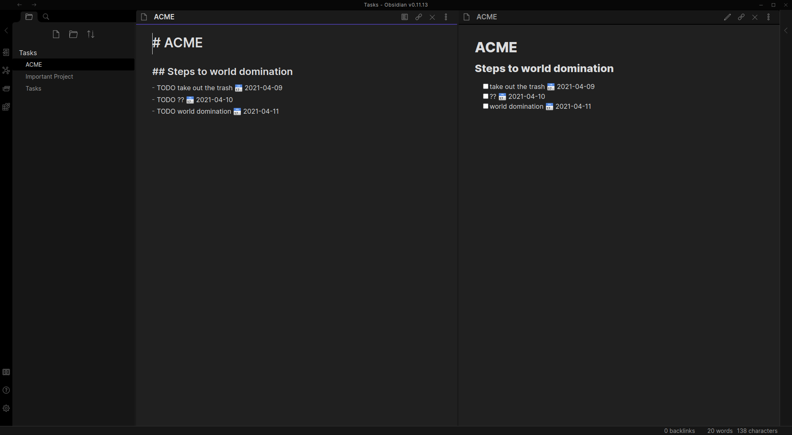
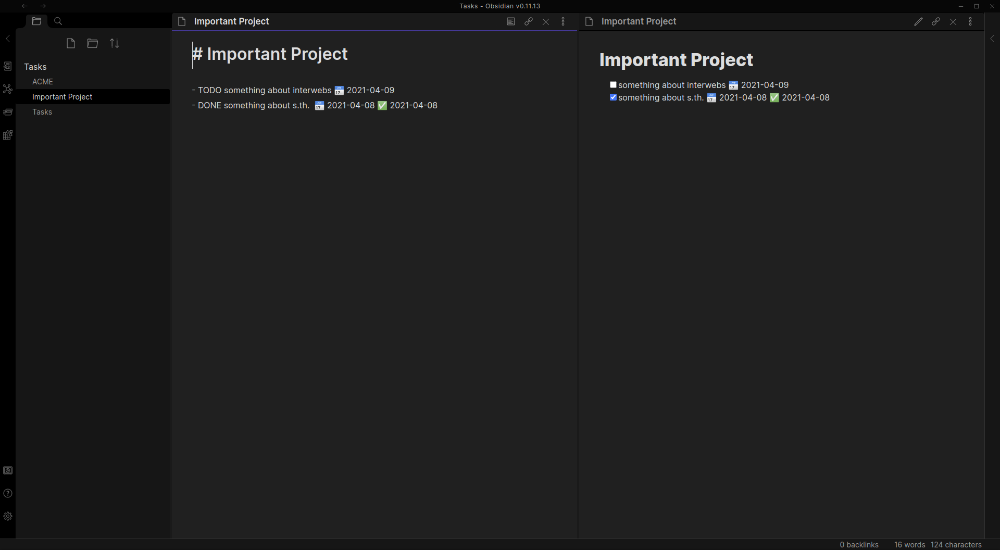
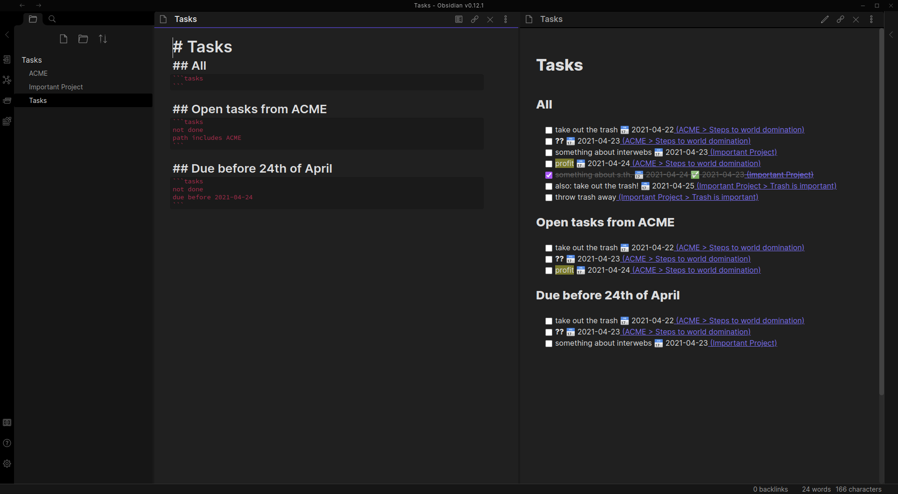

# Obsidian Tasks

Task management for the [Obsidian](https://obsidian.md/) knowledge base. 

Track tasks across your entire vault. List them and mark them as done wherever you want.

## Screenshots

*You can toggle the task status in any view/query and it will update the source file.*


The `ACME` note has some tasks.


The `Important Project` note also has some tasks.


The `Tasks` note gathers all tasks from the vault and displays them.

## Installation

Tasks is not yet available in the repository of Obsidian community plugins.
You have to download, install, and activate the plugin manually.
Follow the steps below to install Tasks.

1. Go to the latest [release](https://github.com/schemar/obsidian-tasks/releases).
2. Download:
    - `main.js`
    - `styles.css`
    - `manifest.json`
3. Copy the files into your vault under `<VaultFolder>/.obsidian/plugins/obsidian-tasks/`.
4. Enable the plugin in your Obsidian settings (find "Tasks" under "Community plugins").

## Usage

You track tasks by creating list items that start with the keyword `TODO`.

Example:

```
- TODO take out the trash
```

There are two ways to mark a task done:

1. In preview mode, click the checkbox at the beginning of the task to toggle the status between `TODO` and `DONE`.
2. In edit mode, use the command `Tasks: Toggle done`.
    - The command will only be available if the cursor is on a line of a task.
    - You can map he command to a hotkey in order to quickly toggle statuses in the editor view.

When a task is marked as done, the keyword will automatically change from `TODO` to `DONE` and vice versa.
A `DONE` task will have the date it was done appended to the end of its line.
For example: `✅ 2021-04-09` means the task was done on the 9th of April, 2021.

### Due dates

Tasks can have due dates.
In order to specify the due date of a task, you must append the "due date signifier" followed by the date it is due to the end of the task.
The date must be in the format `YYYY-MM-DD`, meaning `Year-Month-Day` with leading zeros.
For example: `📅 2021-04-09` means the task is due on the 9th of April, 2021.

```
- TODO take out the trash 📅 2021-04-09
```

### Querying and listing tasks

You can list tasks from your entire vault by querying them using a `tasks` code block.
Tasks are sorted by due date and then path.

**The result will only list tasks that are not indented!**
See section Caveats for more details.

The simplest way is this:

    ```tasks
    ```

In preview mode, this will list all tasks from you vault, regardless of their status.
This is probably not what you want. Therefore, Tasks allows you to filter the tasks that you want to show.
All date filters must be in the format `YYYY-MM-DD`, meaning `Year-Month-Day` with leading zeros.

The following filters exist:

- `done`
- `not done`
- `done (before|after|on) <date>`
- `no due date`
- `due (before|after|on) <date>`
- `path (includes|does not include) <path>`

#### Examples

Show all tasks that aren't done, are due on the 9th of April 2021, and where the path includes `GitHub`:

    ```tasks
    not done
    due on 2021-04-09
    path includes GitHub
    ````

Show all tasks that were done before the 1st of December 2020:

    ```tasks
    done before 2020-12-01
    ```

### Caveats

**Toggling in preview mode of a file**

When you toggle a task in its file, it will identify the task based on its description.
This means that when you have multiple tasks with the exact same description, due date, and done date, it will toggle the first of those tasks and not necessarily the one you actually clicked.
**This only applies to tasks within the file in preview mode.**
**If you have many tasks with the same description and you want to be on the safer side, use a query instead.**

The reason for this is that I can currently not reliably identify the line number in the file from a click on the checkbox in preview mode.
This might change/improve in the future.

**A query result will only list tasks that are not indented!**

This means that the dash that identifies the list item in the file must not have preceding spaces or tabs.
This is a deliberate design decision (for the moment).
I am happy to discuss this and possibly change it.
However, there is more to it than simply showing the task.
Should it be indented in the query results? Below what? Should the parent list item be shown as well?

For now, you can use this "feature" to track projects with sub-tasks that won't clutter your overview.
