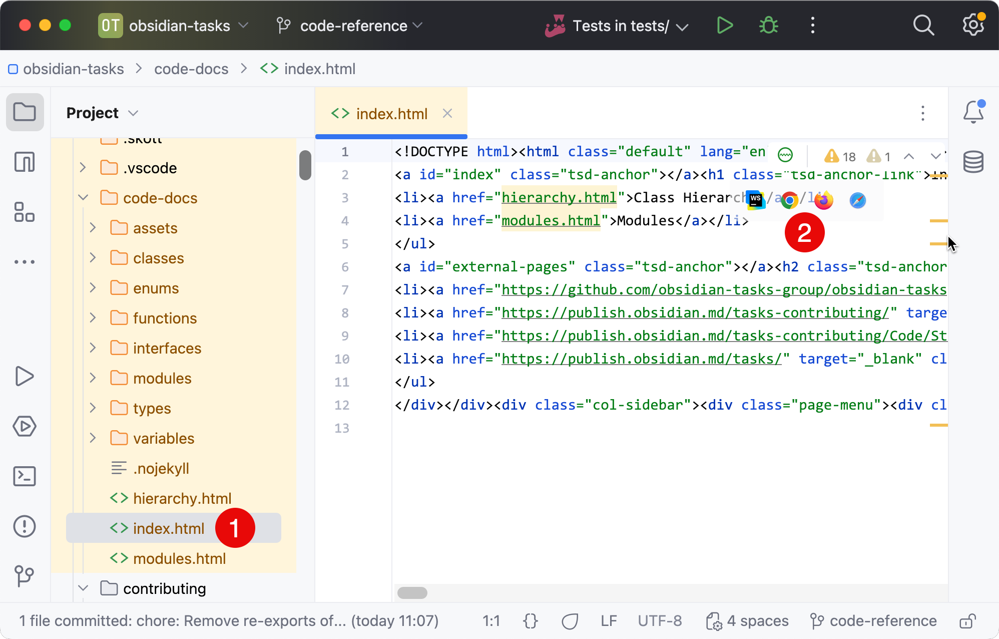
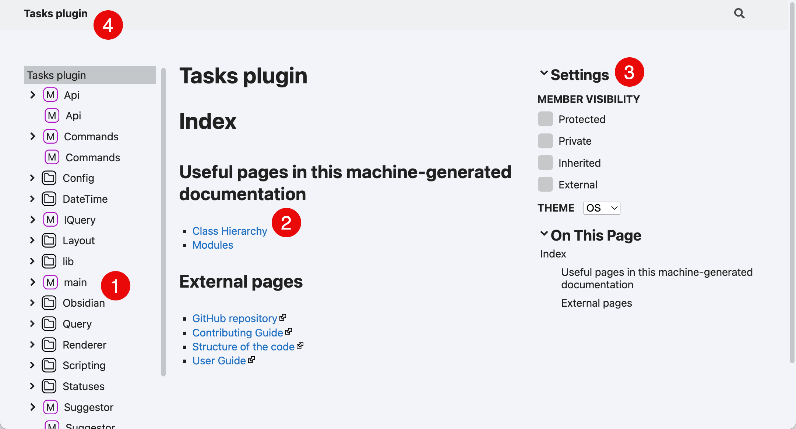
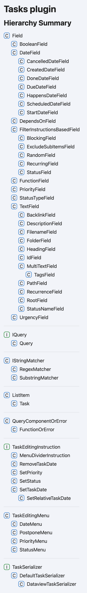

# Generating documentation of the code

It is now possible for developers to create a local documentation website showing the source code of the Tasks plugin.

This can help gain an understanding of the code, and see relationships between classes and functions.

## Generating the documentation

```bash
yarn code-docs
```

This runs [TypeDoc](https://typedoc.org) to populate `code-docs/index.html` and related files.

See the `typedocOptions` section in [tsconfig.json](https://github.com/obsidian-tasks-group/obsidian-tasks/blob/main/tsconfig.json) for options used.

## Launching the documentation

In WebStorm, use the following steps to view the generated documentation:

1. Open `code-docs/index.html`
2. Click on a browser icon to open the file in a browser of your choice.


<span class="caption">How to use WebStorm to open a web server showing the code documentation</span>

## Using the documentation

A page like this (the Index) will open.


<span class="caption">Screenshot showing the code docs</span>

1. Use the links on the left to browse the source code and its documentation.
2. The `Class Hierarchy` is especially useful.
3. When viewing classes and files, these Settings will be useful.
4. Click on the title to get back this Index page.

## Class Hierarchy

Here is a sample screenshot showing the class hierarchy:


<span class="caption">Screenshot showing the class hierarchy as of 8th December 2024</span>
