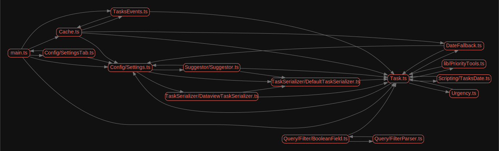

# How do I see circular dependencies

This page assumes that you have already set up your [[Local development]]

## What are circular dependencies?

The article [Tired of circular dependency in Typescript/Node.js?](https://dev.to/tahsinature/tired-of-circular-dependency-in-typescriptnodejs-4i0a) has a good explanation, building on the following quote from [Wikipedia](https://en.wikipedia.org/wiki/Circular_dependency):

> In software engineering, a circular dependency is a relation between two or more modules which either directly or indirectly depend on each other to function properly. Such modules are also known as mutually recursive.

## How to see circular dependencies in Tasks?

### Via GitHub Actions builds

- Browse to the [Verify Commit logs](https://github.com/obsidian-tasks-group/obsidian-tasks/actions/workflows/verify.yml)
  - Choose the branch of interest (at top-right)
  - Click on the most recent run of code on that branch
- Click on the `circular-dependencies` link in the Artifacts list at the bottom of the page to down the results
  - Expand the .zip file
- View the two files:
  - `circular-deps.txt`
  - `circular-deps.png`

### On your local machine

- Install [Graphviz](https://graphviz.org), making sure that the [gvpr](https://graphviz.org/docs/cli/gvpr/) command is available
- Run one of the following commands:

```bash
yarn run circular-deps-text
yarn run circular-deps-image
```

## Example output files

`circular-deps.txt`:

```text
Processed 122 files (1.2s) (15 warnings)

1) Config/Settings.ts > Suggestor/Suggestor.ts
2) Task.ts > Config/Settings.ts > Suggestor/Suggestor.ts
3) Task.ts > Config/Settings.ts > Suggestor/Suggestor.ts > TaskSerializer/DefaultTaskSerializer.ts
4) Task.ts > Config/Settings.ts > TaskSerializer/DataviewTaskSerializer.ts
5) Task.ts > DateFallback.ts
6) Task.ts > Scripting/TasksDate.ts
7) Task.ts > Urgency.ts
8) Task.ts > lib/PriorityTools.ts
9) Cache.ts > TasksEvents.ts
10) Query/FilterParser.ts > Query/Filter/BooleanField.ts
11) Config/SettingsTab.ts > main.ts
```

`circular-deps.png`:

%%Note on a slight cheat: an SVG is shown here, as it gives better scaling when published.
But the appearance is the same as the generated PNG %%


