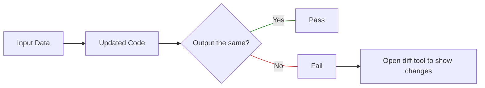

# Approval Tests

## Motivation for using Approval Tests

Some tests in this project use the [Approval Tests implementation in NodeJS](https://github.com/approvals/Approvals.NodeJS).

This enables us to:

- get good coverage from large amounts of test data,
- [visualise patterns](https://github.com/obsidian-tasks-group/obsidian-tasks/blob/main/tests/Query/Filter/ReferenceDocs/FilterReference/DateFieldReference.test.explain_date_reference_last-this-next-weekday.approved.explanation.text) in the behaviour of code that generates many outputs,
- generate complex text to [[Embedding code and data in documentation|include in the documentation]].

## Introduction to Approval Tests

Approval Tests are a kind of [Characterisation test](https://en.wikipedia.org/wiki/Characterization_test).

The flow can be thought of like this:



There is a brief overview of Approval tests at [approvaltests.com](https://approvaltests.com).

### Example Approval Tests

These trivial examples exist just to walk through the behaviour of Approval Tests.

Example test in [tests/TestingTools/ApprovalTestsDemo.test.ts](https://github.com/obsidian-tasks-group/obsidian-tasks/blob/main/tests/TestingTools/ApprovalTestsDemo.test.ts), that saves its input in a text file:

<!-- snippet: approval-test-as-text -->
```ts
test('SimpleVerify', () => {
    verify('Hello From Approvals');
});
```
<!-- endSnippet -->

The corresponding `approved` file, named [tests/TestingTools/ApprovalTestsDemo.test.ApprovalTests_SimpleVerify.approved.txt](https://github.com/obsidian-tasks-group/obsidian-tasks/blob/main/tests/TestingTools/ApprovalTestsDemo.test.ApprovalTests_SimpleVerify.approved.txt):

<!-- snippet: ApprovalTestsDemo.test.ApprovalTests_SimpleVerify.approved.txt -->
```txt
Hello From Approvals
```
<!-- endSnippet -->

<!-- snippet: approval-test-as-json -->
```ts
test('JsonVerify', () => {
    const data = { name: 'fred', age: 30 };
    verifyAsJson(data);
});
```
<!-- endSnippet -->

The corresponding `approved` file, named [tests/TestingTools/ApprovalTestsDemo.test.ApprovalTests_JsonVerify.approved.json](https://github.com/obsidian-tasks-group/obsidian-tasks/blob/main/tests/TestingTools/ApprovalTestsDemo.test.ApprovalTests_JsonVerify.approved.json):

<!-- snippet: ApprovalTestsDemo.test.ApprovalTests_JsonVerify.approved.json -->
```json
{
  "name": "fred",
  "age": 30
}
```
<!-- endSnippet -->

## Writing Approval Tests

### Summary of Approval Tests

Approval tests typically call a function beginning `verify`, and pass
in some text or an object to be tested.

### Reusable Approval Tests code in Tasks

We have these convenience helpers to make it easier to write Approvals-based tests.

- [tests/TestingTools/ApprovalTestHelpers.ts](https://github.com/obsidian-tasks-group/obsidian-tasks/blob/main/tests/TestingTools/ApprovalTestHelpers.ts)
  - For saving various Tasks data types
- [tests/TestingTools/VerifyMarkdownTable.ts](https://github.com/obsidian-tasks-group/obsidian-tasks/blob/main/tests/TestingTools/VerifyMarkdownTable.ts)
  - For saving approved data in Markdown tables

## Running Approval Tests

### Dealing with failed verify tests

When an Approval Test fails, a Diff Tool such as [diffmerge](https://sourcegear.com/diffmerge/) will open to show the changes between the new output (`*.received.*`) and the existing approved output (`*.approved.*`).

As with all tests, if they fail, ask yourself the question:

- **Has a bug/unwanted change in behaviour been introduced?**
  - Then fix the code, and leave the `*.approved.*` file unchanged
- **Has the behaviour been improved?**
  - Then use your diff tool launched by Approval Tests
  - To copy the improvements:
    - from the `received` file on the left
    - to the `approved` file on the right
  - Commit the updated `approved` file along with the source code changes

> [!tip]
> I found that the Beyond Compare diff tool broke emojis when copying them. If this happens, you can copy the `received` to the `approved` in the file explorer.

> [!warning]
> If you are unsure why an approval test failed, do not just save the new output to make the test pass. You probably just missed a bug that the tests revealed.

### Approval Test failures in GitHub Actions

Unfortunately the current version of Approval Tests does not show any diffs on the console if no graphical diff tool is found.

> [!tip]
> For now, that means that if an Approval Test fails on GitHub Actions, the only recourse is to run the test locally in a developer environment.
