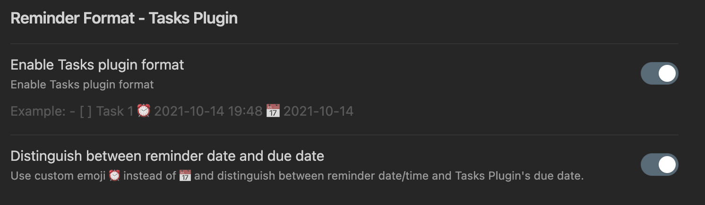

# Notifications

<span class="related-pages">#plugin/reminder</span>

Within Tasks, notifications can be made possible by utilizing [obsidian-reminder](https://github.com/uphy/obsidian-reminder).
This utilizes the standard Tasks date (as the due date) and can be extended with an additional reminder date by including a ⏰ and a date/time in the format `⏰ YYYY-MM-DD HH:MM`.
Further, a default reminder can be enabled based on the Tasks' 'Due Date'.
To enable this make sure obsidian-reminder has enabled the tasks plugin format as below:


_Note that this is a screenshot of the reminder plugin's settings and not Tasks._

## Where to add the reminder date

The order is important when writing the task. Tasks requires the reminder date after the task description and before any other Tasks fields. Reminders [requires no content between the reminder date and the due date](https://uphy.github.io/obsidian-reminder/guide/interop-tasks.html#distinguish-due-date-and-reminder-date).

```markdown
- [ ] #task task name ⏰ YYYY-MM-DD HH:mm 📅 YYYY-MM-DD ⏫ 🔁 every week 🛫 YYYY-MM-DD ⏳ YYYY-MM-DD
```

---

> [!warning]
> The output of the "Create or Edit Tasks" command will not put the due date directly behind the reminder date where Reminders wants it.
You must fix this manually if you want to use the Reminders "defer" command;
**otherwise (as of August 2022), using the Reminders "defer" command will overwrite all information between the ⏰ and 📅 emoji!**
See [this issue in Reminders to check the current status](https://github.com/uphy/obsidian-reminder/issues/100).

## How to complete the reminder

The reminder date doesn't change when completing the task, the date will change only when you complete it from the reminder popup or from the notification.


---

> [!warning]
> Completing recurring tasks does not work correctly with Reminders as of August 2022.
See [this issue in Reminders to check the current status](https://github.com/uphy/obsidian-reminder/issues/93).

---
