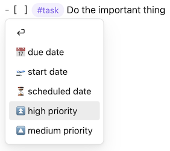
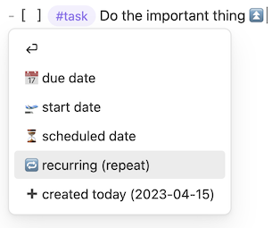
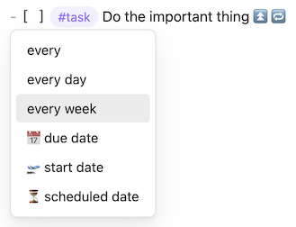
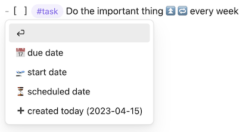
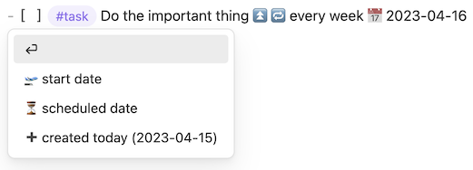
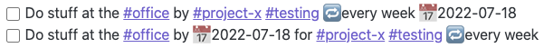
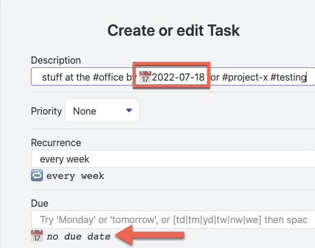
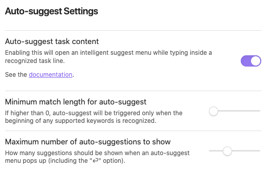

# Intelligent Auto-Suggest

## Introduction

> [!released]
Introduced in Tasks 1.9.0.

The [[Priority|Priorities]], [[Dates]] and [[Recurring Tasks]] pages show various emojis and special phrases that the Tasks plugin recognises, when searching for tasks.

If you prefer to type your tasks, instead of using a dialog, there is now an intelligent auto-suggest completion mechanism that does a
lot of the typing of emojis and dates for you.

It is particularly powerful when creating and editing tasks on mobile phones.

> [!released]
>
> - `➕ created today` was introduced in Tasks 3.2.0.
> - `🆔 id`  and `⛔ depends on id` were introduced in Tasks 7.4.0.

### Video Demo

It is perhaps best understood by watching a [video of it in action](https://user-images.githubusercontent.com/10722656/175102574-78b0f851-cc48-4255-a40e-d3036bec5bb6.gif).

### Walk Through

Here is a more detailed walk through of the creation of a new task, which can be done entirely using the keyboard if you wish.

1. As you are typing a task, the auto-suggest menu pops up to show some common options:

    

    **Note**: the auto-suggest menu pops up only if the cursor is in a line that is recognized as a task, that is, the line contains:

     - a bullet with a checkbox, that is, one of:
         - `- [ ]`
         - `* [ ]`
         - `+ [ ]`
     - and the global filter (if any)

     Tasks also tries to display the auto-suggest menu based on context. For example, suggestions will only appear
      within square brackets `[]` or parentheses `()` when using the [[Dataview Format#Bracketed inline fields|Dataview Task Format]].

2. You can keep typing (to ignore the suggestions), or select one of the menu items in a variety of ways:

    - mouse-click on menu item
    - use the up/down keyboard keys and then type `Return` or `Enter`
    - type a few more characters, to make the menu items more specific. For example, type `pri` to show all the options for setting the task's priority.

    **Note**: When the `⏎` item is shown at the top of the menu, it is given as a default option to enter a new line instead of choosing a suggestion. It is only shown when there is no concrete match when using the [[Tasks Emoji Format]].

3. Here we selected the 'high priority' item, and so now the menu is updated to show the next most likely items you might want to add. We are going to select 'recurring (repeat)' from this menu:

    

4. Now the repeat emoji has been added, the menu offers a few common options for recurrences:

    

5. We chose `every week`, which was added to our task, and now the menu shows the remaining possible emojis:

    

6. We selected the 'due date', and so now the menu offers a selection of commonly-used dates, calculated based on the current date:

    

7. Now our task is complete:

    

## Details

The auto-suggest menu works in both Source mode and Live Preview.

It triggers only on lines that will be recognised as tasks by the Tasks plugin:

- If you use a global task filter, for example `#task`, you will need to provide `- [ ] #task` before the menu pops up.
- If you don't use a global task filter, you will only need to provide `- [ ]` before the menu pops up.
- It also recognises lists starting with asterisk (`*`) and plus (`+`) characters.

The menu is smart: it will only offer valid options:

- For example, if you have already added a due date, that option will be removed from the menu.
- When the `⏎` item is shown at the top of the menu, it is given as a default option to enter a new line instead of choosing a suggestion. It is only shown when there is no concrete match.
- There are many more recognized options than are showing in the menus, including many more dates, such as `2 months`, `15 days`.

Since Tasks 7.4.0, the menu supports easy creation of [[Task Dependencies]].

- Type `id` to filter show the options for dependencies.
- `⛔ depends on id` searches the descriptions of all not-done tasks.
  - Select a task from the menu to add a dependency, and automatically add an `id` value the selected task, if need be.
  - Having added a dependency, such as `⛔ dcf64c`, you can type a comma (`,`) to add another dependency - as many times as you wish.
- `🆔 id` allows you to add an `id` to a task.
  - You can accept its offer to `generate unique id`.
  - Or you can type your own more meaningful `id` if you wish, such as `🆔 suggester-update-docs`.
  - Be sure to stick to the allowed [[Task Dependencies#`id`|allowed `id` characters]], and do not create duplicate `id` values.

The auto-suggest menu supports powerful keyboard control:

- Example: type some fraction of the word `start` and you will get a suggestion to turn it into the start emoji. Pressing `<enter>` then immediately adds the start emoji: 🛫.
- The filtering matches anywhere. For example, if you haven't yet added any dates to the task, typing `du` would then offer `📅 due date` and `⏳ scheduled date`.
- You can use the up/down arrow keys on your keyboard, then press `<enter>` to select from the menu.
- The menu is controlled by the 'Minimum match length for auto-suggest' setting. The higher its value, the more you have to type before the menu pops up.

Things to be aware of, to make sure your Tasks searches work as you intend:

- You can mix tags in between the emojis (as of Tasks 1.9.0), but you must not mix description text amongst the tags and signifier emojis.
  - See 'What do I need to know about the order of items in a task?' below.

## Limitations of Auto-Suggest

There are some Auto-Suggest behaviours that might be improved in future releases:

- The following are not yet supported:
  - It does not yet support Done and Cancelled dates.
    - Done Date can be added either with the 'Tasks: Toggle task done' command or by clicking the task's checkbox when in Live Preview or Reading views.
    - Both Done and Cancelled dates can be edited in the [[Create or edit Task]] modal.
    - We are tracking this in [issue #2863](https://github.com/obsidian-tasks-group/obsidian-tasks/issues/2863).
  - It does not yet offer `when done`.
    - This phrase still needs to be typed manually.
    - We are tracking this in [issue #2066](https://github.com/obsidian-tasks-group/obsidian-tasks/issues/2066).
- It currently pops up when editing completed tasks. This may be changed in future.
- It currently pops up when editing NON_TASK tasks. This may be changed in future.
  - We are tracking this in [issue #1509](https://github.com/obsidian-tasks-group/obsidian-tasks/issues/1509).

## Common Questions

### What do I need to know about the order of items in a task?

The order of text, tags and signifier emojis matters.

Specifically, Tasks reads back from the end of the line, searching for:

- signifier emojis (due, scheduled, recurring, priority)
- tags

As part of the launch of auto-suggest, Tasks now allows tags to be mixed in the middle of the emojis, and at the end of the line.

As soon as it finds any unrecognised text, it stops reading, and ignores any emojis to the left of that unrecognised text.

> [!warning]
> Mixing any descriptive text in amongst the emojis and their values **will cause emojis before the descriptive text to not be recognised by Tasks, and not be searchable**.

We are tracking this ordering limitation in [issue #1505](https://github.com/obsidian-tasks-group/obsidian-tasks/issues/1505).

See the next two sections for how to check your tasks, as you start using this powerful feature.

### How can I find all tasks that may be formatted incorrectly?

See [[Find tasks with invalid data#Finding unread emojis|Finding unread emojis]] to find and fix any tasks with unread emoji values.

### How can I check that a particular Task is formatted correctly?

The Tasks plugin's ability to search tasks depends on the information in the tasks matching the plugin's parsing behaviour, described in the previous section. If not, tasks may be silently omitted from task searches.

Consider these two tasks (in a vault that does not have a global tag filter):

```text
- [ ] Do stuff at the #office by 📅 2022-07-18 #project-x 🔁 every week #testing
- [ ] Do stuff at the #office by 📅 2022-07-18 for #project-x 🔁 every week #testing
```

At first glance, they both look correct.

However, the first sign of a problem is in Reading view:



In the first task, the recurrence and due date appear at the end of the line, in the order that they would be written out by the ‘Create or edit Task’ Modal.

However, in the second task, only the recurrence is at the end of the line. This is because the due date has not been recognised, due to the unrecognised word **for** mixed after the due date emoji, causing that property not to be recognised by tasks.

If you are concerned that a task is being missed out of searches, or you just want to check it, you can click on its line and open the [[Create or edit Task|‘Create or edit Task’ Modal]] and check that there are no unwanted emojis in the description field.

Our second task looks like this. Note that the due date is shown in the Description box, and there is 'no due date':



### How do I see more suggestions?

Increase the 'Maximum number of auto-suggestions to show' value in settings (and re-start Obsidian) so that the menu will contain more options.

There are many more suggestions available than are first shown in the popup menu. As you type more characters, the suggestions shown will be more specific to what you typed.

### How do I make the menu pop up less?

Increase the 'Minimum match length for auto-suggest' value in settings (and re-start Obsidian) so that the menu will only appear when you have typed a few characters from your chosen menu option.

For example, if you set the `Minimum match length for auto-suggest` to 3, you would need to type in your task "pri" or "hig" or "med" or "low" to get auto-suggest for the priority emoji(s).

### What keywords may I type to make auto-suggest write the emoji for me?

Here is the complete set of all available text that is added to the auto-suggest menu, with dates that would be generated when used on 11th July 2022.

As you type, the options are filtered. For example, if you haven't yet added any dates to the task, typing `du` would then offer:

- `📅 due date`
- `⏳ scheduled date`

Similarly, you can type some fraction of the word `start` (of whatever length is needed by the 'Minimum match length' setting) and you will get a suggestion to turn it into the emoji. Pressing `<enter>` then immediately adds the start emoji: 🛫.

<!-- include: Suggestor.test.auto-complete_with__emoji__symbols_show_all_suggested_text.approved.md -->
| Searchable Text | Text that is added |
| ----- | ----- |
| ⏎ | &lt;new line> |
| 📅 due date | 📅  |
| 🛫 start date | 🛫  |
| ⏳ scheduled date | ⏳  |
| 🆔 id | 🆔 |
| ⛔ depends on id | ⛔ |
| ⏫ high priority | ⏫  |
| 🔼 medium priority | 🔼  |
| 🔽 low priority | 🔽  |
| 🔺 highest priority | 🔺  |
| ⏬ lowest priority | ⏬  |
| 🔁 recurring (repeat) | 🔁  |
| ➕ created today (2022-07-11) | ➕ 2022-07-11  |
| every | 🔁 every  |
| every day | 🔁 every day  |
| every week | 🔁 every week  |
| every month | 🔁 every month  |
| every month on the | 🔁 every month on the  |
| every year | 🔁 every year  |
| every week on Sunday | 🔁 every week on Sunday  |
| every week on Monday | 🔁 every week on Monday  |
| every week on Tuesday | 🔁 every week on Tuesday  |
| every week on Wednesday | 🔁 every week on Wednesday  |
| every week on Thursday | 🔁 every week on Thursday  |
| every week on Friday | 🔁 every week on Friday  |
| every week on Saturday | 🔁 every week on Saturday  |
| today (2022-07-11) | 📅 2022-07-11  |
| tomorrow (2022-07-12) | 📅 2022-07-12  |
| Sunday (2022-07-17) | 📅 2022-07-17  |
| Monday (2022-07-18) | 📅 2022-07-18  |
| Tuesday (2022-07-12) | 📅 2022-07-12  |
| Wednesday (2022-07-13) | 📅 2022-07-13  |
| Thursday (2022-07-14) | 📅 2022-07-14  |
| Friday (2022-07-15) | 📅 2022-07-15  |
| Saturday (2022-07-16) | 📅 2022-07-16  |
| next week (2022-07-18) | 📅 2022-07-18  |
| next month (2022-08-11) | 📅 2022-08-11  |
| next year (2023-07-11) | 📅 2023-07-11  |
| today (2022-07-11) | ⏳ 2022-07-11  |
| tomorrow (2022-07-12) | ⏳ 2022-07-12  |
| Sunday (2022-07-17) | ⏳ 2022-07-17  |
| Monday (2022-07-18) | ⏳ 2022-07-18  |
| Tuesday (2022-07-12) | ⏳ 2022-07-12  |
| Wednesday (2022-07-13) | ⏳ 2022-07-13  |
| Thursday (2022-07-14) | ⏳ 2022-07-14  |
| Friday (2022-07-15) | ⏳ 2022-07-15  |
| Saturday (2022-07-16) | ⏳ 2022-07-16  |
| next week (2022-07-18) | ⏳ 2022-07-18  |
| next month (2022-08-11) | ⏳ 2022-08-11  |
| next year (2023-07-11) | ⏳ 2023-07-11  |
| today (2022-07-11) | 🛫 2022-07-11  |
| tomorrow (2022-07-12) | 🛫 2022-07-12  |
| Sunday (2022-07-17) | 🛫 2022-07-17  |
| Monday (2022-07-18) | 🛫 2022-07-18  |
| Tuesday (2022-07-12) | 🛫 2022-07-12  |
| Wednesday (2022-07-13) | 🛫 2022-07-13  |
| Thursday (2022-07-14) | 🛫 2022-07-14  |
| Friday (2022-07-15) | 🛫 2022-07-15  |
| Saturday (2022-07-16) | 🛫 2022-07-16  |
| next week (2022-07-18) | 🛫 2022-07-18  |
| next month (2022-08-11) | 🛫 2022-08-11  |
| next year (2023-07-11) | 🛫 2023-07-11  |
| generate unique id | 🆔 ****** |
<!-- endInclude -->

### How can I use auto-suggest features from other plugins together with the Tasks auto-suggest?

Obsidian plugins such as Tasks cannot tell if you have auto-suggest features from other plugins enabled.
Therefore it is user responsibility to manage conflicts between auto-suggest features.

The Tasks auto-suggest will only appear on lines that start `- [ ]` and contain the global filter (if one is set).
If you want to use auto-suggest features from another plugin on such lines, make sure that plugin's settings for auto-suggest
appearance do not overlap with the keywords listed above,
then increase the 'Minimum match length for auto-suggest' value in the Tasks settings to more characters than used to activate the other plugin's auto-suggest,
and re-start Obsidian.

## Settings

Note that like all Tasks settings, after any changes, Obsidian needs to be restarted for the new settings to take effect.

These are the settings currently available for this feature:



### Auto-suggest task content

This allows the entire auto-suggest feature to be disabled. It is turned on by default.

### Minimum match length for auto-suggest

By default, the auto-suggest menu pops up before you have even typed any non-space characters.
As you become more familiar with the options it offers, this can get annoying, and you may
find that you prefer to just type a few characters instead.

You can make the menu pop up less often, by increasing this setting from 0 to 1, 2 or 3,
which will mean that the menu will only pop up when you have typed
at least the specified number of characters to find a match.

### Maximum number of auto-suggestions to show

How many suggestions should be shown when an auto-suggest menu pops up (including the "⏎" option).

The default is 6, and you can select any value from 3 to 12.
