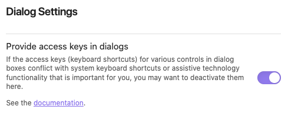

# 'Create or edit Task' Modal

## Introduction

 The `Tasks: Create or edit` command helps you when adding or editing a task.

## Opening the 'Create or edit Task' Modal

Use the command 'Tasks: Create or edit task' to launch the modal.

- If the cursor was on an existing task, the modal will modify that task's properties.
- If the cursor was on a blank line, the modal will create a brand new task on that line.

## Keyboard shortcuts

> [!released]
Introduced in Tasks 1.17.0.

All the fields of the form have "access keys", that is, keyboard shortcuts. The access keys are displayed as the underlined letters in the labels.

- On Windows, press the `Alt`-key and the underlined letter at the same time.
- On Mac, press `Ctrl`-key and the `Option`-key and the underlined letter at the same time.

See [[#Hotkey and keyboard shortcut conflict]] below for important information relating to keyboard shortcuts and the hotkey used to open this modal.

### Turning off keyboard shortcuts

> [!released]
Introduced in Tasks 1.17.0.

If the access keys (keyboard shortcuts) for any field conflicts with system keyboard shortcuts or interferes with assistive technology functionality that is important for you, you may want to turn them off in the Tasks plugin's settings:

This setting takes immediate effect, and does not require restarting of Obsidian.

## Entering values

### Description

This is the text describing your task.

If you have a [[Global Filter|global filter]] enabled, the dialog takes care of adding it automatically.

The description box can be enlarged by dragging its corner. Multi-line text can be pasted in, or dragged-and-dropped in, and Tasks will remove the end-of-line characters automatically.

> [!released]
Description field became resizable in Tasks 2.0.0.

### Priority

See [[Priority|priority]].

### Recurrence

Here you can make the task recur, so that when it is marked as done, a new task is created, with newer dates.

> [!Tip]
> A task with a recurrence rule is required to also have at least one of Due, Scheduled or Starts dates. 
> See [[Recurring Tasks#Recurring tasks must have at least one date|Recurring tasks must have at least one date]].

See [[Recurring Tasks|recurring tasks (repetition)]].

### Dates

Here you can optionally give the task
[[Dates#Due date|due]],
[[Dates#Scheduled date|scheduled]] and
[[Dates#Start date|start]] dates.

You can also add or edit
[[Dates#Created date|created]],
[[Dates#Done date|done]] and
[[Dates#Cancelled date|cancelled]] dates.

There is a lot of flexibility here. For example:

- You can type in exact dates, such as `2022-11-28`.
- You can also enter parts of dates, such as `6 oct`.
- You can enter relative dates, such as `today` or `tomorrow` or `Saturday`.

Note that relative dates will be always interpreted as being in the future, because that is usually what you want. You can change this behavior by unchecking "Only future dates" if you want to enter an overdue task or experiment with the way how relative dates in the past would be interpreted in queries.

> [!Info]
> If you have enabled ‘Set created date on every added task’ in Tasks settings (and restarted Obsidian), when you create a new Task via this modal, today's date will be added automatically.

> [!released]
>
> - `Only future dates` was introduced in Tasks 1.15.0.
> - Editing of [[Dates#Created date|created]], [[Dates#Done date|done]] and [[Dates#Cancelled date|cancelled]] dates was introduced in Tasks 5.5.0.

### Date abbreviations

> [!released]
Introduced in Tasks 1.8.0.

The modal also has a few abbreviations of its own, to speed up entering of common values in the date fields.

Type in the abbreviation and then a space character, and the whole word will be entered for you.

Supported abbreviations:

| Abbreviation | Expanded Text |
| ------------ | ------------- |
| `td`         | `today`       |
| `tm`         | `tomorrow`    |
| `yd`         | `yesterday`   |
| `tw`         | `this week`   |
| `nw`         | `next week`   |
| `weekend`    | `sat`         |
| `we`         | `sat`         |

### Dependencies

> [!released]
> Introduced in Tasks 6.1.0.

> [!Tip]
> This section describes the mechanics of adding and editing dependencies between your tasks.
>
> For an explanation of the dependencies facility itself, see [[Task Dependencies]].

Use the "Dependencies" area of the modal to specify relationships between tasks, to define the order in which you want to work on a set of tasks.

> [!Example]
> This is what the dependencies might look like for a task 'Have a party':
>
> 
> A task which requires two tasks, 'Invite the guests' and 'Make the food' to be done first, and, when done, will allow one other task, 'Tidy up after party', to be started on.

#### Before this

Use the "Before this" region to find and link to any tasks that **must be finished before the task being edited can be started**.

This is marked **1** and **2** in the image above.

#### After this

Use the "After this" region to find and link to any tasks that **can only be started after the task being edited is finished**.

This is areas **3** and **4** in the image above.

#### Searching for tasks

Understanding the search query:

- In either "Before this" or "After this", start typing any text from the description of a required task.
- Currently only task descriptions are searched, and not file paths.
- You can type bits of words, in any order, and capitalisation does not matter.
- For example, you could quickly find `Invite the guests` with `inv gu`, or `gu inv`.

Understanding the matches:

- As you type, Tasks will show you up to 20 closest matching tasks.
- Other tasks in the same file as the task being edited are listed first.
- Then matching tasks elsewhere in the vault are shown, followed by their path.
- If any text is too long to fit, it is truncated with `...` and you can hover over the name to see the full text.

This is what the above process looks like:

Searching for a task, to set up a dependency

#### Saving dependencies

When you click Apply after editing dependencies:

- `id` fields are added to any tasks that are now depended upon,
- `dependsOn` fields are adjusted to add or remove dependencies.

This is currently the only operation in Tasks that can edit multiple files in the vault in one step.

### Status

> [!released]
Introduced in Tasks 1.23.0.

Use the Status dropdown to change the Status Symbol for the task.

For more information, including adding your own customised statuses, see [[Statuses]].

#### Automatic setting of dates upon status change

> [!released]
> Introduced in Tasks 6.1.0.

When you change the Status Symbol for a Task, the [[Dates#Date-tracking settings|Date-tracking settings]] are used to determine whether to update any date fields:

- **If** the status is changed **to** a [[Status Types#DONE|DONE status type]] **from** any other status type,
  - **and** the "Set done date on every completed task" option is enabled,
  - **then** the **Done date** is changed to today's date.
- **If** the status is changed **to** a [[Status Types#CANCELLED|CANCELLED status type]] **from** any other status type,
  - **and** the "Set cancelled date on every completed task" option is enabled,
  - **then** the **Cancelled date** is changed to today's date.

#### Overriding dates on status change

When Tasks has automatically set a Created, Done or Cancelled date to today, you are free to edit the value.

For example, perhaps you actually completed a task yesterday and forget to mark it as complete. Now you can complete it in the modal, and set the Done date to yesterday, before clicking Apply.

#### Rewriting history: completing recurring tasks in the modal

> [!Tip]
> When marking `when done` recurring tasks as Done in the Edit Task modal, the date of the *next* occurrence is now calculated from the value in the Done date field.

The Done date value defaults to the current date, but can then be edited before clicking Apply.

This might be useful if you realise that you had forgotten to mark a recurring task as Done on the actual day that you completed it, and so you would like the new instance to be created based on the day you really completed the task, rather than today when you are marking it as done.

(Today's date is still used for an Created day on a new recurrence, though.)

## Display values

These values cannot currently be edited in this modal.

### Completed

A read-only checkbox, showing whether the task is completed.

## Finishing off

To close the modal and save your edits, do one of:

- click `Apply`,
- press `Return` or `Enter`.

To close the modal and cancel your edits, do one of:

- click `Cancel`,
- click or tap outside the modal,
- click the close button at the corner of the modal (if one exists on your operating system),
- hit the `Esc` key.

## Known limitations

### Need to scroll on phone screens

On phone screens the 'Create or edit Task' Modal may be too tall to fit on the screen.
It does support scrolling, and on Android, the scrollbar is visible.

Unfortunately iPhones don't display the scrollbar until you actually start scrolling.
Tap on the screen and drag down, and you will see a scrollbar appear temporarily.
More importantly, the scrolling does then work fine.

We are tracking the iPhone scrollbar issue in [issue #1238](https://github.com/obsidian-tasks-group/obsidian-tasks/issues/1238).

### Hotkey and keyboard shortcut conflict

If the [custom hotkey](https://help.obsidian.md/Customization/Custom+hotkeys) for the 'Create or edit Task' Modal is the same as one of the keyboard shortcuts  [[#Keyboard shortcuts]] used in this modal, then when the modal opens, **the keyboard shortcut is unexpectedly also triggered**.

For example, making `Alt + O` (Linux and Windows) or `Ctrl + Opt + O` (Mac) will mean that when the modal opens, the `Lowest` priority is selected, instead of `Normal`.

We are tracking this in [issue #2503](https://github.com/obsidian-tasks-group/obsidian-tasks/issues/2503).

## Use this modal in scripts and other plugins

The [[Tasks Api|Tasks API Interface]] allows this modal to be used outside of the Tasks plugin, for example in QuickAdd scripts, and by other plugins.
