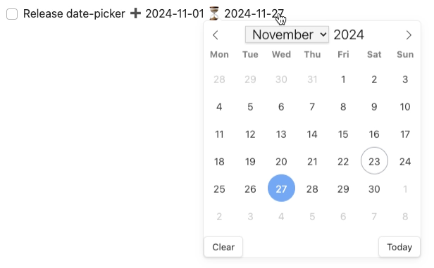
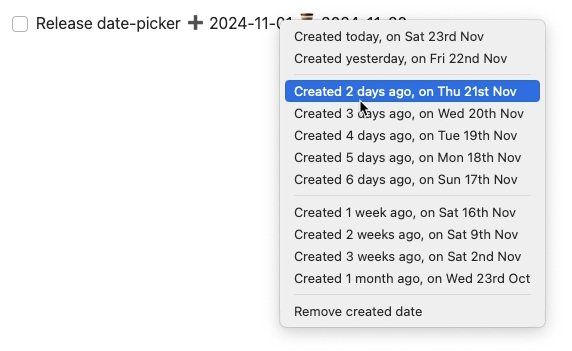

# Editing Dates

#feature/dates

## Summary

Tasks supports a range of date properties for managing your tasks: see [[Dates]].

This page describes ways to add, edit and remove date values on tasks.

There is a [[#Date-picker on task dates]] and a [[#Context menu on task dates]], or you can use various [[#other date-editing options]].

## Date-picker on task dates

> [!released]
> Introduced in Tasks 7.14.0.

**Left-click on any task date field** in **Reading mode** and **Tasks query search results** to use a date-picker and calendar to edit or remove a date.

### Customizing the calendar

#### First day of the week

By default, the calendar uses your systems's locale settings to determine first day of the week (Sunday, Monday, etc.).

If the calendar doesn't start on your preferred day, you can change this in Settings → Tasks → First day of week.

Available options:

- **Locale default**: Uses your system settings (automatic)
- **Explicit weekday**: Choose Sunday through Saturday to force a specific start day

See [[Settings#First day of week|First day of week setting]] for more details.

### Using the date picker

1. Click on any date in a task (due date, scheduled date, etc.)
2. A calendar popup appears
3. Click a date to change it
4. The task is automatically updated

Hover over a date in Read mode or Tasks query search results

In the date-picker, you can easily select a new date, or clear the current one

| Where                         | Viewing Mode | Works? |
| ----------------------------- | ------------ | ------ |
| Task lines in markdown files  | Source mode  | ❌     |
| Task lines in markdown files  | Live Preview | ❌     |
| Task lines in markdown files  | Reading mode | ✅     |
| In Tasks query search results | Live Preview | ✅     |
| In Tasks query search results | Reading mode | ✅     |

## Context menu on task dates

> [!released]
> Introduced in Tasks 7.10.0.

**Right-click on any task date field** in **Reading mode** and **Tasks query search results** to:

- postpone Start, Scheduled and Due dates
- advance Created, Cancelled and Done dates

Hover over a date in Read mode or Tasks query search results

Chose an option from the context menu

| Where                         | Viewing Mode | Works? |
| ----------------------------- | ------------ | ------ |
| Task lines in markdown files  | Source mode  | ❌     |
| Task lines in markdown files  | Live Preview | ❌     |
| Task lines in markdown files  | Reading mode | ✅     |
| In Tasks query search results | Live Preview | ✅     |
| In Tasks query search results | Reading mode | ✅     |

## Other date-editing options

In **Editing mode** (both Source mode and Live Preview) the options are:

- Type the dates yourself.
- Use [[Auto-Suggest]] to add emojis and a range of convenient dates.
- Using the `Create or edit Task` command to access the [[Create or edit Task]] modal/dialog.

In **Reading mode** and **Tasks query search results** the options are:

- Click or right-click ⏩ to use the [[Postponing|Postpone]] button.
- Click the Pencil icon  (📝) to use the [[Create or edit Task]] modal/dialog.
