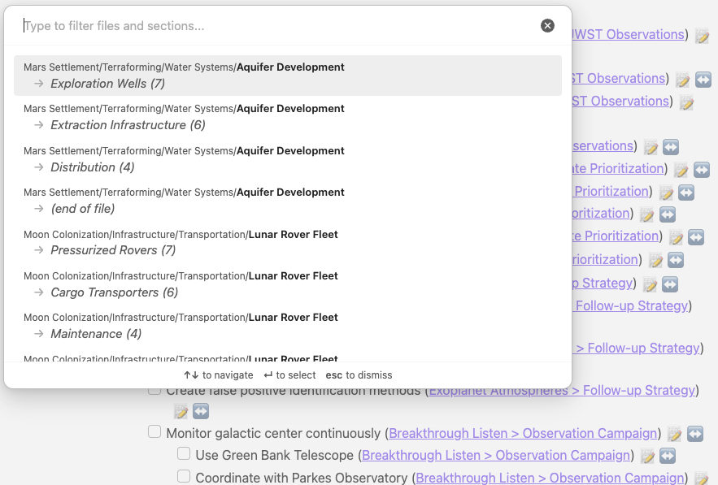

# Moving Tasks

<span class="related-pages">#feature/managing-tasks</span>

## Introduction

> [!Tip]
> Do you want to move a task from one file or section to another?
>
> - Perhaps a task belongs to a different project now?
> - Or you want to reorganize your daily notes?
> - Or move a task to a different section within the same file?
>
> Then the ↔️ Move button is for you!

The ↔️ button in Tasks Search results allows you to quickly move a task (and its subtasks) to another file or section.

> [!released]
>
> - Move was introduced in Tasks X.X.X.

## Using the Move Button

### Click to Open the Destination Modal

Click the ↔️ button to open a filterable modal showing all possible destinations:


<span class="caption">The Move modal shows files and sections that contain tasks</span>

### The Destination List

The modal displays:

1. **Files** containing tasks that match your [[Global Filter]] (if set)
2. **Sections** within each file (identified by headings)
3. **Task counts** for each section
4. **Full folder paths** for unambiguous identification

Files are sorted by last modified date, with the most recently edited files appearing first.

### Filtering Destinations

Start typing to filter the destination list. The search matches against:

- Folder paths
- File names
- Section headings

### Selecting a Destination

Click on a destination to move the task there. The task will be:

1. **Inserted** at the end of the selected section (after the last task)
2. **Deleted** from its original location

If the task has indented subtasks or list items below it, they will be moved together.

### Current Location Indicator

Your task's current location is marked with "← current" and is dimmed. Selecting it will show a notice that the task is already there.

## Move from the Editor

The Move option is also available in the [[Auto-Suggest]] dropdown when editing a task:

1. Start typing a task in a markdown file
2. Open the auto-suggest dropdown
3. Select "↔️ Move task to another file/section" (the last option)

This is useful when you realize mid-edit that a task belongs elsewhere.

## Excluding Folders from Destinations

You can exclude certain folders from appearing in the destination list.

### Settings

In the Tasks settings, under **Move Task**, you can configure:

- **Excluded paths**: A comma-separated list of folder paths to exclude from the move destination list

For example, to exclude your archive and templates folders:

```text
Archive, Templates, _templates
```

## Hiding the Move Button

You can hide the move button from query results using the `hide move button` [[Layout]] instruction:

```text
hide move button
```

## Availability

| Where                                   | Viewing Mode | Works? |
| --------------------------------------- | ------------ | ------ |
| Task lines in markdown files            | Source mode  | ❌     |
| Task lines in markdown files            | Live Preview | ❌     |
| Task lines in markdown files            | Reading mode | ❌     |
| Edit task modal                         | All modes    | ❌     |
| ↔️ button in Tasks query search results | Live Preview | ✅     |
| ↔️ button in Tasks query search results | Reading mode | ✅     |
| Auto-suggest dropdown                   | Source mode  | ✅     |
| Auto-suggest dropdown                   | Live Preview | ✅     |

## Technical Details

### What Gets Moved

When you move a task:

- The task line itself
- All indented lines immediately following it (subtasks and list items)

### Global Filter Respect

Only files containing tasks that match your [[Global Filter]] appear in the destination list. This ensures you only see relevant destinations.

### Section Detection

Sections are identified by markdown headings (`#`, `##`, etc.). Tasks without a preceding heading are grouped under "(no heading)".

## Current Limitations

### Cannot Create New Sections

The move feature can only move tasks to existing sections that already contain tasks. You cannot create a new section or move to an empty section.

### Cannot Move to Files Without Tasks

Only files that already contain tasks (matching your Global Filter) appear in the destination list.
