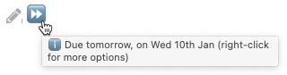
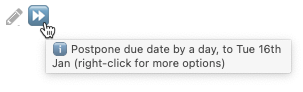
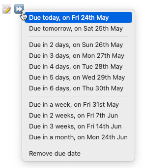
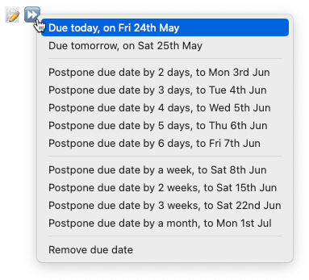

# Postponing

#feature/dates

## Introduction

> [!Tip]
> Do you ever find that your Task list is full of overdue tasks that you scheduled with the best of intentions?
>
> - And now you want to postpone many of them, so you can focus on the immediate priorities?
> - Or perhaps you want to remove the date instead?
>
> Then the ⏩ Postpone button is for you!

The ⏩ button in Tasks Search results allows you to quickly postpone (or "snooze") a task until tomorrow or later.

> [!released]
>
> - Postpone was introduced in Tasks 5.3.0.
> - The ability to remove the existing date was introduced in Tasks 7.3.0.

### Click and Context Menu

The ⏩ button provides two choices:

1. **Click the button** to advance the date to the **earlier** of:
    - tomorrow
    - the day after its current date
    
    **Tooltip** on the Postpone button shows **tomorrow's date**, for dates **before or on today**.
    
    **Tooltip** on the Postpone button shows '**postpone by day**', for **future dates**.

2. **Right-click** or **press-and-hold** the button to select from a context menu with:
    - future dates in the next 6 days
    - more future dates, further ahead
    - an option to remove the date instead:
    
    **Context menu** on the Postpone button shows options for dates **before or on today**
    
    **Context menu** on the Postpone button shows options for **future dates**.

### Which date field is edited?

The postpone option looks at the first of these Task fields, and will edit the first of:

1. **Due** date, if present.
1. **Scheduled** date
    - if no Due date is present.
1. **Start** date
    - If no Due or Scheduled date is present.

### When is the postpone button shown?

- Tasks with none of Due, Scheduled and Start currently don't show the Postpone button.
- Tasks with any invalid dates at all (including Created and Done dates) also don't show the Postpone button.
- You can use the `hide postpone button` [[Layout]] instruction to hide the Postpone button from your Task query results.

### Availability

This facility is currently only available in Tasks query search results.

| Where                                   | Viewing Mode | Works? |
| --------------------------------------- | ------------ | ------ |
| Task lines in markdown files            | Source mode  | ❌     |
| Task lines in markdown files            | Live Preview | ❌     |
| Task lines in markdown files            | Reading mode | ❌     |
| Edit task modal                         | All modes    | ❌     |
| ⏩ button in Tasks query search results | Live Preview | ✅     |
| ⏩ button in Tasks query search results | Reading mode | ✅     |

## Current Limitations

### Why is Postpone not shown on a particular task?

One of these reasons:

- The task status type [[Status Types|status type]] is `DONE`, `CANCELLED` or `NON_TASK`.
- The task does has no [[Dates#Due date|due]], [[Dates#Scheduled date|scheduled]] or [[Dates#Start date|start]] date.
- The task has at least one date field with an invalid date value.
- The `hide postpone button` instruction was used.

### Can I use Postpone to add a date to an undated task?

Currently, no.
