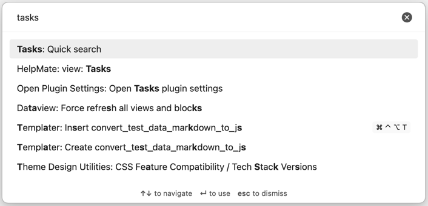
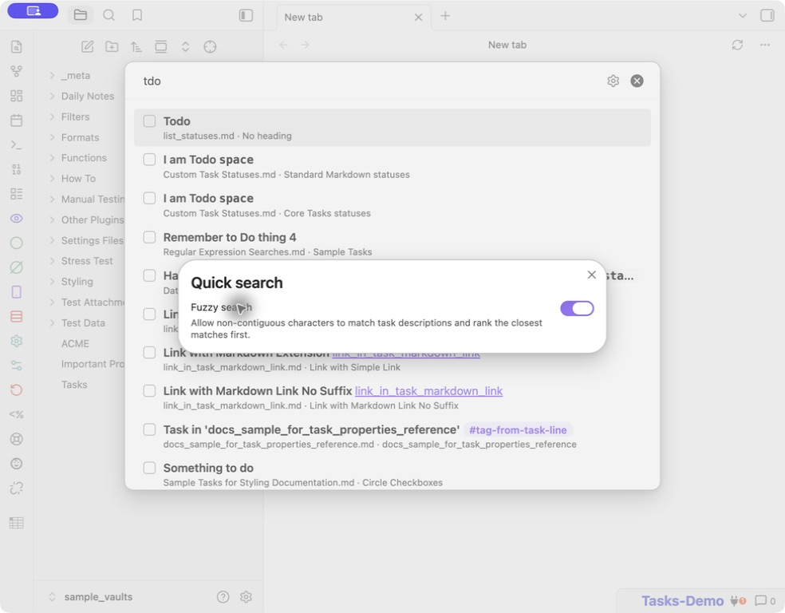
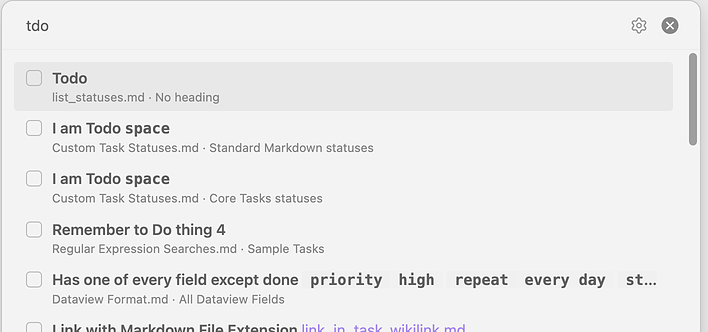

# Quick Search

> [!released]
> Introduced in Tasks 8.4.0.

## Introduction

Use the `Tasks: Quick search` command to find an incomplete task recognised by Tasks anywhere in your vault. If you use a [[Global Filter]], only tasks that match it are searchable. Similarly, if you use a [[Global Query]], only tasks that match it are searchable.

You can assign a hotkey to `Tasks: Quick search` in Obsidian's [Hotkeys settings](https://help.obsidian.md/Customization/Hotkeys).

The Command Palette showing Tasks: Quick search

## Searching

Start typing in the search dialog to filter tasks by their description. By default, Quick Search uses fuzzy matching, so non-contiguous characters can match a description. For example, `tdo` can match `todo`. The closest matches are shown first.

Select the cog icon in the Quick Search dialog to turn fuzzy matching off or on. With fuzzy matching off, Quick Search uses case-insensitive text matching and only returns descriptions containing the complete search text. Your choice is saved for future searches.

The option to enable or disable fuzzy matching

Neither search mode searches task tags, file names, or headings.

## Results

Each result shows a non-interactive checkbox for the task status, the rendered task description, its source file name and preceding heading, and any priority, date or recurrence information. Select a result with the arrow keys and press Enter to open the source note at the task line. Press Esc to close the dialog.

Quick search results

## How Quick Search Works

- The task description is searched.
  - The search is case-insensitive and looks for the exact text you type.
  - It does not search the task tags, file names, or headings.
  - Be aware of spaces at the start and end of the search string, as they may cause valid matches not to be found.
- Results are sorted by description, ignoring Markdown formatting.
  - If tasks have the same description, they are then sorted using the [[Sorting#Default sort order|Tasks default sort order]].
- If you use a [[Global Filter]], Quick Search respects the [[Global Filter#Settings for the Global Filter|Remove global filter from description]] setting.
- If you use a [[Global Query]], Quick Search only includes tasks that match it.
  - At the moment, Quick Search cannot ignore the Global Query.
  - However, if the Global Query causes an error for any matching task, Quick Search ignores the Global Query.

## Support

Before creating a new bug report or feature request about Quick Search, please check existing items to avoid duplicates.

You do not need to search manually: the links below are already filtered to the label `"scope: quick search"`.

- Check both Open and Closed items.
- If you find an existing item, support it there instead of adding a `+1` comment. See [[About Support and Help#How to support an existing request|How to support an existing request]].

| Type | Open | Closed | Notes |
| --- | --- | --- | --- |
| Issues | [Open](https://github.com/obsidian-tasks-group/obsidian-tasks/issues?q=is%3Aopen%20label%3A%22scope%3A+quick+search%22%20is%3Aissue%20) | [Closed](https://github.com/obsidian-tasks-group/obsidian-tasks/issues?q=is%3Aclosed%20label%3A%22scope%3A+quick+search%22%20is%3Aissue%20) | bug reports and feature requests |
| Discussions | [Open](https://github.com/obsidian-tasks-group/obsidian-tasks/discussions/categories/ideas-any-new-feature-requests-go-in-issues-please?discussions_q=is%3Aopen+label%3A%22scope%3A+quick+search%22+category%3A%22Ideas%3A+Any+New+Feature+Requests+go+in+Issues+please%22+sort%3Atop) | [Closed](https://github.com/obsidian-tasks-group/obsidian-tasks/discussions/categories/ideas-any-new-feature-requests-go-in-issues-please?discussions_q=is%3Aclosed+label%3A%22scope%3A+quick+search%22+category%3A%22Ideas%3A+Any+New+Feature+Requests+go+in+Issues+please%22+sort%3Atop) | older feature discussions from before late 2022 |

If you do not find an existing item in Issues or Discussions, see [[About Support and Help]] for how to report a bug or request a feature.
