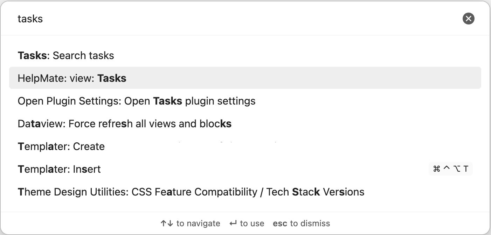
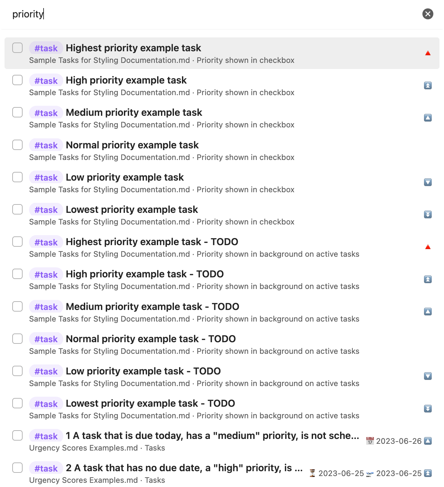

# Search Tasks

Use the `Tasks: Search tasks` command to find an incomplete task recognised by Tasks anywhere in your vault. If you use a [[Global Filter]], only tasks that match it are searchable.

Start typing in the search dialog to filter tasks by their description. The search is case-insensitive and uses ordinary text matching. It does not search task tags, file names, or headings.

Each result shows a non-interactive checkbox for the task status, the rendered task description, its source file name and preceding heading, and any priority, date or recurrence information. Select a result with the arrow keys and press Enter to open the source note at the task line. Press Esc to close the dialog.

You can assign a hotkey to `Tasks: Search tasks` in Obsidian's [Hotkeys settings](https://help.obsidian.md/Customization/Hotkeys).

> [!released]
> Introduced in Tasks X.Y.Z.
