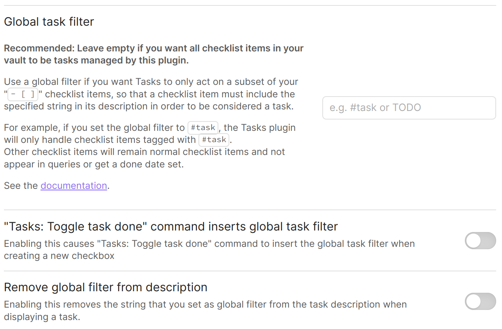
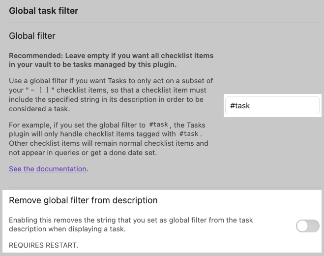

# Global Filter

> [!tip]
> Since Tasks 3.5.0, a new [[Global Query]] facility has been added, which offers a lot more flexibility than the Global Filter.

## Optional Global Filter

You can set a global filter in the settings so that Tasks only matches specific checklist items.
For example, you could set it to `#task` to only track checklist items as task if they include the string `#task`.
It doesn't have to be a tag. It can be any string.
Leave it empty to regard all checklist items as tasks.

Example with global filter `#task`:

```markdown
- [ ] #task take out the trash
```

If you don't have a global filter set, all regular checklist items will be considered a task:

```markdown
- [ ] take out the trash
```

> [!warning]
> If you use a tag such as `#task` as the global filter, you cannot add sub-tags to that tag.

## Settings for the Global Filter

The following settings in the Tasks Options pane control the vault's global filter.

Note you must restart Tasks after changing any settings here.


<span class="caption">Image of the settings options for the global filter, showing the default settings</span>


<span class="caption">Image showing the additional 'Remove global filter from description' setting that is shown when there is a global filter</span>

## Support

Before creating a new bug report or feature request about Global Filter, please check existing items to avoid duplicates.

You do not need to search manually: the links below are already filtered to the label `"scope: global filter"`.

- Check both Open and Closed items.
- If you find an existing item, support it there instead of adding a `+1` comment. See [[About Support and Help#How to support an existing request|How to support an existing request]].

| Type | Open | Closed | Notes |
| --- | --- | --- | --- |
| Issues | [Open](https://github.com/obsidian-tasks-group/obsidian-tasks/issues?q=is%3Aopen%20label%3A%22scope%3A+global+filter%22%20is%3Aissue%20) | [Closed](https://github.com/obsidian-tasks-group/obsidian-tasks/issues?q=is%3Aclosed%20label%3A%22scope%3A+global+filter%22%20is%3Aissue%20) | bug reports and feature requests |
| Discussions | [Open](https://github.com/obsidian-tasks-group/obsidian-tasks/discussions/categories/ideas-any-new-feature-requests-go-in-issues-please?discussions_q=is%3Aopen+label%3A%22scope%3A+global+filter%22+category%3A%22Ideas%3A+Any+New+Feature+Requests+go+in+Issues+please%22+sort%3Atop) | [Closed](https://github.com/obsidian-tasks-group/obsidian-tasks/discussions/categories/ideas-any-new-feature-requests-go-in-issues-please?discussions_q=is%3Aclosed+label%3A%22scope%3A+global+filter%22+category%3A%22Ideas%3A+Any+New+Feature+Requests+go+in+Issues+please%22+sort%3Atop) | older feature discussions from before late 2022 |

If you do not find an existing item in Issues or Discussions, see [[About Support and Help]] for how to report a bug or request a feature.
