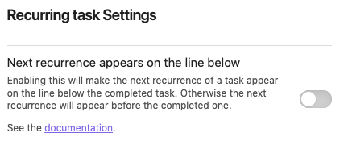
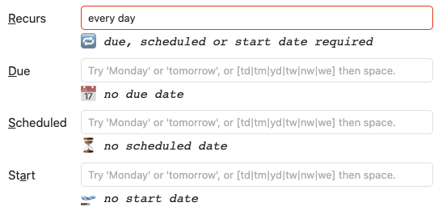

# Recurring Tasks (Repetition)

## Usage

Tasks can be recurring.
In order to specify a recurrence rule of a task, you must append the "recurrence signifier 🔁" followed by the recurrence rule.
For example: `🔁 every weekday` means the task will repeat every week on Monday through Friday.
Every recurrence rule has to start with the word `every`.

When you toggle the status of a recurring task to anything but "todo" (i.e. "done"), the original task that you wanted to toggle will be marked as done and get the done date appended to it, like any other task.

In addition, _a new task will be put one line above the original task_ by default.

See [[#Order of the new task]] below, for how to change this behaviour and make the new task appear _on the line below the original task_.

The new task will have updated dates based off the original task.

### Basic Example

Take as an example the following task:

```markdown
- [ ] take out the trash 🔁 every Sunday 📅 2021-04-25
```

If you mark the above task "done", the file will now look like this:

```markdown
- [ ] take out the trash 🔁 every Sunday 📅 2021-05-02
- [x] take out the trash 🔁 every Sunday 📅 2021-04-25 ✅ 2021-04-24
```

The next Sunday after 25 April 2021 is on 2 May.

Alternatively, if you have enabled addition of [[Dates#Created date|created dates]], the file will instead now look like this, showing the date that the new task was created:

```markdown
- [ ] take out the trash 🔁 every Sunday ➕ 2023-03-10 📅 2021-05-02
- [x] take out the trash 🔁 every Sunday 📅 2021-04-25 ✅ 2023-03-10
```

### Order of the new task

Use this setting to control where the recurring task is inserted. The default is to put the new task before the original one.



> [!released]
> Control of the location (or order) of the new task was introduced in Tasks 3.8.0

### Recurring Tasks with Custom Statuses

> [!Warning]
> If you use [[Custom Statuses]], please see [[Recurring Tasks and Custom Statuses]] for important information about how these two facilities interact.

## Repeating a Task Based on the Original Due Date or the Completion Date

When you create a recurring task, you can decide whether the next occurrence should be based on the original dates or the date when you completed the task.
The default behavior results in newly created tasks having dates relative to the original task rather than "today".

For example, given that today is the 13. February 2022 and you just completed the lower task:

```markdown
- [ ] sweep the floors 🔁 every week ⏳ 2021-02-13
- [x] sweep the floors 🔁 every week ⏳ 2021-02-06 ✅ 2022-02-13
```

Regardless of you having missed the original scheduled date by a week,
the newly created task is still scheduled just one week after the original scheduled date: the same day you completed the original task.

If you want to have tasks be scheduled relative to the "done" date rather than the original dates,
then you will need to add `when done` to the end of the recurrence rule.
Below is the same example as above, but this time the new task is scheduled based on the current date when you completed the task:

```markdown
- [ ] sweep the floors 🔁 every week when done ⏳ 2022-02-20
- [x] sweep the floors 🔁 every week when done ⏳ 2021-02-06 ✅ 2022-02-13
```

Now the newly created task is scheduled 1 week after the task was completed rather than 1 week after it was originally scheduled.

## How the New Date is Calculated: Repeating Monthly

Because calendar months differ in length, there are some pitfalls in monthly recurrence rules.

Below are some representative examples to demonstrate the differences in behavior, to help you choose which approach to use.

Note that there are several more month-based options in the [[#Examples]] section below.

### every month on the last: reliable and safe

Suppose we want a sequence of tasks to be due on the last day of each month.

The safest way to achieve that goal is to use `every month on the last`. This is specific about which day of the month to use, and so Tasks (or rather, the [rrule](https://github.com/jakubroztocil/rrule) library), calculates the new due date as intended.

Consider this task:

```markdown
- [ ] do stuff 🔁 every month on the last 📅 2022-01-31
```

When completing it several times, we would see that each new task is due on the last day of the next month:

```markdown
- [ ] do stuff 🔁 every month on the last 📅 2022-06-30
- [x] do stuff 🔁 every month on the last 📅 2022-05-31 ✅ 2022-05-31
- [x] do stuff 🔁 every month on the last 📅 2022-04-30 ✅ 2022-04-30
- [x] do stuff 🔁 every month on the last 📅 2022-03-31 ✅ 2022-03-31
- [x] do stuff 🔁 every month on the last 📅 2022-02-28 ✅ 2022-02-28
- [x] do stuff 🔁 every month on the last 📅 2022-01-31 ✅ 2022-01-31
```

### every month: if next calculated date does not exist, move new due date earlier

Suppose we start with this task:

```markdown
- [ ] do stuff 🔁 every month 📅 2021-10-31
```

Here, the recurrence rule `every month` has no opinion on the date, and so Tasks looks at the due date of the task being completed to calculate the next due date.

When completing it several times, we would see this:

```markdown
- [ ] do stuff 🔁 every month 📅 2022-03-28
- [x] do stuff 🔁 every month 📅 2022-02-28 ✅ 2022-02-28
- [x] do stuff 🔁 every month 📅 2022-01-30 ✅ 2022-01-30
- [x] do stuff 🔁 every month 📅 2021-12-30 ✅ 2021-12-30
- [x] do stuff 🔁 every month 📅 2021-11-30 ✅ 2021-11-30
- [x] do stuff 🔁 every month 📅 2021-10-31 ✅ 2021-10-31
```

Note how because `2021-11-31` does not exist, the due date is moved earlier, to `2021-11-30`.
From then on, the due date will be based on the 30th day of the month, unless changed manually.
Once February is reached, from then on, the due date will be based on the 28th day of the month.

This moving to earlier dates instead of skipping to the following month is especially important for recurrence patterns such as `every month when done`, which would otherwise sometimes skip occurrences when completing monthly tasks at the end of months with 31 days.

### every month on the 31st: skips months with fewer than 31 days

**Beware**: This is probably not the option you are looking for. If using it, be sure that you understand how it skips over months with fewer than 31 days.

Suppose we start with this task:

```markdown
- [ ] do stuff 🔁 every month on the 31st 📅 2022-01-31
```

Here, the user has specifically requested that the task happens on the 31st of the month.

In this case, if the new due date falls on a month with fewer than 31 days,  [rrule](https://github.com/jakubroztocil/rrule) skips forward to the next month until a valid date is found.

So, when completing the above task several times, we would see this, which skips over February, April and June:

```markdown
- [ ] do stuff 🔁 every month on the 31st 📅 2022-08-31
- [x] do stuff 🔁 every month on the 31st 📅 2022-07-31 ✅ 2022-07-31
- [x] do stuff 🔁 every month on the 31st 📅 2022-05-31 ✅ 2022-05-31
- [x] do stuff 🔁 every month on the 31st 📅 2022-03-31 ✅ 2022-03-31
- [x] do stuff 🔁 every month on the 31st 📅 2022-01-31 ✅ 2022-01-31
```

This is intentional. As well as matching what the user requested, it matches the [specification](https://datatracker.ietf.org/doc/html/rfc5545#section-3.3.10) of the [iCalendar RFC](https://tools.ietf.org/html/rfc5545) which the [rrule](https://github.com/jakubroztocil/rrule) library implements:

> Recurrence rules may generate recurrence instances with an invalid
 date (e.g., February 30) or nonexistent local time (e.g., 1:30 AM
 on a day when the local time is moved forward by an hour at 1:00
 AM).  Such recurrence instances MUST be ignored and MUST NOT be
 counted as part of the recurrence set.

## Priority of Dates

A task can have [[Dates|various dates]].
When a task has multiple dates, one of them is selected as reference date based on the following priorities:

1. Due date
2. Scheduled date
3. Start date

If more dates than the reference date exist on the original recurring task, the next occurrence will have the same dates.
All dates of the next occurring task will have the relative distance to the reference date that they had on the original task.

For example: A task has a due date and a scheduled date.
The scheduled date is set 2 days before the due date.
The task is set to repeat every two weeks.

```markdown
-   [ ] Mow the lawn 🔁 every 2 weeks ⏳ 2021-10-28 📅 2021-10-30
```

The new task will have the due date advanced by two weeks and a scheduled date that is two days before the due date, like on the original task.

```markdown
-   [ ] Mow the lawn 🔁 every 2 weeks ⏳ 2021-11-11 📅 2021-11-13
```

## Examples

Examples of possible recurrence rules (mix and match as desired; these should be considered inspirational):

- `🔁 every 3 days`
- `🔁 every 10 days when done`
- `🔁 every weekday` (meaning every Mon - Fri)
- `🔁 every week on Sunday`
- `🔁 every week on Tuesday, Friday` (meaning every Tuesday and Friday)
- `🔁 every 2 weeks`
- `🔁 every 3 weeks on Friday`
- `🔁 every 2 months`
- `🔁 every month on the 1st`
- `🔁 every month on the last`
- `🔁 every month on the last Friday`
- `🔁 every month on the 2nd last Friday`
- `🔁 every 6 months on the 2nd Wednesday`
- `🔁 every January on the 15th`
- `🔁 every February on the last`
- `🔁 every April and December on the 1st and 24th` (meaning every April 1st, April 24th, December 1st and December 24th)
- `🔁 every year`

## Limitations of Recurring Tasks

### Recurring tasks must have at least one date

> [!important]
> To be useful in date-based searches, a recurring task must have at least one of Due, Scheduled or Start dates. The so-called Reference date and the Recurrence rule must appear after the task's description.

Since Tasks 5.0.0, this is enforced by the [[Create or edit Task]] modal:



*Above: The 'Create or edit Task', with an error message saying a date must be set on a recurring task.*

> [!info] Detail
> Technically, you _can_ add a recurrence rule to a task without any dates, and there is nothing stopping anyone editing a task like to give it a recurrence rule but no date.
>
> However, it is not clear that the behaviour is useful, and based on Tasks support requests, it has been seen to confuse a number of users who misunderstand the expected search results.
>
> Here is a recurring task without any dates, that has been completed twice:
>
> ```text
> - [x] Do stuff 🔁 every day ✅ 2023-02-11
> - [x] Do stuff 🔁 every day ✅ 2023-02-13
> - [ ] Do stuff 🔁 every day
> ```
>
> These tasks are not searchable by the usual Due, Schedule, Starts or Happens date searches: we believe the majority of Tasks users find their tasks by searching for dates.

### Tasks in Daily Notes should not be recurring

> [!Important]
> Do not use `recurring` on tasks in daily notes, as it would create repeated copies of the task in _each_ daily note.

This is less a limitation of Tasks and more pattern occasionally asked about by users.

When entering repeating tasks into daily notes, the template will create the tasks for each appropriate date. In such cases, these tasks should not be set as recurring.

Repeating tasks can be managed effectively in the following ways:

- **Either** included in a daily note via a template and set as non-recurring (as each daily note will have its own copy of the task)
- **Or** placed in a file other than the daily note and set as recurring.

### Next recurrence is on non-existent date

> [!important]
> There are edge cases for tasks that recur monthly or yearly.
For example, a task may be due `2022-01-31` and recur `every 3 months`.
The next recurrence date of `2022-04-31` does not exist.

In that case, Tasks moves the next occurrence **backwards** to the next valid date.
In this case, that would be `2022-04-30`.

From then on, the due date will be based on the 30th day of the month, unless changed manually.
So the next occurrence would happen on `2022-07-30`, even though July has 31 days.

> [!important]
> With edge cases for tasks that recur monthly or yearly, **if the rule states the actual date of the next recurrence, Tasks will honour that instruction, skipping recurrence dates that do not exist**.

For example, a task may be due `2022-01-31` and recur `every month on the 31st`.
The next recurrence date of `2022-02-31` does not exist.

In that case, Tasks moves the next occurrence **forwards** to the next valid date,
skipping over recurrences with invalid dates.
In this case, that would be `2022-03-31`.

### In Reading mode, no feedback if rule is invalid

In the editor there is no direct feedback to whether your recurrence rule is valid.
You can validate that tasks understands your rule by using the `Tasks: Create or edit` command when creating or editing a task.

### No way to recur for x times

You can _not_ use rules where recurrence happens a certain number of times (`for x times`). Tasks doesn't link the tasks and does not know how often it occurred.

### No way to recur until a specific date

You can _not_ use rules where recurrence ends on a specific date (`until "date"`). There is a bug in [`rrule`](https://github.com/jakubroztocil/rrule) where `until "date"` rules are not converted to the correct text. As a consequence, every subsequent task's "until" date will be one day earlier than the one before. We are tracking this in [issue #1818](https://github.com/obsidian-tasks-group/obsidian-tasks/issues/1818).

### Recurrence rule lost if highest priority date is invalid

> [!important]
> If the highest priority date in a task does not exist (for example, due date is February 30th), when the task is completed the recurrence rule will disappear, and no new task will be created.

For example, consider the following task:

```text
- [ ] Do stuff 🔁 every year 🛫 2024-02-27 ⏳ 2024-02-28 📅 2024-02-30
```

Its highest priority date is the Due date - see [[Recurring Tasks#Priority of Dates|Priority of Dates]] -  which is invalid:  `2024-02-30`.

When this task is completed, the result will be:

```text
- [x] #task Do stuff 🛫 2024-02-27 ⏳ 2024-02-28 📅 Invalid date ✅ 2023-10-21
```

Note that:

- The recurrence rule has disappeared.
- No new task has been created.

This is detectable prior to completing the task by viewing the task in Reading Mode:

- the recurrence rule will be hidden,
- and the date will be displayed as 'Invalid date'.

## Technical Details

Tasks uses the [rrule](https://github.com/jakubroztocil/rrule) library to calculate the next date when completing a recurring task.
