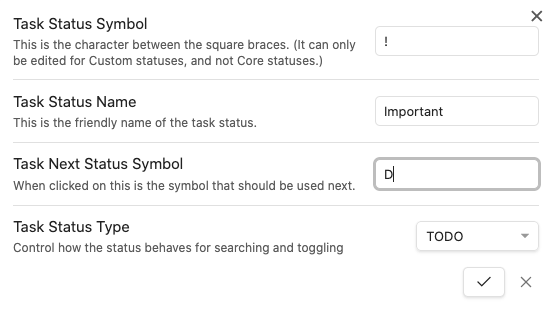

# Statuses

<span class="related-pages">#feature/statuses</span>

## Introduction

> [!released]
Custom Statuses were introduced in Tasks 1.23.0.

This page provides an overview of using Tasks with **Custom Statuses**, which some people refer to as Custom Checkboxes or Alternative/Alternate Checkboxes.

Here's the kind of thing that you can do:

 

### Related pages

Once you're comfortable with the background information in this page, further information is available in the following related pages.

- [[Style custom statuses|How to style custom statuses]].
- [[Set up custom statuses|How to set up your custom statuses]].
- [[About Status Collections]].
- [[Check your Statuses]].

## Do I need to set up statuses?

If you are happy with all your tasks beginning with `[ ]` and `[x]`, then **no**, you can just ignore Tasks' Statuses facility.

## About Statuses

### What IS a Status?

Every task in the Tasks plugin now has a Status.

Status is just Tasks' name for:

1. the character (`symbol`) between the `[` and `]` in a task line
2. AND some options that you can customise, to tell tasks how to treat all your tasks with that character.

Some obsidian users call them other names, like 'Alternative Checkboxes', but that is more about how they are displayed, rather than about the actual *behaviour* of tasks with particular statuses.

### What's IN a Status?

These are the options that you can modify, for each status:



Here is some more detail.

- **Status Symbol**
  - the single character in the `[]` at the start of the task.
  - this character will control what how tasks are rendered by your Theme or CSS Snippet.
- **Status Name**
  - a name for the status.
  - this is flexible: for custom statuses, you can use any name you wish.
  - is searchable with `status.name`, for example `status.name includes My custom in-progress status`.
- **Next Status Symbol**
  - the status symbol to use when the task is toggled.
- **Status Type**
  - one of `TODO`, `IN_PROGRESS`, `DONE`, `CANCELLED`, `NON_TASK`.
  - Tasks needs to know the type of each status, so that it knows how to treat them when searching, and what to do when tasks with the status are toggled.
  - types are searchable with `status.type`, for example `status.type is IN_PROGRESS`.
  - Also available:
    - `sort by status.type`
    - `group by status.type`
  - For more information, see [[Status Types]]

### Unknown Statuses

What happens if Tasks reads a line with a status symbol that it does not know about?

All such tasks are given a status called `Unknown`, with these properties:

| Property           | Value                                                               |
| ------------------ | ------------------------------------------------------------------- |
| Status Symbol      | The unrecognised character between the `[` and `]` in the task line |
| Status Name        | **Unknown**                                                         |
| Next Status Symbol | `x`                                                                 |
| Status Type        | `TODO`                                                              |

### Done date, Recurrence and Statuses

It is the Task Status Type changing **to** `DONE` that controls when:

- tasks **gain** their Done dates (if Done dates are enabled in settings),
- new copies of recurring tasks are created.

It is the Task Status Type changing **from** `DONE` that controls when:

- tasks **lose** their Done dates (if Done dates are enabled in settings).

See [[Recurring Tasks and Custom Statuses]] for a more thorough explanation of the above.

## What can Statuses do?

Now we have seen what is in a Status, what can we do with them?

We can use them to control what Tasks does when a task's checkbox is clicked, or toggled.

The [[Example Statuses]] page has a variety of examples, for inspiration.

## More about Statuses

### Core Statuses

Core statuses represent conventional markdown tasks:

```text
- [ ] I am a task that is not yet done
- [x] I am a task that has been done
```

They don't require any custom CSS styling or theming on order to display correctly in Tasks blocks or Live Preview.

Before Tasks 1.23.0, these were the only statuses that Tasks knew about.

See [[Core Statuses]] to find out more.

### Custom Statuses

Custom statuses represent any non-standard markdown tasks.

Here are some tasks with example custom statuses, that is, with non-standard characters between the `[` and `]`:

```text
- [X] Checked
- [-] A dropped/cancelled task
- [?] A question
- [/] A Half Done/In-progress task
```

They **require custom CSS styling or theming** on order to display correctly in Tasks blocks or Live Preview.

### What's the Big Deal?

People have been using themes and CSS snippets to style custom checkboxes in Obsidian all along.

What Tasks' custom statuses allow you to do is to **also customise the behaviour of your tasks**.

### Setting up Custom Statuses

<!-- force a blank line --><!-- include: snippet-statuses-overview.md -->

> [!info]
> Broad steps to understand and set up Statuses (or "Alternate Checkboxes"):
>
> - Understand what Statuses are:
>   - [[Statuses]]
>   - [[Custom Statuses]]
> - Choose your status styling scheme: this will determine the names and symbols for your custom statuses:
>   - Some common ones are shown in [[About Status Collections]]
> - Set up your status styling scheme
>   - [[Style custom statuses|How to style custom statuses]].
> - Configure Tasks to use your custom statuses
>   - [[Set up custom statuses|How to set up your custom statuses]]
>   - [[Check your Statuses]]
> - Optionally, update your tasks searches to take advantage of the new flexibility
>   - [[Filters#Filters for Task Statuses|Filters for Task Statuses]]

<!-- force a blank line --><!-- endInclude -->

## Using Statuses

### Editing your tasks

The [[Create or edit Task#Status|‘Create or edit Task’ Modal]] allows you to change the status of a task.

### Related commands

> [!info]
There are not yet any new commands for applying custom statuses.
We are tracking this in [issue #1486](https://github.com/obsidian-tasks-group/obsidian-tasks/issues/1486) .

### Related searches

- `done` - matches tasks with status types `DONE`, `CANCELLED` and `NON_TASK`
- `not done` - matches tasks with status types `TODO` and `IN_PROGRESS`
- **Status Name**
  - `status.name` text search
  - `sort by status.name`
  - `group by status.name`
- **Status Type**
  - `status.type` text search
  - `sort by status.type`
  - `group by status.type`

For details, see [[Filters#Filters for Task Statuses|Filters for Task Statuses]]

> [!info]
We envisage adding `status.symbol`. We are tracking this in [issue #1630](https://github.com/obsidian-tasks-group/obsidian-tasks/issues/1630).

## Credit: Sytone and the 'Tasks SQL Powered' plugin

This plugin's implementation of reading, searching and editing custom statuses was entirely made possible by the work of [Sytone](https://github.com/sytone) and his fork of Tasks called ['Tasks SQL Powered'](https://github.com/sytone/obsidian-tasks-x). [^task-x-version]

Where code in Tasks has been copied from 'Tasks SQL Powered', Sytone has been specifically credited as a co-author, that is, joint author, and these commits can be seen on the GitHub site: [Commits "Co-Authored-By: Sytone"](https://github.com/search?q=repo%3Aobsidian-tasks-group%2Fobsidian-tasks+%22Co-Authored-By%3A+Sytone%22&type=commits&s=committer-date&o=desc).

Subsequently, the custom statuses implementation in Tasks has diverged from the 'Tasks SQL Powered' significantly. However, none of the new features and fixes would have been possible without Sytone's foundation work, for which we are very grateful.

[^task-x-version]: 'Tasks SQL Powered' as of [revision 2c0b659](https://github.com/sytone/obsidian-tasks-x/tree/2c0b659457cc80806ff18585c955496c76861b87) on 2 August 2022
