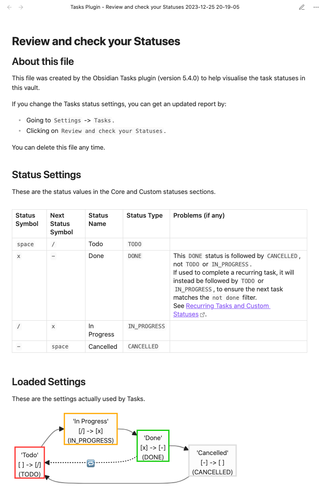

# Check your Statuses

#feature/statuses

> [!released]
> Introduced in Tasks 5.1.0.

## Overview

At any time you can **validate** and **visualise** your custom statuses, using the **'Review and check your Statuses' button** in Tasks' [[Status Settings]].

## The output file

- A Markdown report is written to the root of the vault.
- Example file name:
  - `Tasks Plugin - Review and check your Statuses 2023-11-08 21-30-15`
- By adding the date and time to the end of the file name, you can create a series of reports, and review the differences.
- You can of course delete the files at any time.

## Content of the report

The sections are:

- **About this file**
  - An introduction.
- **Status Settings**
  - A table of the statuses in your settings.
  - Here you can find advice on any potential issues in your status settings.
- **Loaded Settings**
  - This has a **Mermaid diagram** showing transitions between your statuses.
  - View the report in Live Preview or Reading Mode, to see the diagram.

## Example statuses report

Here is an example report, that is generated from the problem statuses shown in [[Recurring Tasks and Custom Statuses#When DONE is not followed by TODO or IN_PROGRESS|When DONE is not followed by TODO or IN_PROGRESS]]:

 
*Example statuses report*
