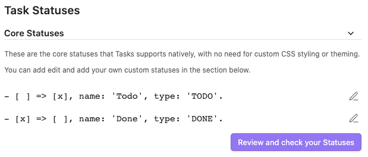

# Core Statuses

<span class="related-pages">#feature/statuses</span>

## Overview

Core statuses represent conventional markdown tasks:

```text
- [ ] I am a task that is not yet done
- [x] I am a task that has been done
```

They don't require any custom CSS styling or theming on order to display correctly in Tasks blocks or Live Preview.

## Core Statuses in Settings

This is what the Core Statuses look like initially in Tasks' settings:



Note that `Todo` is followed by `Done`, in order to preserve compatibility with earlier Tasks releases.

> [!info]
You can edit the 'Todo' core status to make its Next Status Symbol be `/` and enable `Todo` -> `In Progress` -> `Done`, if you prefer.

> [!Tip]
> Use the "Review and check your Statuses" button at any time to [[Check your Statuses]] and to visualise them.

## Editing core statuses

The only restriction on editing core statuses is that you cannot change their Status Symbols.

You are free to rename them, change their next character, and even change their Status Type, should you wish.

## Details

And this is how you can use them:

<!-- placeholder to force blank line before included text --><!-- include: DocsSamplesForStatuses.test.DefaultStatuses_core-statuses.approved.md -->

| Status Symbol | Next Status Symbol | Status Name<br>`status.name includes...`<br>`sort by status.name`<br>`group by status.name` | Status Type<br>`status.type is...`<br>`sort by status.type`<br>`group by status.type` | Needs Custom Styling |
| ----- | ----- | ----- | ----- | ----- |
| `space` | `x` | Todo | `TODO` | No |
| `x` | `space` | Done | `DONE` | No |

<!-- placeholder to force blank line after included text --><!-- endInclude -->
