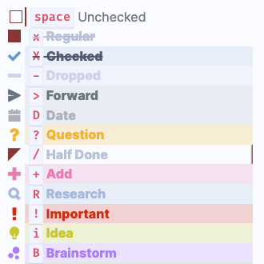

# Custom Statuses

<span class="related-pages">#feature/statuses</span>

## Introduction

> [!released]
Custom Statuses were introduced in Tasks 1.23.0.

Custom statuses represent any non-standard markdown tasks.

Here are some tasks with example custom statuses, that is, with non-standard characters between the `[` and `]`:

```text
- [X] Checked
- [-] A dropped/cancelled task
- [?] A question
- [/] A Half Done/In-progress task
```

They **require custom CSS styling or theming** in order to display correctly in Tasks blocks or Live Preview.

Here's the kind of thing that you can do with custom statuses and styling:

 

## What's the Big Deal?

People have been using themes and CSS snippets to style custom checkboxes in Obsidian all along.

What Tasks' custom statuses allow you to do is to **also customise the behaviour of your tasks**.

## Default custom statuses

This is what the Custom Statuses look like initially in Tasks' settings, showing the two custom statuses that Tasks provides by default:


And this is how you can use them:

<!-- placeholder to force blank line before included text --><!-- include: DocsSamplesForStatuses.test.DefaultStatuses_custom-statuses.approved.md -->

| Status Symbol | Next Status Symbol | Status Name<br>`status.name includes...`<br>`sort by status.name`<br>`group by status.name` | Status Type<br>`status.type is...`<br>`sort by status.type`<br>`group by status.type` | Needs Custom Styling |
| ----- | ----- | ----- | ----- | ----- |
| `/` | `x` | In Progress | `IN_PROGRESS` | Yes |
| `-` | `space` | Cancelled | `CANCELLED` | Yes |

<!-- placeholder to force blank line after included text --><!-- endInclude -->

## Setting up your custom statuses

<!-- force a blank line --><!-- include: snippet-statuses-overview.md -->

> [!info]
> Broad steps to understand and set up Statuses (or "Alternate Checkboxes"):
>
> - Understand what Statuses are:
>   - [[Statuses]]
>   - [[Custom Statuses]]
> - Choose your status styling scheme: this will determine the names and symbols for your custom statuses:
>   - Some common ones are shown in [[About Status Collections]]
> - Set up your status styling scheme
>   - [[Style custom statuses|How to style custom statuses]].
> - Configure Tasks to use your custom statuses
>   - [[Set up custom statuses|How to set up your custom statuses]]
>   - [[Check your Statuses]]
> - Optionally, update your tasks searches to take advantage of the new flexibility
>   - [[Filters#Filters for Task Statuses|Filters for Task Statuses]]

<!-- force a blank line --><!-- endInclude -->

### First choose your styling scheme

You can use any snippet or theme you wish. If you are already using a snippet or theme that supports "custom checkboxes", you should stick with that.

If, however, you are using the default theme, or a theme that doesn't know style "custom checkboxes", you will need to pick one.

[[About Status Collections]] has a list of the ones that Tasks already has one-click support for, to help you choose.

### Install your styling scheme

For example, you could follow [[Style custom statuses|How to style custom statuses]].

### Editing custom statuses

Your choice of styling facility will determine which letters and characters you wish to use in your custom statuses.

Now you can follow [[Set up custom statuses|How to set up your custom statuses]].

Or you can read about [[Status Settings]], and see how to [[Editing a Status|edit a Status]].

> [!warning]
Remember to set up your chosen CSS Snippet or Theme before setting up the custom statuses.
