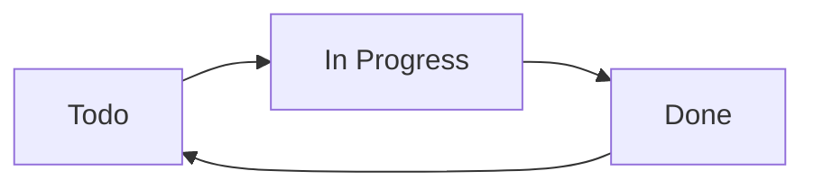
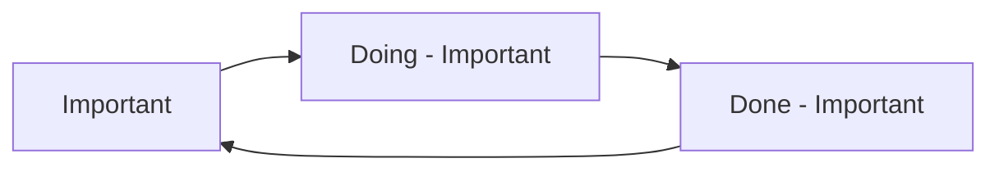
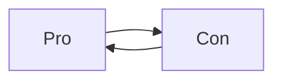
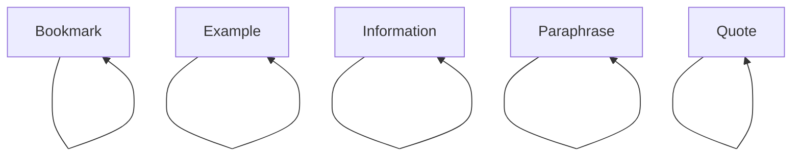

# Example Statuses

## Overview

Once we know what [[Statuses]] are, what can we do with them?

Here are some example scenarios, for inspiration.

## Todo -> In Progress -> Done

You can tweak Tasks' `Todo` status so that it toggles to 'In Progress', which then toggles to 'Done'.

This might be useful if you have a few slightly more time-consuming tasks to keep an eye on. Perhaps you would like to prioritise finishing things that are in progress before starting something new?

<!-- placeholder to force blank line before included text --> <!-- include: DocsSamplesForStatuses.test.DefaultStatuses_todo-in_progress-done.approved.md -->

| Status Symbol | Next Status Symbol | Status Name | Status Type | Needs Custom Styling |
| ----- | ----- | ----- | ----- | ----- |
| `space` | `/` | Todo | `TODO` | No |
| `/` | `x` | In Progress | `IN_PROGRESS` | Yes |
| `x` | `space` | Done | `DONE` | No |

<!-- placeholder to force blank line after included text --> <!-- endInclude -->

## Separate cycle for Important tasks

Sometimes I have a few really important tasks that I wish to stand out from the crowd, and several Themes make `!` tasks stand out visually, so I find this works really well.

By using non-standard symbols for the `IN_PROGRESS` and `DONE` statuses, if I decide to later re-open one of these completed tasks, it automatically goes on to `!` again.

<!-- placeholder to force blank line before included text --> <!-- include: DocsSamplesForStatuses.test.DefaultStatuses_important-cycle.approved.md -->

| Status Symbol | Next Status Symbol | Status Name | Status Type | Needs Custom Styling |
| ----- | ----- | ----- | ----- | ----- |
| `!` | `D` | Important | `TODO` | Yes |
| `D` | `X` | Doing - Important | `IN_PROGRESS` | Yes |
| `X` | `!` | Done - Important | `DONE` | Yes |

<!-- placeholder to force blank line after included text --> <!-- endInclude -->

## Pro and Con checkboxes - which toggle to each other

If I'm brain-storming ideas for things I am stuck on, writing a list of Pros and Cons sometimes helps.

Happily, some themes use `P` and `C` for these. Others use `p` and `c`.

Either way, I can make them toggle to each other, and by giving them the type `NON_TASK`, I can exclude them from my Tasks searches, as I don't see them as actionable.

<!-- placeholder to force blank line before included text --> <!-- include: DocsSamplesForStatuses.test.DefaultStatuses_pro-con-cycle.approved.md -->

| Status Symbol | Next Status Symbol | Status Name | Status Type | Needs Custom Styling |
| ----- | ----- | ----- | ----- | ----- |
| `P` | `C` | Pro | `NON_TASK` | Yes |
| `C` | `P` | Con | `NON_TASK` | Yes |

<!-- placeholder to force blank line after included text --> <!-- endInclude -->

## Ignoring clicks and toggles

Suppose you have some statuses which are purely for display purposes: they will definitely never be used for actionable tasks, and if you click on one by mistake, you do not want it to toggle or get a Done date.

There is a nice property that statuses with the same Status Symbol and Next Status Symbol - and a type other than `DONE` - do nothing when they are toggled.

Here are some statuses from the ITS Theme where this behaviour might be useful.

<!-- placeholder to force blank line before included text --> <!-- include: DocsSamplesForStatuses.test.DefaultStatuses_toggle-does-nothing.approved.md -->

| Status Symbol | Next Status Symbol | Status Name | Status Type | Needs Custom Styling |
| ----- | ----- | ----- | ----- | ----- |
| `b` | `b` | Bookmark | `NON_TASK` | Yes |
| `E` | `E` | Example | `NON_TASK` | Yes |
| `I` | `I` | Information | `NON_TASK` | Yes |
| `P` | `P` | Paraphrase | `NON_TASK` | Yes |
| `Q` | `Q` | Quote | `NON_TASK` | Yes |

<!-- placeholder to force blank line after included text --> <!-- endInclude -->
