# Recurring Tasks and Custom Statuses

<span class="related-pages">#feature/statuses</span>

> [!Note]
> This page assumes basic familiarity with [[Recurring Tasks]].
>
> Also, for examples in this page we adjusted the Tasks settings so that [[Recurring Tasks#Order of the new task|new task recurrences are added *below* the previous one.]]

## Determining the next status

When you click on the checkbox of a task, the Tasks plugin applies the following logic: ^[Except when the task status has type `NON_TASK`. See [[#When the current status type is NON_TASK]] for an example.]

1. When a task line checkbox is clicked, the next status symbol is looked up in the user's Task plugin's [[Status Settings]].
2. If the next status symbol is of type `DONE`:
    - A [[Dates#Done date|Done date]] is added (if enabled in user settings).
    - If the task line has a Recurrence rule, a new task is created, with the next status symbol after the `DONE` symbol.
    - If that next status is neither `TODO` nor `IN_PROGRESS`, a different status is chosen. See [[#When DONE is not followed by TODO or IN_PROGRESS]] below.

> [!Important]
> Every time Tasks detects you clicked on a task checkbox, the plugin reads the current status symbol - inside the `[` and `]` - and looks it up in your Tasks status settings, to determine what the next status symbol will be.

## Worked example, with recurring task

### Starting point

Suppose that we have adjusted the default Tasks settings slightly, to give us the **following Tasks status settings**:

<!-- include: DocsSamplesForStatuses.test.DefaultStatuses_todo-in_progress-done.approved.detailed.mermaid.md -->

<!-- endInclude -->

And we have selected the Tasks setting to put [[Recurring Tasks#Order of the new task|the new recurrence below the initial one]].

Now imagine we have the **following task line**:

```text
- [ ] Do something 🔁 every day 📅 2023-10-15
```

- It is a recurring task.
- It recurs every day.
- And it is due on `2023-10-15` (today).

### First click - advances to IN_PROGRESS

The **first time we click on the task's checkbox** or run Tasks' **Toggle task done** command, the line becomes:

```text
- [/] Do something 🔁 every day 📅 2023-10-15
```

- Notice that `[ ]` has become `[/]` ...
  - ... because the next status symbol after `space` is `/`.
- From the settings, we see the status type is now `IN_PROGRESS`.

### Second click - advances to DONE and recurs

The **next time we click on the task's checkbox** or run Tasks' **Toggle task done** command we toggle the task, the line becomes **two lines**:

```text
- [x] Do something 🔁 every day 📅 2023-10-15 ✅ 2023-10-15
- [ ] Do something 🔁 every day 📅 2023-10-16
```

Let's look at that in more detail.

### Breaking down the result

Let's look at the **first of those two lines:**

```text
- [x] Do something 🔁 every day 📅 2023-10-15 ✅ 2023-10-15
```

- Notice that `[/]` has become `[x]` ...
  - ... because the next status symbol after `/` is `x`.
- From the settings, we see the status type is now `DONE`.
- So a [[Dates#Done date|Done date]] is added (if enabled in user settings).

Let's look at the **second of those two lines**:

```text
- [ ] Do something 🔁 every day 📅 2023-10-16
```

- This new task line was created because:
  - the original task had a Recurrence rule,
  - and its status type had advanced to `DONE`.
- Notice that in the new task line, the status is `[ ]` ...
  - ... because the next status symbol after `x` is ``.
- And the Due date has advanced a day.

## When DONE is not followed by TODO or IN_PROGRESS

In the following example, `DONE` is followed by `CANCELLED`.

```mermaid
flowchart LR

classDef TODO        stroke:#f33,stroke-width:3px;
classDef DONE        stroke:#0c0,stroke-width:3px;
classDef IN_PROGRESS stroke:#fa0,stroke-width:3px;
classDef CANCELLED   stroke:#ddd,stroke-width:3px;
classDef NON_TASK    stroke:#99e,stroke-width:3px;

1["'Todo'<br>[ ] -> [/]<br>(TODO)"]:::TODO
2["'Done'<br>[x] -> [-]<br>(DONE)"]:::DONE
3["'In Progress'<br>[/] -> [x]<br>(IN_PROGRESS)"]:::IN_PROGRESS
4["'Cancelled'<br>[-] -> [ ]<br>(CANCELLED)"]:::CANCELLED
1 --> 3
2 --> 4
2-. "🔁" .-> 1
3 --> 2
4 --> 1

linkStyle default stroke:gray
```

<!-- include: DocsSamplesForStatuses.test.DefaultStatuses_done-toggles-to-cancelled.approved.detailed.mermaid.md -->

<!-- endInclude -->

> [!important] Status type for next recurrence: always `TODO` or `IN_PROGRESS`
> When toggling a recurring task creates the next recurrence, it only makes sense for the new task to be `TODO` or `IN_PROGRESS`, so that the new task is found by `not done` searches.)
>
> The dashed arrow with "recurring" emoji in the above diagram indicates that Tasks will skip the `Cancelled` status for new recurrences, and jump to `Todo`.

This means that even though the new recurrence of any completed recurring tasks looks like it will always be `CANCELLED`, tasks will look at the other statuses in the loop and:

1. It will follow the arrows, and select the first `TODO` status it finds.
2. If there wasn't a `TODO` found, it will follow the arrows again, and select the first `IN_PROGRESS` status it finds.
3. If that fails too, it will just select the status symbol `space` .

> [!example]
> For example, when the following task is toggled, in a vault with the status settings in the diagram above:
>
> ```text
> - [/] Do something 🔁 every day 📅 2024-10-16
> ```
>
> ... it will become ...
>
> ```text
> - [x] Do something 🔁 every day 📅 2024-10-16 ✅ 2023-10-16
> - [ ] Do something 🔁 every day 📅 2024-10-17
> ```
>
> Note that the new task has `TODO` status, so it will show up in standard Tasks searches.

> [!released]
> This improved selection of status for new recurrences was introduced in Tasks 5.4.0.

## When the current status type is NON_TASK

[[Status Types#NON_TASK|NON_TASK]] is a special status type to use for checklists that do not represent tasks.

<!-- include: DocsSamplesForStatuses.test.DefaultStatuses_pro-con-cycle.approved.detailed.mermaid.md -->

<!-- endInclude -->

With the above custom statuses in Tasks settings, clicking on task lines with checkboxes `[P]` and `[C]` will:

- never add a Done date
- never create a new instance, even if the task line has a recurrence rule.
