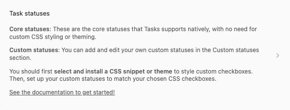
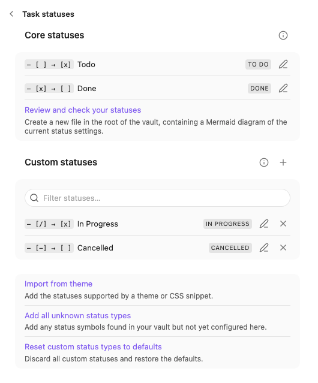
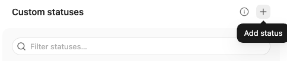
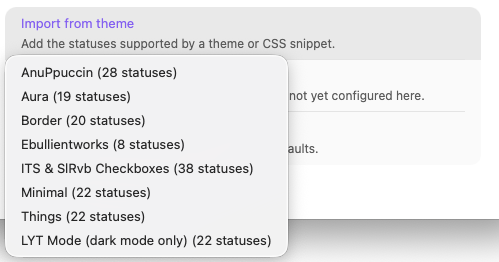
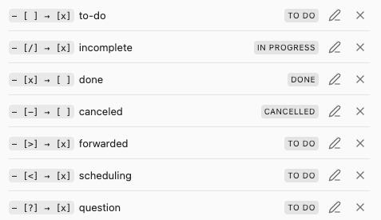
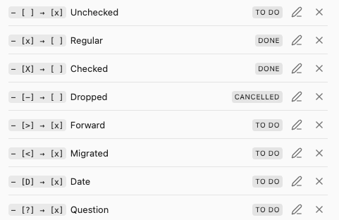
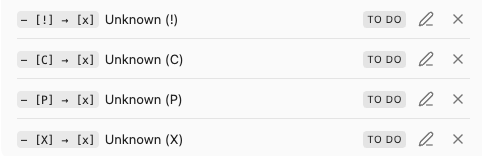

# Status Settings

#feature/statuses

## Overview

1. First click on the "Task Statuses" section in the Tasks settings:

    
    Entry to Tasks Statuses Settings

2. You will then see:

     
    *Initial Task Statuses Settings*

There are two sections:

1. **Core statuses**
    - These are statuses that are built in to Tasks, and cannot be deleted.
    - They are the two task types that are built in to Obsidian and Tasks natively: `[ ]` and `[x]`.
    - Their status symbols cannot be changed.
    - All their other properties can be edited.
2. **Custom statuses**
    - These statuses are what many themes call 'custom checkboxes'.
    - You will need to choose and install a Theme or CSS Snippet that supports 'custom checkboxes'
    - Tasks automatically adds `[/]` and `[-]`
    - And this is where you can add your own custom statuses.

We also see that each status consists of:

- **Status Symbol** (for example, `x` and  `-`)
- **Status Name** (for example, 'In Progress')
- **Next Status Symbol** (for example, `x` and `space`)
- **Status Type** (one of `TODO`, `DONE`, `IN_PROGRESS` or `CANCELLED`)

## Add New Task Status

Click the **+** button to add a new custom status.

 
*An empty Status, which can be edited and deleted*

You can then fill in the details for your new Status: see [[Editing a Status]].

## Bulk-adding Statuses

You can click on **Import from theme** to show a menu that allows you to add all the custom statuses that are supported by a theme or CSS snippet.

The "Import from theme" menu

### Minimal

This button populates the Custom Statuses list with all the statuses supported by the Minimal Theme.

You may wish to delete the default custom statuses first, so that you only see the Minimal statuses.

 
*The first few statuses supported by Minimal*

The [[Minimal Theme]] page shows the full list statuses that will be added, and what they look like in that theme.

### ITS Theme & SlRvb Checkboxes

This button populates the Custom Statuses list with all the statuses supported by the ITS Theme, and also the identical SlRvb's Alternate Checkboxes.

 
*The first few statuses supported by ITS Theme and SlRvb's Alternate Checkboxes*

You can see screenshots, and the statuses that will be added:

- [[SlRvb's Alternate Checkboxes|SlRvb’s Alternate Checkboxes]]
- [[ITS Theme]]

### Other supported themes

Tasks knows about a growing list of custom checkboxes in Themes and CSS Snippets.

You can find a full list, with screenshots and complete details of the supported checkboxes, in [[About Status Collections]].

### Add All Unknown Status Types

This searches all the tasks in your vault for any with status symbols that are not already in Tasks settings.
It then creates a new custom status for each unknown status symbol.

The new statuses are sorted by their symbols.
This can be a convenient way to populate the Custom Statuses settings.

For example, in a vault that has already used a few custom statuses, we might see:

 
*Example result from adding all Unknown statuses*

## Reset custom status types to defaults

This resets the entire Custom Statuses section back to its default list.

This allows you to try out each of the buttons above, and if you don't like them, you can quickly undo their changes.

## Limitations and Issues

- Any statuses in the settings with the same symbol as any earlier statuses will be ignored.
  - There is no visual feedback in the settings pane if there are any duplicates
  - You have to confirm the actually loaded statuses by running the 'Create or edit task' command and looking at the Status drop-down.
- The Core and Custom Status sections in the settings are collapsible, but they keep expanding.
  - The mechanism to remember which sections were collapsed is not yet working.
- Usability wise, it would be good if the 'Add New Task Status' button opened the modal to immediately edit the new status.
- Ideally, the lists of statuses, with their delete and edit buttons, would be a table instead, with the ability to edit the properties directly in the table, instead of having to open up a modal.

> [!Tip]
> Use [[Check your Statuses]] to easily find any issues with your Custom Statuses.
