# Task Dependencies

> [!released]
> Introduced in Tasks X.Y.Z.

## Introduction

At a high level, task dependencies define the order in which you want to work on a set of tasks.
This can be useful for mapping out projects, where one part needs to be completed before the other.
By specifying these dependencies, Obsidian Tasks can streamline your workflow by displaying only the tasks that are actionable at any given moment.

> [!NOTE]
> Obsidian tasks exclusively allows for 'Finish to start (FS)' dependencies, meaning Task A needs to be finished before you start on Task B. You can learn more about this concept [on Wikipedia](https://en.wikipedia.org/wiki/Dependency_(project_management)).

## Sample dependency

Here is an example dependency, to tell Tasks that ==the second task cannot be started until the first task is completed==:

%%
### Tasks Emoji Format
%%

- The first task has an **`id`** field with the value `abcdef`.
- The second task has a **`dependsOn`** the same value `abcdef`, which is a reference or pointer to the first task.

```mermaid
flowchart BT

classDef TASK        stroke-width:3px,font-family:monospace;

2["- [ ] do this first 🆔 abcdef"]:::TASK
1["- [ ] do this after first ⛔️ abcdef"]:::TASK
1-- depends --> 2

linkStyle default stroke:gray
```



%%
### Dataview Format


%%

See [[Dataview Format#Dataview Format for Dependencies|Dataview Format for Dependencies]] for the dataview equivalent.

## Dependency fields

### `id`

Task `id` values consistent of **one or more of the following allowed characters**:

- `abcdefghijklmnopqrstuvwxyz`
- `ABCDEFGHIJKLMNOPQRSTUVWXYZ`
- `0123456789`
- underscore (`_`)
- hyphen (`-`)

The following are examples of valid `id` values:

- `1`
- `2`
- `hftw84745`
- `task_1`
- `do-me-first`

Task `id` values are intended to be **unique across the whole vault**, each different `id` being only used on one task. However, there is no checking for this.

%%
#### Duplicate `id` values

This section commented out for now, because although the search handles tasks with duplicate `id` well, the Edit Task modal does not make clear when a task depends on the same `id` multiple times.

Task `id` values are *intended* to be unique across the whole vault.

However, a task that depends on an `id` that occurs multiple times in your vault will depend on *all* those other tasks. You can use this to your advantage, if you want to quickly make one task depend on a long list of other tasks.
%%

### `dependsOn`

Task `dependsOn` values consist of:

- one or more `id` values of other tasks
- separated by commas (`,`) with optional spaces allowed.

The following are valid `dependsOn` values:

- `1`
- `dcf64c,0h17ye`
- `dcf64c, 0h17ye`

## Example

To illustrate the concept of task dependencies, let's consider a scenario where we are outlining the tasks required to develop an application. Two tasks are identified:

```text
- [ ] Build a first draft
- [ ] Test with users
```

In this scenario, testing with users can only occur after the initial draft is completed. To establish this relationship, you can create a dependency between the two tasks using either of the following methods.

1. Open the 'Build a first draft' task in the Edit Task Modal and specify 'Test with users' as a 'Blocking' task
2. Alternatively, open the 'Test with users' task in the Edit Task Modal and add 'Build a first draft' as a 'Blocked By' task
    ![[task-dependencies-blocked-by-example.png]]

By implementing either of these methods, the task list is updated to reflect the dependency relationship:

```text
- [ ] Build a first draft 🆔 4ijuhy
- [ ] Test with users ⛔️ 4ijuhy
```

Then, if the query `is not blocked` is used

    ```tasks
    is not blocked
    ```

We only see 'Build a first draft'

```text
- [ ] Build a first draft 🆔 4ijuhy
```

Until this task is marked as complete, at which time Obsidian Tasks sees that 'Test with users' is no longer blocked, and displays it as well

```text
- [x] Build a first draft 🆔 4ijuhy
- [ ] Test with users ⛔️ 4ijuhyz
```

## Nomenclature

Fields:

- `dependsOn`
- `id`

UI:

- Blocked by [implies an id of another task]
- Blocks

Query

- blocking
- blocked

## Adding Dependencies

## Using Dependencies in Tasks Searches

- [[Filters#Filters for Task Dependencies]]
- [[Sorting#Sort by Task Dependencies]]
- [[Grouping#Group by Task Dependencies]]

`is not blocked`

`is blocking`

![[Pasted image 20231011181837.png]]

## Known Limitations

- It's not yet possible to directly navigate from a task to the tasks it depends on.
- Outside of the edit task modal, it is not possible to see the descriptions of the blocking tasks.
- It is not yet possible to visualise the relationships in a graph viewer.
- The [[Urgency]] score does not account for task dependencies. We are tracking this in [issue #2655](https://github.com/obsidian-tasks-group/obsidian-tasks/issues/2655).
