# Task Dependencies

## Introduction

> [!released]
> Task Dependencies were introduced in Tasks 6.1.0.

At a high level, task dependencies define the order in which you want to work on a set of tasks.
This can be useful for mapping out projects, where one part needs to be completed before the other.
By specifying these dependencies, Obsidian Tasks can streamline your workflow by displaying only the tasks that are actionable at any given moment.

> [!NOTE]
> The Tasks plugin exclusively allows for 'Finish to start (FS)' dependencies, meaning Task A needs to be finished before you start on Task B. You can learn more about this concept [on Wikipedia](https://en.wikipedia.org/wiki/Dependency_(project_management)).

> [!Tip]
> This page explains the dependencies facility and how to use it.
>
> For an explanation of how to add and edit dependencies between tasks, see [[Create or edit Task#Dependencies]].

## Sample dependency

Here is an example dependency, to tell Tasks that ==the second task cannot be started until the first task is completed==:

### Tasks Emoji format sample

- The first task has an **`id`** field with the value `abcdef`.
- The second task has a **`dependsOn`** which is the same value `abcdef`, and is a reference or pointer to the first task.

```mermaid
flowchart BT

classDef TASK        stroke-width:3px,font-family:monospace;

2["- [ ] do this first 🆔 abcdef"]:::TASK
1["- [ ] do this after first ⛔ abcdef"]:::TASK
1-- depends on --> 2

linkStyle default stroke:gray
```



### Dataview format sample

In Dataview format, the above would be written as:


## Defining dependencies

### `id`

Task `id` values consistent of **one or more of the following allowed characters**:

- `abcdefghijklmnopqrstuvwxyz`
- `ABCDEFGHIJKLMNOPQRSTUVWXYZ`
- `0123456789`
- underscore (`_`)
- hyphen (`-`)

The following are examples of valid `id` values:

- `1`
- `2`
- `hftw84745`
- `task_1`
- `do-me-first`

Task `id` values are intended to be **unique across the whole vault**, each different `id` being only used on one task. However, there is no checking for this.

%%
#### Duplicate `id` values

This section commented out for now, because although the search handles tasks with duplicate `id` well, the Edit Task modal does not make clear when a task depends on the same `id` multiple times.

Task `id` values are *intended* to be unique across the whole vault.

However, a task that depends on an `id` that occurs multiple times in your vault will depend on *all* those other tasks. You can use this to your advantage, if you want to quickly make one task depend on a long list of other tasks.
%%

### `dependsOn`

Task `dependsOn` values consist of:

- one or more `id` values of other tasks
- separated by commas (`,`) with optional spaces allowed.

The following are valid `dependsOn` values:

- `1`
- `dcf64c,0h17ye`
- `dcf64c, 0h17ye`

## Editing dependencies

Below is a worked example, walking through adding one dependency.

For more detailed explanations of how to add and edit dependencies between tasks, see [[Create or edit Task#Dependencies]] and [[Auto-Suggest#Details]].

### Worked example

To illustrate the concept of task dependencies, let's consider a scenario where we are outlining the tasks required to develop an application. Two tasks are identified:

```text
- [ ] Build a first draft
- [ ] Test with users
```

In this scenario, testing with users can only occur after the initial draft is completed. To establish this relationship, you can create a dependency between the two tasks using either of the following methods.

#### Option 1: Use the Edit Task Modal

Using the [[Create or edit Task]] modal, you can:

1. **Either:**
    - open the **'Build a first draft'** task in the Edit Task Modal
    - and specify **'Test with users'** in **After this**.
1. **Or:**
    - open the **'Test with users'** task in the Edit Task Modal
    - and add **'Build a first draft'** in **Before this**.


<span class="caption">Making the **'Test with users'** task depend on the **'Build a first draft'** task.</span>

#### Option 2: Use the Auto-Suggest feature

Using the [[Auto-Suggest]] feature, when in **Source mode** or **Live Preview** you can add the dependency without leaving the editor:

> [!Tip]
> This is an optional first step, if you want to control the `id` used:
>
> 1. Click at the end of the `Build a first draft`.
> 1. Start typing `id` and select `🆔 id`.
> 1. There are then two options:
>     - You can select `generate unique id` to generate an ID automatically.
>     - Or you can specify your own.

To create the dependency:

1. Click at the end of the `Test with users` line.
1. Start typing `id` or `dep`, and select `⛔ depends on id`.
1. Start typing the task on which it should depend (`Build a first draft`)
1. Click on the `Build a first draft` task, to add the dependency.
1. Press the enter key. If no ID has been entered, an ID is generated for the task.

> [!info]
> When selecting `⛔ depends on id`:
>
> - To depend on multiple tasks, type a comma after the last id in an existing `depends on` value, and select another task.
> - It only searches/shows descriptions of not-done tasks.
> - It initially filters to show tasks in the same file ('closer' to the Task), but if you type more text, it will search all non-done tasks in the vault.
> - Do not create Circular Dependencies between tasks.

#### The Result

By implementing any of these methods, the task list is updated to reflect the dependency relationship:

```text
- [ ] Build a first draft 🆔 4ijuhy
- [ ] Test with users ⛔ 4ijuhy
```

Then, if the query `is not blocked` is used

    ```tasks
    is not blocked
    ```

We only see 'Build a first draft'

```text
- [ ] Build a first draft 🆔 4ijuhy
```

Until this task is marked as complete, at which time Obsidian Tasks sees that 'Test with users' is no longer blocked, and displays it as well

```text
- [x] Build a first draft 🆔 4ijuhy
- [ ] Test with users ⛔ 4ijuhyz
```

## Search concepts

`id` and `dependsOn` indicate dependency ordering relationships between tasks, that is, an order in which tasks should be done.

When using those dependencies in searches, we define two more relationships: `blocking` and `blocked`.

### Blocking tasks

> [!Summary]
> Tasks are `blocking` when:
>
> 1. they are not yet done
> 2. and there is at least one other task **directly depending on them**, that is also not yet done.
>
> You might wish to work on blocking tasks first, in order to un-block later tasks.

A task is `blocking` if:

- It is `TODO` or `IN_PROGRESS`.
- And any of the tasks that **directly depend on it** are also `TODO` or `IN_PROGRESS`.

Note that:

- Only direct dependencies are considered.
- Tasks with status type `DONE`, `CANCELLED` or `NON_TASK` are never treated as `blocking`.

Search for `blocking` tasks with:

````text
```tasks
is blocking
```
````

### Blocked tasks

> [!Summary]
> Tasks are `blocked` when:
>
> 1. they are not yet done
> 2. and there is at least one other task **they directly depend on**, that is also not yet done.
>
> They cannot yet be worked on.

A task is `blocked` if:

- It is `TODO` or `IN_PROGRESS`.
- And any of the tasks **it directly depends on** are also `TODO` or `IN_PROGRESS`.

Note that:

- Only direct dependencies are considered.
- Tasks with status type `DONE`, `CANCELLED` or `NON_TASK` are never treated as `blocked`.

Search for `blocked` tasks with:

````text
```tasks
is blocked
```
````

### Non-blocked tasks

To find tasks which are **not** `blocked` and *can* be acted on, use:

````text
```tasks
not done
is not blocked
```
````

### Demonstration of blocking and blocked

> [!Example] Blocking occurs
> If *both* ends of a `dependsOn` link are `TODO` or `IN_PROGRESS`, blocking occurs:
>
> ```mermaid
> flowchart BT
>
> classDef TASK        stroke-width:3px,font-family:monospace;
>
> 2["- [ ] this is blocking  🆔 abcdef"]:::TASK
> 1["- [ ] this is blocked&nbsp ⛔ abcdef"]:::TASK
> 1-- depends on --> 2
>
> linkStyle default stroke:gray
> ```

> [!Example] No blocking
> If *either* end of  `dependsOn` link is `DONE`, `CANCELLED` or `NON_TASK`, no blocking occurs:
>
> ```mermaid
> flowchart BT
>
> classDef TASK        stroke-width:3px,font-family:monospace;
>
> 4["- [ ] not blocking  🆔 abcdef"]:::TASK
> 3["- [x] not blocked&nbsp ⛔ abcdef"]:::TASK
> 3-- depends on --> 4
>
> linkStyle default stroke:gray
> ```

> [!Example] A mixture
> A task is only un-blocked when *all* of the tasks it `dependsOn` have been `DONE` or `CANCELLED` (or marked as `NON_TASK`):
>
> ```mermaid
> flowchart BT
>
> classDef TASK        stroke-width:3px,font-family:monospace;
>
> 5["- [x] not blocking  🆔 abcdef"]:::TASK
> 4["- [ ] blocking 🆔 ghijkl"]:::TASK
> 3["- [ ] blocked ⛔ abcdef,ghijkl"]:::TASK
> 3-- depends on --> 5
> 3-- depends on --> 4
>
> linkStyle default stroke:gray
> ```

## Using Dependencies in Tasks Searches

### Filters

The built-in filters relating to task dependencies are:

```text
is blocking
is not blocking
is blocked
is not blocked

has id
no id
id (includes|does not include) <string>
id (regex matches|regex does not match) /<JavaScript-style Regex>/

has depends on
no depends on
```

See details in [[Filters#Filters for Task Dependencies|Filters for Task Dependencies]].

### Sorting

The only built-in sort instruction relating to task dependencies is:

```text
sort by id
```

See [[Sorting#Sort by Task Dependencies|Sort by Task Dependencies]].

### Grouping

The only built-in group instruction relating to task dependencies is:

```text
group by id
```

See [[Grouping#Group by Task Dependencies|Group by Task Dependencies]].

### Task Properties

See [[Task Properties#Values for Task Dependencies|Task property values for Task Dependencies]].

## Known Limitations

- It's not yet possible to directly navigate from a task to the tasks it depends on.
- Outside of the edit task modal, it is not possible to see the descriptions of the blocking tasks.
- It is not yet possible to visualise the relationships in any kind of graphical view.
- The [[Urgency]] score does not account for task dependencies. We are tracking this in [issue #2655](https://github.com/obsidian-tasks-group/obsidian-tasks/issues/2655).
