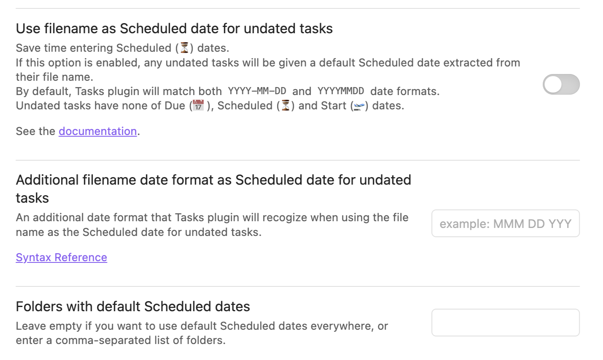

# Use Filename as Default Date

## Automatic scheduled date

> [!released]
>
> - Introduced in Tasks 1.18.0.
> - Support for filenames exactly matching a custom format added in 7.6.0.

You can automatically set a scheduled date for tasks based on the name of their files. This feature can be enabled in the
settings, via the option `Use filename as Scheduled date for undated tasks`. Changing this requires a restart of Obsidian.

This allows you, for instance, to make all the tasks in your daily notes be considered as scheduled. You can then
query them using the `scheduled` and `happens` [[Filters|filters]].

Example query :

````text
```tasks
scheduled before today
group by scheduled
not done
```
````

> [!info] Seeing implied dates
>
> - The task is not visually modified in any Obsidian views: the scheduled date is only implied, and not displayed.
> - It will however appear in the [[Create or edit Task|edit dialog]].
> - It can also be examined by using the `group by scheduled` instruction in a tasks block.

## Rules

For the scheduled date to be automatically set from the file name, the following rules apply :

- the setting 'Use filename as Scheduled date for undated tasks' must be enabled, and Obsidian restarted,
- the task must have no existing scheduled date, due date or start date,
- one of these must be true:
  1. either the file name must **contain** a date in the format `YYYY-MM-DD` or `YYYYMMDD`,
  2. or the file name must **exactly equal** an additional date format which has been added using the [[Use Filename as Default Date#Additional date format|additional date format setting]]),
- the file must be in one of the configured folders or its sub-folders if [[#Folders setting|that setting is enabled]].

Examples of file names that contain the built-in date formats:

```text
daily/2022-10-12 Wednesday.md
meetings/rd. 2022-09-07.md
20220612 - random thoughts.md
```

## Settings

The following image shows the settings relating to this feature:


<span class="caption">Use filename as Scheduled date for undated tasks settings</span>

### Additional date format
> [!released]
> Introduced in tasks 7.6.0.

By default, only the date formats `YYYY-MM-DD` and `YYYYMMDD` will be matched.

This setting allows you to specify an additional date format to be matched for this feature.

> [!warning]
> Note that unlike the `YYYY-MM-DD` and `YYYYMMDD` date formats, this setting does not support prefixes or suffixes in file names at this time. The custom additional date format must be an exact match to the file.
>
> So if the additional format is `MMM D YYYY`:
>
> - A file `Jan 4 2024.md` would be detected as the date `2024-01-04`.
> - A file `Notes from Jan 4 2024.md` wouldn't be recognised as having a date.

See the [syntax reference](https://momentjs.com/docs/#/displaying/format/) for supported date formats.

> [!example] Example 1
> If you have a daily note in `daily/Jun 20 2024`, then you could use the date format `MMMM Do YYYY` to automatically set tasks within that file as scheduled on that date.

> [!example] Example 2
> If your Daily Notes core plugin settings specifies a Date format with folders:
>
> ```text
> YYYY/MM/dddd, MMMM Do YYYY
> ```
>
> Then you would want to put this text in as the additional filename date format:
>
> ```text
> dddd, MMMM Do YYYY
> ```

> [!example] Example 3 - Weekly notes
> If you use Weekly notes, you can specify the format of the weekly note name, and then Tasks will select the first day of the week as the default scheduled date. For example, if using typical weekly note names like `2024-W49`:
>
> ```text
> YYYY-[W]ww
> ```

### Folders setting

If the `Folders with default Scheduled dates` field is left empty in the settings dialog, default dates are applied to un-dated tasks all the
files in the vault.

A comma-separated list of folders can be entered to limit the scope. Default dates will then only be applied to undated tasks in all files in the specified folders and their subfolders.

Examples:

| Folders setting   | Matching files                                                                          | Not matching                               |
| ----------------- | --------------------------------------------------------------------------------------- | ------------------------------------------ |
| (empty)           | `20221022.md`<br/>`daily/20221012.md`                                                   |                                            |
| `daily`           | `daily/2022-10-12.md`<br/>`daily/notes/2022-10-12.md`                                   | `20221022.md`<br/>`meetings/2022-10-12.md` |
| `daily,prj/daily` | `daily/2022-10-12.md`<br/>`prj/daily/2022-10-12.md`<br/>`prj/daily/notes/2022-06-12.md` | `20221022.md`<br/>`meetings/2022-10-12.md` |

> [!warning]
> Folders with a comma (`,`) in their name are not supported.

## Limitations

### Apply setting to selected folders

Folders with a comma (`,`) in their name are not supported.

### Exact matching for additional date format

Unlike the `YYYY-MM-DD` and `YYYYMMDD` date formats, if an additional custom date format is provided, it will not support prefixes or suffixes and will only match files following the exact format provided.
