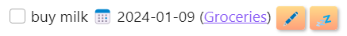

# How to style task buttons

<span class="related-pages">#css</span>

## Motivation and assumptions

In Tasks results, by default each task is displayed with two buttons &ndash;
one to [[Create or edit Task|edit]] the task, and one to [[Postponing|postpone]] the task, using corresponding icons.
In the current version of Tasks they look they this:


At least they look like this on Windows 11 -
icons may appear slightly different on different platforms.

If you don't like how these icons look, this guide shows how you can modify their appearance.

We assume that you know how to [use CSS snippets in Obsidian](https://help.obsidian.md/How+to/Add+custom+styles#Use+Themes+and+or+CSS+snippets).

## Monochrome buttons

As you see, the default buttons are colorful which some people may find distracting. If you prefer monochrome buttons, you can simply convert the buttons to grayscale via [this CSS snippet](https://github.com/obsidian-tasks-group/obsidian-tasks/blob/main/resources/sample_vaults/Tasks-Demo/.obsidian/snippets/tasks-buttons-gray.css):

<!-- snippet: resources/sample_vaults/Tasks-Demo/.obsidian/snippets/tasks-buttons-gray.css -->
```css
.tasks-edit, .tasks-postpone {
    filter: grayscale(100%);
}
```
<!-- endSnippet -->

This gives us this result:


Or you can use alternative characters instead, which are monochromatic by default, like in [this CSS snippet](https://github.com/obsidian-tasks-group/obsidian-tasks/blob/main/resources/sample_vaults/Tasks-Demo/.obsidian/snippets/tasks-buttons-alt.css):

<!-- snippet: resources/sample_vaults/Tasks-Demo/.obsidian/snippets/tasks-buttons-alt.css -->
```css
.tasks-edit::after {
    content: '\1f589';
}

.tasks-postpone::after {
    content: '\2bee';
}
```
<!-- endSnippet -->

This would look like so:


Note that the unicode characters used here are from Unicode version 7 and 8 and
may not yet be supported on all platforms. If you want to support more platforms,
you should choose characters from Unicode 6 that are more widely available.

## More style, please

If you want to make the buttons look more like real buttons and give them some color, this is also possible, like in [this CSS snippet](https://github.com/obsidian-tasks-group/obsidian-tasks/blob/main/resources/sample_vaults/Tasks-Demo/.obsidian/snippets/tasks-buttons-stylish.css):

<!-- snippet: resources/sample_vaults/Tasks-Demo/.obsidian/snippets/tasks-buttons-stylish.css -->
```css
.tasks-edit::after {
    content: '\1f58b';
}

.tasks-postpone::after {
    content: '\1f4a4';
}

.tasks-edit, .tasks-postpone {
    background: linear-gradient(to bottom, #ffda89, #ffa07a);
    padding: 2px 5px;
    border-radius: var(--radius-s);
    box-shadow: 2px 2px 4px rgba(0, 0, 0, 0.3);
}
```
<!-- endSnippet -->

This example snippet result in the follow style:



## Back to the roots

This section shows how to recreate the pre-Tasks 6.0.0 appearance of the Edit button.

You can also use your own graphics instead of existing unicode characters, like in [this example CSS snippet](https://github.com/obsidian-tasks-group/obsidian-tasks/blob/main/resources/sample_vaults/Tasks-Demo/.obsidian/snippets/tasks-buttons-svg.css):

<!-- snippet: resources/sample_vaults/Tasks-Demo/.obsidian/snippets/tasks-buttons-svg.css -->
```css
.tasks-edit, .tasks-postpone {
    background-color: var(--text-faint);
    -webkit-mask-size: contain;
    margin-left: .66em;
    display: inline-block;
}

.tasks-edit {
    -webkit-mask-image: url("data:image/svg+xml,%3Csvg%20xmlns%3D%22http%3A%2F%2Fwww.w3.org%2F2000%2Fsvg%22%20xmlns%3Axlink%3D%22http%3A%2F%2Fwww.w3.org%2F1999%2Fxlink%22%20aria-hidden%3D%22true%22%20focusable%3D%22false%22%20width%3D%221em%22%20height%3D%221em%22%20style%3D%22-ms-transform%3A%20rotate(360deg)%3B%20-webkit-transform%3A%20rotate(360deg)%3B%20transform%3A%20rotate(360deg)%3B%22%20preserveAspectRatio%3D%22xMidYMid%20meet%22%20viewBox%3D%220%200%201536%201536%22%3E%3Cpath%20d%3D%22M363%201408l91-91l-235-235l-91%2091v107h128v128h107zm523-928q0-22-22-22q-10%200-17%207l-542%20542q-7%207-7%2017q0%2022%2022%2022q10%200%2017-7l542-542q7-7%207-17zm-54-192l416%20416l-832%20832H0v-416zm683%2096q0%2053-37%2090l-166%20166l-416-416l166-165q36-38%2090-38q53%200%2091%2038l235%20234q37%2039%2037%2091z%22%20fill%3D%22%23626262%22%2F%3E%3C%2Fsvg%3E");
}

.tasks-postpone {
    -webkit-mask-image: url("data:image/svg+xml,%3Csvg%20xmlns%3D%22http%3A%2F%2Fwww.w3.org%2F2000%2Fsvg%22%20xmlns%3Axlink%3D%22http%3A%2F%2Fwww.w3.org%2F1999%2Fxlink%22%20aria-hidden%3D%22true%22%20focusable%3D%22false%22%20width%3D%221em%22%20height%3D%221em%22%20style%3D%22-ms-transform%3A%20rotate%28360deg%29%3B%20-webkit-transform%3A%20rotate%28360deg%29%3B%20transform%3A%20rotate%28360deg%29%3B%22%20preserveAspectRatio%3D%22xMidYMid%20meet%22%20viewBox%3D%220%200%201536%201536%22%3E%3Cpath%20d%3D%22M45%20-115q-19%20-19%20-32%20-13t-13%2032v1472q0%2026%2013%2032t32%20-13l710%20-710q9%20-9%2013%20-19v710q0%2026%2013%2032t32%20-13l710%20-710q9%20-9%2013%20-19v678q0%2026%2019%2045t45%2019h128q26%200%2045%20-19t19%20-45v-1408q0%20-26%20-19%20-45t-45%20-19h-128q-26%200%20-45%2019t-19%2045v678q-4%20-10%20-13%20-19l-710%20-710%20q-19%20-19%20-32%20-13t-13%2032v710q-4%20-10%20-13%20-19z%22%20fill%3D%22%23626262%22%2F%3E%3C%2Fsvg%3E");

}

.tasks-edit::after, .tasks-postpone::after {
    content: none;
}
```
<!-- endSnippet -->

The CSS snippet above shows the buttons with a similar look as in earlier versions of Tasks:


When using graphics, it is also guaranteed that the icons look the same on all platforms.

## Text-based buttons

And finally, if you prefer simple text-based buttons which would look more like links, then [this CSS snippet](https://github.com/obsidian-tasks-group/obsidian-tasks/blob/main/resources/sample_vaults/Tasks-Demo/.obsidian/snippets/tasks-buttons-text.css) shows how to do it:

<!-- snippet: resources/sample_vaults/Tasks-Demo/.obsidian/snippets/tasks-buttons-text.css -->
```css
.tasks-edit, .tasks-postpone {
    font-size: var(--font-ui-smaller);
    font-variant: small-caps;
    font-weight: bold;
    margin-left: 1em;
}

.tasks-edit::after {
    content: '[edit]';
}

.tasks-postpone::after {
    content: '[move]';
}
```
<!-- endSnippet -->

The CSS snippet above results in the following style:


## Related pages

For details on styling tasks with CSS, see [[Styling]].
