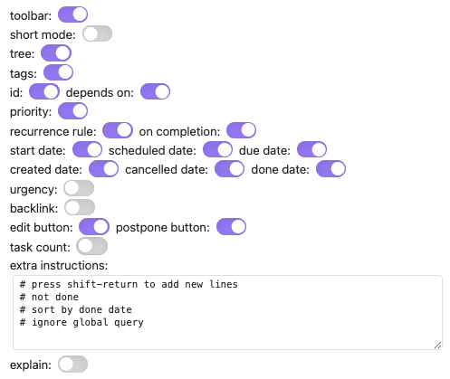

# How to make a query user interface

<span class="related-pages">#plugin/meta-bind</span>

## Meta Bind Tasks User Interface to Query File Defaults

> [!released]
> Query File Defaults were introduced in Tasks 7.15.0.

The [[Meta Bind Plugin]] allows Obsidian users to make their notes interactive with inline input fields, metadata displays, and buttons.

We can combine:

1. The Tasks plugin's [[Query File Defaults]] facility, based on specific properties named `TQ_*`,
2. The Meta Bind plugin's ability to create widgets to modify note properties.

... to create a User Interface to easily adjust your Tasks searches, that can:

- show and hide each of the task properties,
- enable or disable other search features, such as nested tasks, short mode, backlink and buttons,
- and allow arbitrary extra instructions to be added:


<span class="caption">Meta Bind widgets to edit Query File Defaults</span>

## How to set it up

Follow these steps, which assume you have already [turned off Obsidian's Restricted mode](https://help.obsidian.md/Extending+Obsidian/Plugin+security):

1. Install and enable the [Meta Bind](https://obsidian.md/plugins?search=Meta%20Bind) plugin.
2. Copy the Markdown code-block below.
3. Paste the Markdown in to a note in Obsidian that has one or more Tasks searches.
4. Switch to Live Preview or Reading modes, to see the widgets.
5. After experimenting, delete any labels and widgets that you do not need.

<!-- snippet: DocsSamplesForDefaults.test.DocsSamplesForDefaults_meta-bind-widgets-snippet.approved.md -->
```md
short mode: `INPUT[toggle:TQ_short_mode]`
tree: `INPUT[toggle:TQ_show_tree]`
tags: `INPUT[toggle:TQ_show_tags]`
id: `INPUT[toggle:TQ_show_id]` depends on: `INPUT[toggle:TQ_show_depends_on]`
priority: `INPUT[toggle:TQ_show_priority]`
recurrence rule: `INPUT[toggle:TQ_show_recurrence_rule]` on completion: `INPUT[toggle:TQ_show_on_completion]`
start date: `INPUT[toggle:TQ_show_start_date]` scheduled date: `INPUT[toggle:TQ_show_scheduled_date]` due date: `INPUT[toggle:TQ_show_due_date]`
created date: `INPUT[toggle:TQ_show_created_date]` cancelled date: `INPUT[toggle:TQ_show_cancelled_date]` done date: `INPUT[toggle:TQ_show_done_date]`
urgency: `INPUT[toggle:TQ_show_urgency]`
backlink: `INPUT[toggle:TQ_show_backlink]`
edit button: `INPUT[toggle:TQ_show_edit_button]` postpone button: `INPUT[toggle:TQ_show_postpone_button]`
task count: `INPUT[toggle:TQ_show_task_count]`
extra instructions: `INPUT[textArea:TQ_extra_instructions]`
explain: `INPUT[toggle:TQ_explain]`
```
<!-- endSnippet -->

## Why provide this?

Some might say that this mechanism is perhaps a little awkward, and wouldn't it be good for Tasks to provide its own user interface?

We agree, and we are tracking this in [issue #2579](https://github.com/obsidian-tasks-group/obsidian-tasks/issues/2579).

However, the development process went something like this:

1. Teach Tasks to use [[Obsidian Properties#Using Query Properties in Searches|query properties in searches]].
2. Discover that generating Tasks instructions from simple `true`/`false` properties required some really rather complex JavaScript code inside user queries, which was:
    - horrible for us to document,
    - horrible for users to have to copy and understand, cluttering up their searches.
3. Implement the [[Query File Defaults]] mechanism.
4. Discover that using Obsidian's [Properties view](https://help.obsidian.md/Plugins/Properties+view) core plugin was *sort-of-OK*, but:
    - it was a little tedious opening and closing that side-panel,
    - it does not do a very good job editing multi-line strings, which are useful with `TQ_extra_instructions`.
5. Experiment with [[Meta Bind Plugin]] and decide this use of it is a relatively easy and big step forward, until such time as Obsidian has its own user interface!
