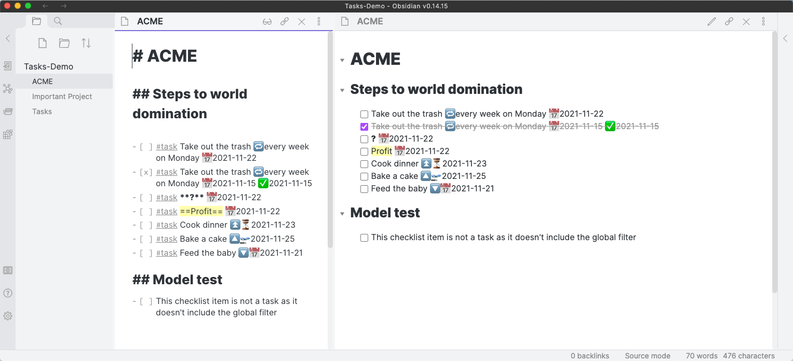
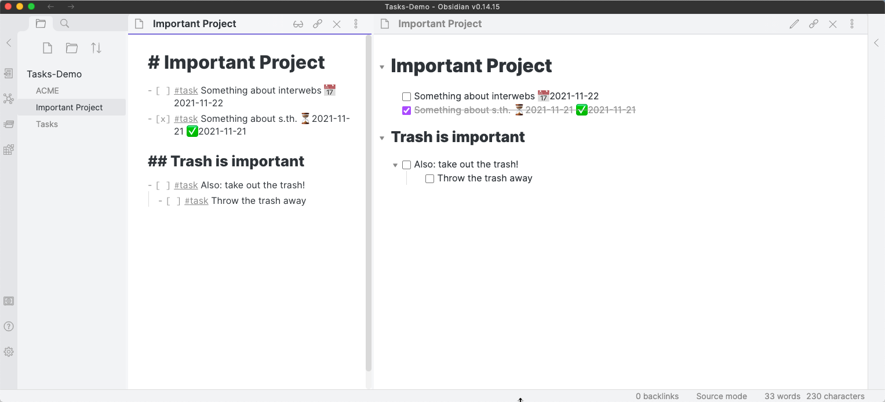

# Introduction

## Navigation around this site

These are the main pages and sections, that connect to all the pages here:

> [!Info] Navigation
> ### Basics
>
> - [[About Getting Started|Getting Started ...]]
>   - [[About Statuses|Statuses ...]]
> - [[About Editing|Editing...]]
> - [[About Queries|Queries ...]]
> - [[Quick Reference]]
>
> ### Advanced and Detail
>
> - [[About Scripting|Scripting ...]]
> - [[About Advanced|Advanced ...]]
> - [[About Other Plugins|Other Plugins ...]]
> - [[About Reference|Reference ...]]
>   - [[About Status Collections|Status Collections ...]]
>   - [[About Task Formats|Task Formats ...]]
>
> ### Help
>
> - [[About How Tos|How Tos ...]]
> - [[About Support and Help|Support and Help ...]]
> - [[Changelog|Changelog...]]

## Task management for the Obsidian knowledge base

Track tasks across your entire [Obsidian](https://obsidian.md/) vault.
Query them and mark them as done wherever you want.
Supports due dates, recurring tasks (repetition), done dates, sub-set of checklist items, and filtering.

You can toggle the task status in any view or query and it will update the source file.

## Screenshots

- _All screenshots assume the global filter `#task` which is not set by default (see also "Getting Started")._
- _The theme is default Obsidian theme._

The `ACME` note has some tasks.

The `Important Project` note also has some tasks.

The `Tasks` note gathers all tasks from the vault and displays them using queries.

The `Tasks: Create or edit` command helps you when editing a task.
