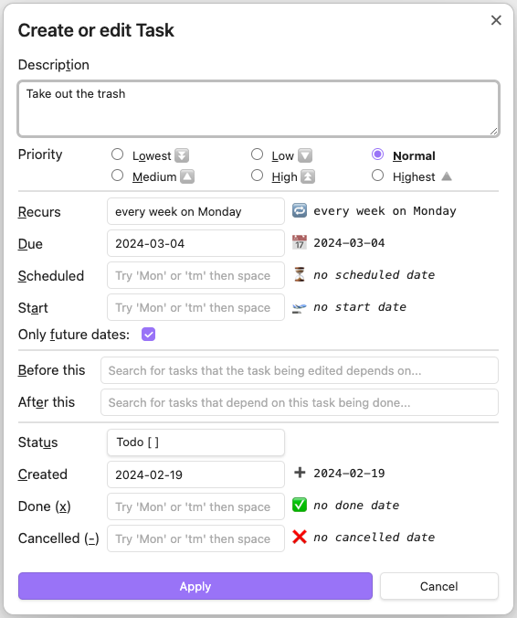

# Introduction

## What's New?

_In recent [releases](https://github.com/obsidian-tasks-group/obsidian-tasks/releases)..._

<!--
    Keep to around 2 to 4 lines, so that 'Navigation around this site' is visible.
    Move the older ones down to the top of the comment block below...
-->

- 5.2.0: 🔥 Most query instructions can now include [[About Queries#Capitals in Query Instructions - Case Insensitivity|capital letters]].
- 5.1.0: 🔥 Add 'Review and check your Statuses' facility: see [[Check your Statuses|check your statuses]].
- 5.1.0: 🔥 Enable [[Custom Filters|custom filters]] and [[Custom Grouping|custom grouping]] to use [[Query Properties|query properties]] directly - no placeholders required.

<!--
- 5.0.0: 🔥 Add [[Line Continuations|line continuations]].
  - **Warning**: This is a [[Line Continuations#Appendix Updating pre-5.0.0 searches with trailing backslashes|potentially breaking change]] if you search for backslash (`\`) characters.
- 5.0.0: 🔥 Document [[Comments#Inline comments|inline comments]]
- 5.0.0: 🔥 Document [[Recurring Tasks and Custom Statuses|recurring tasks and custom statuses]]
- 5.0.0: 🔥 Add new Help pages [[Known Limitations]] and [[Breaking Changes]].
- 4.9.0: 🔥 Add [[Task Properties|task properties]] `task.priorityNameGroupText` and `task.status.typeGroupText`, for example:
  - `group by function task.priorityNameGroupText + ': ' + task.status.typeGroupText`
- 4.9.0: 🔥 Add [[Task Properties#Values in TasksDate Properties|task date properties]] for categorising dates, for example:
  - `group by function task.due.category.groupText`
- 4.9.0: 🔥 Add [[Task Properties#Values in TasksDate Properties|task date properties]] for grouping dates by [time from now](https://momentjs.com/docs/#/displaying/fromnow/), for example:
  - `group by function task.due.fromNow.groupText`
- 4.8.0: 🔥 Add [[Query Properties#Values for Query File Properties|query file properties]] `query.file.pathWithoutExtension` and `query.file.filenameWithoutExtension`
- 4.8.0: 🔥 Add [[Task Properties#Values for File Properties|task file properties]] `task.file.pathWithoutExtension` and `task.file.filenameWithoutExtension`
- 4.7.0: 🔥 Use [[Query Properties]] and [[Placeholders]] to filter and group with the query's file path, root, folder and name.
- 4.6.0: 🔥 Add `on or before` and `on or after` to [[Filters#Date search options|date search options]]
- 4.6.0: 🔥 Add `in or before` and `in or after` to [[Filters#Date range options|date range search options]]
- 4.5.0: 🔥 Support task in list items starting with [[Getting Started#Finding tasks in your vault|`+` signs]]
- 4.4.0: 🔥 Support [[Expressions#More complex expressions|variables, if statements, and functions]] in custom filters and groups
- 4.3.0: 🔥 Bug fixes, usability improvements and `explain` support for [[Regular Expressions|regular expression]] searches
- 4.2.0: 🔥 Add [[Custom Filters|custom filtering]]
- 4.1.0: 🔥 Add [[Layout|hide and show tags]]
- 4.0.0: 🔥 Add [[Custom Grouping|custom grouping]], using [[Task Properties|task properties]] to create [[expressions|expressions]] - the start of a whole new [[About Scripting|scripting]] world in Tasks!
- 3.9.0: 🔥 Add [[Priority#Priorities and Order|lowest and highest]] priorities
- 3.8.0: 🔥 Add [[Limiting#Limit number of tasks in each group|limiting tasks per group]]
- 3.8.0: 🔥 Add option to control the [[Recurring Tasks#Order of the new task|order of new recurring tasks]]
- 3.7.0: 🔥 Add [[Grouping#Reversing groups|reverse sorting of groups]]
- 3.6.0: 🔥 Add [[Grouping#Urgency|group by urgency]]
- 3.6.0: 🔥 Add [[Sorting#Recurrence|sort by recurring]]
- 3.5.0: 🔥 New [[Global Query]] facility.
- 3.4.0: 🔥 Clicking on a [[Backlinks|Backlink]] jumps to the exact task line.
- 3.4.0: Tasks now requires at least Obsidian 1.1.1.
- 3.3.0: 🔥 Multiple [[About Task Formats|Task Format]] support - starting with [[Dataview Format]].
-->

## Navigation around this site

These are the main pages and sections, that connect to all the pages here:

> [!Info] Navigation
> ### Basics
>
> - [[Installation]]
> - [[About Getting Started|Getting Started ...]]
>   - [[About Statuses|Statuses ...]]
> - [[About Queries|Queries ...]]
> - [[Quick Reference]]
>
> ### Advanced and Detail
>
> - [[About Scripting|Scripting ...]]
> - [[About Advanced|Advanced ...]]
> - [[About Other Plugins|Other Plugins ...]]
> - [[About Reference|Reference ...]]
>   - [[About Status Collections|Status Collections ...]]
>   - [[About Task Formats|Task Formats ...]]
>
> ### Help
>
> - [[About How Tos|How Tos ...]]
> - [[About Support and Help|Support and Help ...]]
> - [[Useful Links]]

## Task management for the Obsidian knowledge base

Track tasks across your entire [Obsidian](https://obsidian.md/) vault.
Query them and mark them as done wherever you want.
Supports due dates, recurring tasks (repetition), done dates, sub-set of checklist items, and filtering.

You can toggle the task status in any view or query and it will update the source file.

> Please submit bugs using [[Report a Bug]].
>
> Please submit ideas using the [Feature Request form](https://github.com/obsidian-tasks-group/obsidian-tasks/issues/new?assignees=&labels=type%3A+enhancement&template=feature-request.yaml).
>
> Please ask for help in the [Q&A Discussions section](https://github.com/obsidian-tasks-group/obsidian-tasks/discussions/categories/q-a) by clicking **New discussion**.
>
> Please share any interesting or fun uses of tasks in the [Show and Tell Discussions section](https://github.com/obsidian-tasks-group/obsidian-tasks/discussions/categories/show-and-tell) by clicking **New discussion**.

For changes in each release, please check the [releases page](https://github.com/obsidian-tasks-group/obsidian-tasks/releases).

## Screenshots

- *All screenshots assume the global filter `#task` which is not set by default (see also "Getting Started").*
- *The theme is default Obsidian theme.*

The `ACME` note has some tasks.

The `Important Project` note also has some tasks.

The `Tasks` note gathers all tasks from the vault and displays them using queries.

The `Tasks: Create or edit` command helps you when editing a task.
