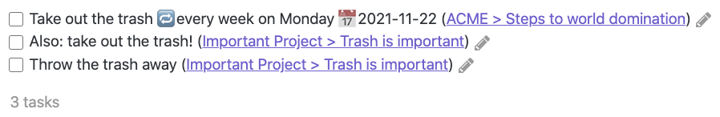

# Backlinks

#feature/backlinks

## What are backlinks?

In Tasks search results, by default each task is displayed with its filename,
and the name of the previous heading, for example `(ACME > Steps to world domination)`.
This is called a **backlink**.

This screenshot shows what this might look like, with some sample data:

If the filename and previous heading are identical, or if there is no previous heading, only the filename is shown.

## Using backlinks for navigation

You can click on a backlink to navigate directly to the task's source line.

> [!Tip]
> This honours the standard Obsidian keyboard modifiers used when clicking on internal links, to control how the note is opened (Navigate, New Tab, New Tab Group, New Window).
>
> See the table in the Tabs section of the [Obsidian 1.0.0 release notes](https://obsidian.md/changelog/2022-10-13-desktop-v1.0.0/).

> [!released]
> Navigating directly to the task line was introduced in Tasks 3.4.0.

## Hiding backlinks

You can control backlinks in search results with these query instructions:

- `hide backlink` removes backlinks from all tasks. See [[Layout]].
- `hide nested backlink` keeps the full backlink on top-level tasks but hides the repeated
  backlink on nested tasks (when using `show tree`).
  See [[Layout#Hide and Show Nested Backlink|Nested Backlink]].

> [!released]
> `hide nested backlink` was introduced in Tasks 8.3.0.

## Support

Before creating a new bug report or feature request about Backlinks, please check existing items to avoid duplicates.

You do not need to search manually: the links below are already filtered to the label `"scope: backlinks"`.

- Check both Open and Closed items.
- If you find an existing item, support it there instead of adding a `+1` comment. See [[About Support and Help#How to support an existing request|How to support an existing request]].

| Type | Open | Closed | Notes |
| --- | --- | --- | --- |
| Issues | [Open](https://github.com/obsidian-tasks-group/obsidian-tasks/issues?q=is%3Aopen%20label%3A%22scope%3A+backlinks%22%20is%3Aissue%20) | [Closed](https://github.com/obsidian-tasks-group/obsidian-tasks/issues?q=is%3Aclosed%20label%3A%22scope%3A+backlinks%22%20is%3Aissue%20) | bug reports and feature requests |
| Discussions | [Open](https://github.com/obsidian-tasks-group/obsidian-tasks/discussions/categories/ideas-any-new-feature-requests-go-in-issues-please?discussions_q=is%3Aopen+label%3A%22scope%3A+backlinks%22+category%3A%22Ideas%3A+Any+New+Feature+Requests+go+in+Issues+please%22+sort%3Atop) | [Closed](https://github.com/obsidian-tasks-group/obsidian-tasks/discussions/categories/ideas-any-new-feature-requests-go-in-issues-please?discussions_q=is%3Aclosed+label%3A%22scope%3A+backlinks%22+category%3A%22Ideas%3A+Any+New+Feature+Requests+go+in+Issues+please%22+sort%3Atop) | older feature discussions from before late 2022 |

If you do not find an existing item in Issues or Discussions, see [[About Support and Help]] for how to report a bug or request a feature.
