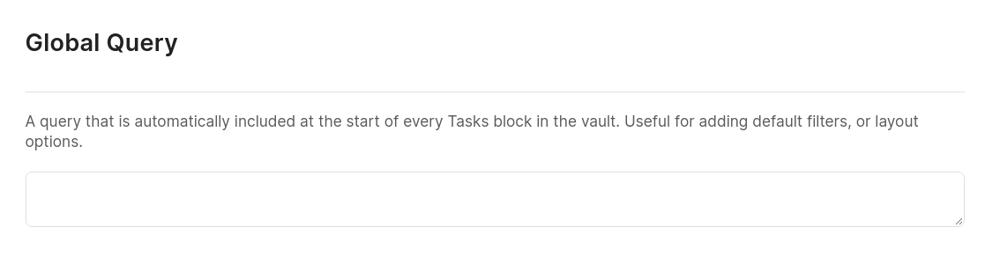

# Global Query

## Summary

> [!released]
The Global Query setting was added in Tasks 3.5.0.

Global Query is a powerful and flexible alternative to the [[Global Filter]].

You can set a global query in the settings that Tasks will add to the start of all the Queries in your vault.

> [!example]
> With a global query set to `path includes /tasks`, the following task block:
>
> ````text
> ```tasks
> tags include work
> ```
> ````
>
> will run as if it were:
>
> ````text
> ```tasks
> path includes /tasks
> tags include work
> ```
> ````

## Ignoring the global query

If you need to ignore the Global Query in a given Tasks block you may add `ignore global query` instruction to any place of the block.

For example, this allows you to have your task searches ignore certain folders by default. And then in a few searches, you can enable searching for tasks in those folders.

> [!example]
>
> ```text
> tags include work
> ignore global query
> ```

> [!note]
> Any use of `ignore global query` inside the Global Query itself is harmless, but ignored.

> [!released]
The `ignore global query` instruction was added in Tasks 4.6.0.

## Examples

Currently, any query that is allowed in a task block will also work as your Global Query. This feature is especially useful for applying [filters](Filters) or [layout options](Layout) by default for all your queries.

> [!warning]
> It isn't always possible to override a filter set in the Global Query. We are tracking this in [issue #2074](https://github.com/obsidian-tasks-group/obsidian-tasks/issues/2074).

### [[Layout]]

> [!example]
> **Turn on short mode**
>
> ````text
> ```tasks
> short mode
> ```
> ````
>
> > [!info]
> > You can override this in a task block using `full mode`

> [!example]
> **Hide priority**
>
> ````text
> ```tasks
> hide priority
> ```
> ````
>
> > [!info]
> > You can override this in a task block using `show priority`

> [!example]
> **Show up to 50 tasks**
>
>
> ````text
> ```tasks
> limit 50
> ```
> ````
>
> > [!info]
> > You can override this in a task block by specifying a new limit in that task block

### [[Filters]]

> [!example]
> **Only show tasks under specific headings**
>
> ````text
> ```tasks
> heading includes Task
> ```
> ````

> [!example]
> **Exclude tasks from a specific path**
>
> ````text
> ```tasks
> path regex does not match /^_templates/
> ```
> ````

## Settings

The following setting in the [[Settings|Tasks Options pane]] controls the vault's global query:



Changing the global query should take effect without restarting Obsidian, but open queries may need to be refreshed.

## Support

Before creating a new bug report or feature request about Global Query, please check existing items to avoid duplicates.

You do not need to search manually: the links below are already filtered to the label `"scope: global query"`.

- Check both Open and Closed items.
- If you find an existing item, support it there instead of adding a `+1` comment. See [[About Support and Help#How to support an existing request|How to support an existing request]].

| Type | Open | Closed | Notes |
| --- | --- | --- | --- |
| Issues | [Open](https://github.com/obsidian-tasks-group/obsidian-tasks/issues?q=is%3Aopen%20label%3A%22scope%3A+global+query%22%20is%3Aissue%20) | [Closed](https://github.com/obsidian-tasks-group/obsidian-tasks/issues?q=is%3Aclosed%20label%3A%22scope%3A+global+query%22%20is%3Aissue%20) | bug reports and feature requests |
| Discussions | [Open](https://github.com/obsidian-tasks-group/obsidian-tasks/discussions/categories/ideas-any-new-feature-requests-go-in-issues-please?discussions_q=is%3Aopen+label%3A%22scope%3A+global+query%22+category%3A%22Ideas%3A+Any+New+Feature+Requests+go+in+Issues+please%22+sort%3Atop) | [Closed](https://github.com/obsidian-tasks-group/obsidian-tasks/discussions/categories/ideas-any-new-feature-requests-go-in-issues-please?discussions_q=is%3Aclosed+label%3A%22scope%3A+global+query%22+category%3A%22Ideas%3A+Any+New+Feature+Requests+go+in+Issues+please%22+sort%3Atop) | older feature discussions from before late 2022 |

If you do not find an existing item in Issues or Discussions, see [[About Support and Help]] for how to report a bug or request a feature.
