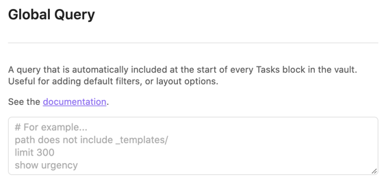

# Global Query

## Summary

> [!released]
The Global Query setting was added in Tasks 3.5.0.

Global Query is a powerful and flexible alternative to the [[Global Filter]].

You can set a global query in the settings that Tasks will add to the start of all the Queries in your vault.

> [!example]
> With a global query set to `path includes /tasks`, the following task block:
>
>     ```tasks
>     tags include work
>     ```
>
> will run as if it were:
>
>     ```tasks
>     path includes /tasks
>     tags include work
>     ```

## Ignoring the global query

If you need to ignore the Global Query in a given Tasks block you may add `ignore global query` instruction to any place of the block.

For example, this allows you to have your task seaches ignore certain folders by default. And then in few searches, you can enable searching for tasks in those folders.

> [!example]
>
> ```tasks
> tags include work
> ignore global query
> ```

> [!released]
The `ignore global query` instruction was added in Tasks 4.6.0.

## Examples

Currently, any query that is allowed in a task block will also work as your Global Query. This feature is especially useful for applying [filters](Filters) or [layout options](Layout) by default for all your queries.

> [!warning]
> It isn't always possible to override a filter set in the Global Query. We are tracking this in [issue #2074](https://github.com/obsidian-tasks-group/obsidian-tasks/issues/2074).

### [[Layout]]

> [!example]
> **Turn on short mode**
>
>     ```tasks
>     short mode
>     ```
>
> > [!info]
> > You can override this in a task block using `full mode`

> [!example]
> **Hide priority**
>
>     ```tasks
>     hide priority
>     ```
>
> > [!info]
> > You can override this in a task block using `show priority`

> [!example]
> **Show up to 50 tasks**
>
>
>     ```tasks
>     limit 50
>     ```
>
> > [!info]
> > You can override this in a task block by specifying a new limit in that task block

### [[Filters]]

> [!example]
> **Only show tasks under specific headings**
>
>     ```tasks
>     heading includes Task
>     ```

> [!example]
> **Exclude tasks from a specific path**
>
>     ```tasks
>     path regex does not match /^_templates/
>     ```

## Settings

The following setting in the [[Settings|Tasks Options pane]] controls the vault's global query:



Changing the global query should take effect without restarting Obsidian, but open queries may need to be refreshed.
