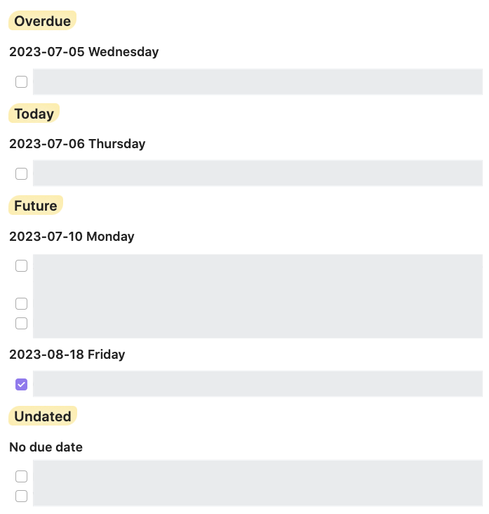
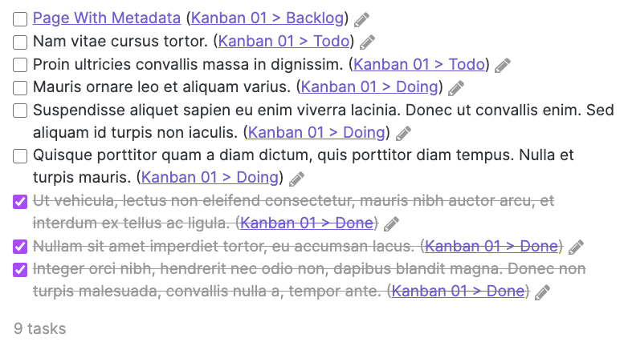
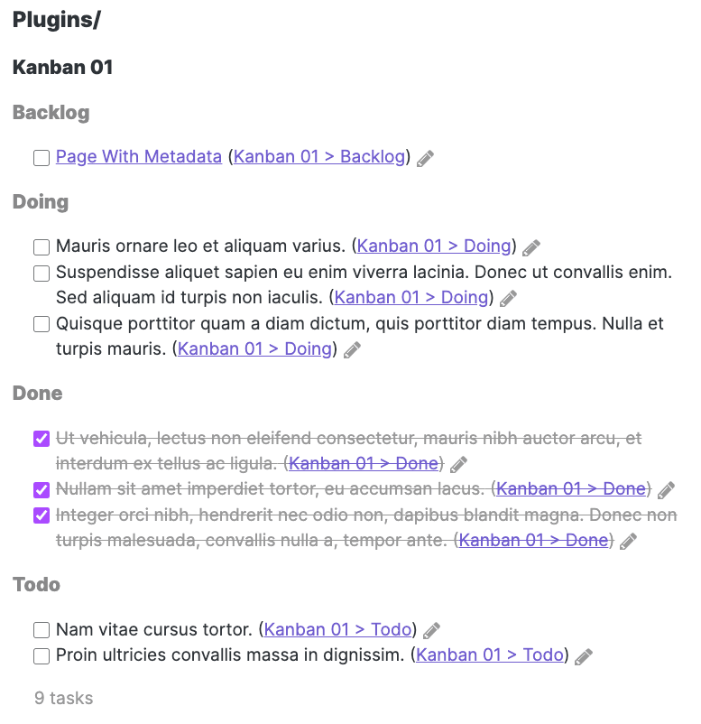

# Grouping

<span class="related-pages">#feature/grouping</span>

<!-- NEW_QUERY_INSTRUCTION_EDIT_REQUIRED -->

## Contents

This page is long. Here are some links to the main sections:

- [[#Basics]]
- [[#Custom Groups]]
- [[#Group by Task Statuses]]
- [[#Group by Task Dependencies]]
- [[#Group by Dates in Tasks]]
- [[#Group by Other Task Properties]]
- [[#Group by File Properties]]
- [[#Multiple groups]]
- [[#Refining groups]]
- [[#Notes]]
- [[#Screenshots]]
- [[#Examples]]

## Basics

> [!released]
Introduced in Tasks 1.6.0.

By default, Tasks displays tasks in a single list.

To divide the matching tasks up with headings, you can add `group by` lines to the query.

## Custom Groups

> [!released]
> `group by function` was introduced in Tasks 4.0.0.

Tasks provides many built-in grouping options, but sometimes they don't quite do what is wanted by all users.

Now Tasks has a powerful mechanism for you to create your own **custom groups**, offering incredible flexibility.

There are many examples of the custom grouping instruction `group by function` in the documentation below, with explanations, for when the `group by` instructions built in to Tasks do not satisfy your preferences.

You can find out more about this very powerful facility in [[Custom Grouping]].

## Group by Task Statuses

For more information, including adding your own customised statuses, see [[Statuses]].

### Status

- `group by status` (Done or Todo, which is capitalized for visibility in the headings)
  - Note that the Done group is displayed before the Todo group,
      which differs from the Sorting ordering of this property.
    - `Done` is used for tasks status types `DONE`, `CANCELLED` and `NON_TASK`
    - `Todo` is used for status types with type `TODO` and `IN_PROGRESS`

Since Tasks 4.0.0, **[[Custom Grouping|custom grouping]] by status** is now possible.

<!-- placeholder to force blank line before included text --><!-- include: CustomGroupingExamples.test.other_properties_task.isDone_docs.approved.md -->

```javascript
group by function task.isDone ? "Action Required" : "Nothing To Do"
```

- Use JavaScript's ternary operator to choose what to do for true (after the ?) and false (after the :) values.

<!-- placeholder to force blank line after included text --><!-- endInclude -->

### Status Name

- `group by status.name`
  - This groups by the names you give to your custom statuses, in alphabetical order.

> [!released]
`group by status.name` was introduced in Tasks 1.23.0.

Since Tasks 4.0.0, **[[Custom Grouping|custom grouping]] by status names** is now possible.

<!-- placeholder to force blank line before included text --><!-- include: CustomGroupingExamples.test.statuses_task.status.name_docs.approved.md -->

```javascript
group by function task.status.name
```

- Identical to "group by status.name".

```javascript
group by function task.status.name.toUpperCase()
```

- Convert the status names to capitals.

<!-- placeholder to force blank line after included text --><!-- endInclude -->

### Status Type

- `group by status.type`
  - This groups by the types you have given to your custom statuses.
  - The groups will appear in this order, and with these group names:
    - `IN_PROGRESS`
    - `TODO`
    - `DONE`
    - `CANCELLED`
    - `NON_TASK`

> [!released]
`group by status.type` was introduced in Tasks 1.23.0.

Since Tasks 4.0.0, **[[Custom Grouping|custom grouping]] by status types** is now possible.

`task.status.typeGroupText` was added in Tasks 4.9.0.

<!-- placeholder to force blank line before included text --><!-- include: CustomGroupingExamples.test.statuses_task.status.type_docs.approved.md -->

```javascript
group by function task.status.type
```

- Unlike "group by status.type", this sorts the status types in alphabetical order.

```javascript
group by function task.status.typeGroupText
```

- This sorts the status types in the same order as "group by status.type".

<!-- placeholder to force blank line after included text --><!-- endInclude -->

### Status Symbol

There is no built-in instruction to group by status symbols.

Since Tasks 4.0.0, **[[Custom Grouping|custom grouping]] by status symbol** is now possible.

<!-- placeholder to force blank line before included text --><!-- include: CustomGroupingExamples.test.statuses_task.status.symbol_docs.approved.md -->

```javascript
group by function "Status symbol: " + task.status.symbol.replace(" ", "space")
```

- Group by the status symbol, making space characters visible.

<!-- placeholder to force blank line after included text --><!-- endInclude -->

### Next Status Symbol

There is no built-in instruction to group by next status symbols.

Since Tasks 4.0.0, **[[Custom Grouping|custom grouping]] by next status symbol** is now possible.

<!-- placeholder to force blank line before included text --><!-- include: CustomGroupingExamples.test.statuses_task.status.nextSymbol_docs.approved.md -->

```javascript
group by function "Next status symbol: " + task.status.nextSymbol.replace(" ", "space")
```

- Group by the next status symbol, making space characters visible.

<!-- placeholder to force blank line after included text --><!-- endInclude -->

## Group by Task Dependencies

At a high level, task dependencies define the order in which you want to work on a set of tasks. You can read more about them in [[Task Dependencies]].

> [!released]
> Task Dependencies were introduced in Tasks 6.1.0.

### Id

- `group by id`

For more information, see [[Task Dependencies]].

> [!released]
>
> - Task Id was introduced in Tasks 6.1.0.

Since Tasks 6.1.0, **[[Custom Grouping|custom grouping]] by Id** is now possible, using `task.id`.

<!-- placeholder to force blank line before included text --><!-- include: CustomGroupingExamples.test.dependencies_task.id_docs.approved.md -->

```javascript
group by function task.id
```

- Group by task Ids, if any.
- Note that currently there is no way to access any tasks that are blocked by these Ids.

<!-- placeholder to force blank line after included text --><!-- endInclude -->

### Depends On

There is no built-in instruction to group by 'Depends On'.

For more information, see [[Task Dependencies]].

> [!released]
>
> - Task Depends On was introduced in Tasks 6.1.0.

Since Tasks 6.1.0, **[[Custom Grouping|custom grouping]] by Depends On** is now possible, using `task.dependsOn`.

<!-- placeholder to force blank line before included text --><!-- include: CustomGroupingExamples.test.dependencies_task.dependsOn_docs.approved.md -->

```javascript
group by function task.dependsOn
```

- Group by the Ids of the tasks that each task depends on, if any.
- If a task depends on more than one other task, it will be listed multiple times.
- Note that currently there is no way to access the tasks being depended on.

<!-- placeholder to force blank line after included text --><!-- endInclude -->

## Group by Dates in Tasks

### Due Date

- `group by due`
  - The due date of the task, including the week-day, or `Invalid due date` or `No due date`.

> [!released]
>
> - `due` grouping option was introduced in Tasks 1.7.0.

Since Tasks 4.0.0, **[[Custom Grouping|custom grouping]] by due date** is now possible.

These examples all use  `task.due` property, which is a `TasksDate` object. See [[Task Properties#Values in TasksDate Properties|Values in TasksDate Properties]] to explore its capabilities.

Some of these examples use the [moment.js format characters](https://momentjs.com/docs/#/displaying/format/).

<!-- placeholder to force blank line before included text --><!-- include: CustomGroupingExamples.test.dates_task.due_docs.approved.md -->

```javascript
group by function task.due.category.groupText
```

- Group task due dates in to 5 broad categories: `Invalid date`, `Overdue`, `Today`, `Future` and `Undated`, displayed in that order.
- Try this on a line before `group by due` if there are a lot of due date headings, and you would like them to be broken down in to some kind of structure.
- The values `task.due.category.name` and `task.due.category.sortOrder` are also available.

```javascript
group by function task.due.fromNow.groupText
```

- Group by the [time from now](https://momentjs.com/docs/#/displaying/fromnow/), for example `8 days ago`, `in 11 hours`.
- It users an empty string (so no heading) if there is no due date.
- The values `task.due.fromNow.name` and `task.due.fromNow.sortOrder` are also available.

```javascript
group by function task.due.format("YYYY-MM-DD dddd")
```

- Like "group by due", except it uses no heading, instead of a heading "No due date", if there is no due date.

```javascript
group by function task.due.formatAsDate()
```

- Format date as YYYY-MM-DD or empty string (so no heading) if there is no due date.

```javascript
group by function task.due.formatAsDateAndTime()
```

- Format date as YYYY-MM-DD HH:mm or empty string if no due date.
- Note:
  - This is shown for demonstration purposes.
  - Currently the Tasks plugin does not support storing of times.
  - Do not add times to your tasks, as it will break the reading of task data.

```javascript
group by function task.due.format("YYYY[%%]-MM[%%] MMM", "no due date")
```

- Group by month, for example `2023%%-05%% May` ...
  - ... which gets rendered by Obsidian as `2023 May`.
- Or show a default heading "no due date" if no date.
- The hidden month number is added, commented-out between two `%%` strings, to control the sort order of headings.
- To escape characters in format strings, you can wrap the characters in square brackets (here, `[%%]`).

```javascript
group by function task.due.format("YYYY[%%]-MM[%%] MMM [- Week] WW")
```

- Group by month and week number, for example `2023%%-05%% May - Week 22` ...
  - ... which gets rendered by Obsidian as `2023 May - Week 22`.
- If the month number is not embedded, in some years the first or last week of the year is displayed in a non-logical order.

<!-- placeholder to force blank line after included text --><!-- endInclude -->

DON'T PANIC! For users who are comfortable with JavaScript, these more complicated examples may also be of interest:

<!-- placeholder to force blank line before included text --><!-- include: CustomGroupingExamples.test.dates_task.due.advanced_docs.approved.md -->

```javascript
group by function task.due.format("dddd")
```

- Group by day of the week (Monday, Tuesday, etc).
- The day names are sorted alphabetically.

```javascript
group by function task.due.format("[%%]d[%%]dddd")
```

- Group by day of the week (Sunday, Monday, Tuesday, etc).
- The day names are sorted in date order, starting with Sunday.

```javascript
group by function                                   \
    const date = task.due;                          \
    if (!date.moment) {                             \
        return "Undated";                           \
    }                                               \
    if (date.moment.day() === 0) {                  \
        {{! Put the Sunday group last: }}           \
        return date.format("[%%][8][%%]dddd");      \
    }                                               \
    return date.format("[%%]d[%%]dddd");
```

- Group by day of the week (Monday, Tuesday, etc).
- The day names are sorted in date order, starting with Monday.
- Tasks without due dates are displayed at the end, under a heading "Undated".
- The key technique is to say that if the day is Sunday (`0`), then force it to be displayed as date number `8`, so it comes after the other days of the week.
- To add comments, we can use `{{! ... }}`
- To make the expression more readable, we put a `\` at the end of several lines, to continue the expression on the next line.

```javascript
group by function \
    const date = task.due.moment; \
    return \
        (!date)                           ? '%%4%% Undated' :      \
        !date.isValid()                   ? '%%0%% Invalid date' : \
        date.isBefore(moment(), 'day')    ? '%%1%% Overdue' :      \
        date.isSame(moment(), 'day')      ? '%%2%% Today'   :      \
        '%%3%% Future';
```

- This gives exactly the same output as `group by function task.due.category.groupText`, and is shown here in case you want to customise the behaviour in some way.
- Group task due dates in to 5 broad categories: `Invalid date`, `Overdue`, `Today`, `Future` and `Undated`, displayed in that order.
- Try this on a line before `group by due` if there are a lot of due date headings, and you would like them to be broken down in to some kind of structure.
- Note that because we use variables to avoid repetition of values, we need to add `return`

```javascript
group by function \
    const date = task.due.moment; \
    return \
        (!date)                           ? '%%4%% ==Undated==' :      \
        !date.isValid()                   ? '%%0%% ==Invalid date==' : \
        date.isBefore(moment(), 'day')    ? '%%1%% ==Overdue==' :      \
        date.isSame(moment(), 'day')      ? '%%2%% ==Today=='   :      \
        '%%3%% ==Future==';
```

- As above, but the headings `Invalid date`, `Overdue`, `Today`, `Future` and `Undated` are highlighted.
- See the sample screenshot below.

```javascript
group by function \
    const date = task.due.moment; \
    const now = moment(); \
    const label = (order, name) => `%%${order}%% ==${name}==`; \
    if (!date)                      return label(4, 'Undated'); \
    if (!date.isValid())            return label(0, 'Invalid date'); \
    if (date.isBefore(now, 'day'))  return label(1, 'Overdue'); \
    if (date.isSame(now, 'day'))    return label(2, 'Today'); \
    return label(3, 'Future');
```

- As above, but using a local function, and `if` statements.

```javascript
group by function \
    const date = task.due.moment; \
    const tomorrow  = moment().add(1,'days'); \
    const now = moment(); \
    const label = (order, name) => `%%${order}%% ==${name}==`; \
    if (!date)                           return label(5, 'Undated'); \
    if (!date.isValid())                 return label(0, 'Invalid date'); \
    if (date.isBefore(now, 'day'))       return label(1, 'Overdue'); \
    if (date.isSame(now, 'day'))         return label(2, 'Today'); \
    if (date.isSame(tomorrow, 'day'))    return label(3, 'Tomorrow'); \
    return label(4, 'Future');
```

- As above, but adds a heading for Tomorrow.

<!-- placeholder to force blank line after included text --><!-- endInclude -->



Sample image showing tasks grouped first by highlighted words `Overdue`, `Today`, `Future` and `Undated`, and then by individual due date.

### Done Date

- `group by done`
  - The done date of the task, including the week-day, or `Invalid done date` or `No done date`.

> [!released]
>
> - `done` grouping option was introduced in Tasks 1.7.0.

Since Tasks 4.0.0, **[[Custom Grouping|custom grouping]] by done date** is now possible.

<!-- placeholder to force blank line before included text --><!-- include: CustomGroupingExamples.test.dates_task.done_docs.approved.md -->

```javascript
group by function task.done.format("YYYY-MM-DD dddd")
```

- Like "group by done", except it uses an empty string instead of "No done date" if there is no done date.

<!-- placeholder to force blank line after included text --><!-- endInclude -->

For more examples, see [[#Due Date]].

### Scheduled Date

- `group by scheduled`
  - The scheduled date of the task, including the week-day, or `Invalid scheduled date` or `No scheduled date`.

> [!released]
>
> - `scheduled` grouping option was introduced in Tasks 1.7.0.

Since Tasks 4.0.0, **[[Custom Grouping|custom grouping]] by scheduled date** is now possible.

<!-- placeholder to force blank line before included text --><!-- include: CustomGroupingExamples.test.dates_task.scheduled_docs.approved.md -->

```javascript
group by function task.scheduled.format("YYYY-MM-DD dddd")
```

- Like "group by scheduled", except it uses an empty string instead of "No scheduled date" if there is no scheduled date.

<!-- placeholder to force blank line after included text --><!-- endInclude -->

For more examples, see [[#Due Date]].

### Start Date

- `group by start`
  - The start date of the task, including the week-day, or `Invalid start date` or `No start date`.

> [!released]
>
> - `start` grouping option was introduced in Tasks 1.7.0.

Since Tasks 4.0.0, **[[Custom Grouping|custom grouping]] by start date** is now possible.

<!-- placeholder to force blank line before included text --><!-- include: CustomGroupingExamples.test.dates_task.start_docs.approved.md -->

```javascript
group by function task.start.format("YYYY-MM-DD dddd")
```

- Like "group by start", except it uses an empty string instead of "No start date" if there is no start date.

<!-- placeholder to force blank line after included text --><!-- endInclude -->

For more examples, see [[#Due Date]].

### Created Date

- `group by created`
  - The created date of the task, including the week-day, or `Invalid created date` or `No created date`.

> [!released]
`created` grouping option was introduced in Tasks 2.0.0.

Since Tasks 4.0.0, **[[Custom Grouping|custom grouping]] by created date** is now possible.

<!-- placeholder to force blank line before included text --><!-- include: CustomGroupingExamples.test.dates_task.created_docs.approved.md -->

```javascript
group by function task.created.format("YYYY-MM-DD dddd")
```

- Like "group by created", except it uses an empty string instead of "No created date" if there is no created date.

<!-- placeholder to force blank line after included text --><!-- endInclude -->

For more examples, see [[#Due Date]].

### Cancelled Date

- `group by cancelled`
  - The cancelled date of the task, including the week-day, or `Invalid cancelled date` or `No cancelled date`.

> [!released]
`cancelled` grouping option was introduced in Tasks 5.5.0.

Since Tasks 5.5.0, **[[Custom Grouping|custom grouping]] by cancelled date** is now possible, using `task.cancelled`.

<!-- placeholder to force blank line before included text --><!-- include: CustomGroupingExamples.test.dates_task.cancelled_docs.approved.md -->

```javascript
group by function task.cancelled.format("YYYY-MM-DD dddd")
```

- Like "group by cancelled", except it uses an empty string instead of "No cancelled date" if there is no cancelled date.

<!-- placeholder to force blank line after included text --><!-- endInclude -->

For more examples, see [[#Due Date]].

### Happens

- `group by happens`
  - The earliest of start date, scheduled date, and due date, including the week-day, or `No happens date` if none of those are set.

> [!released]
`happens` grouping option was introduced in Tasks 1.11.0.

Since Tasks 4.0.0, **[[Custom Grouping|custom grouping]] by happens date** is now possible.

<!-- placeholder to force blank line before included text --><!-- include: CustomGroupingExamples.test.dates_task.happens_docs.approved.md -->

```javascript
group by function task.happens.format("YYYY-MM-DD dddd")
```

- Like "group by happens", except it uses an empty string instead of "No happens date" if there is no happens date.

<!-- placeholder to force blank line after included text --><!-- endInclude -->

For more examples, see [[#Due Date]].

## Group by Other Task Properties

As well as the date-related groups above, groups can be created from properties in individual tasks.

### Description

There is no built-in instruction to group by description.

Since Tasks 4.0.0, **[[Custom Grouping|custom grouping]] by description** is now possible.

<!-- placeholder to force blank line before included text --><!-- include: CustomGroupingExamples.test.other_properties_task.description_docs.approved.md -->

```javascript
group by function task.description
```

- group by description.
- This might be useful for finding completed recurrences of the same task.

```javascript
group by function task.description.toUpperCase()
```

- Convert the description to capitals.

```javascript
group by function task.description.slice(0, 25)
```

- Truncate descriptions to at most their first 25 characters, and group by that string.

```javascript
group by function task.description.replace('short', '==short==')
```

- Highlight the word "short" in any group descriptions.

<!-- placeholder to force blank line after included text --><!-- endInclude -->

### Description without tags

Since Tasks 4.2.0, it is possible to remove tags from the descriptions in custom groups, for use in **[[Custom Grouping|custom grouping]]**.

The value `task.descriptionWithoutTags` returns a copy of the description with all the tags removed, so that you can group together any tasks whose descriptions differ only by their tags.

<!-- placeholder to force blank line before included text --><!-- include: CustomGroupingExamples.test.other_properties_task.descriptionWithoutTags_docs.approved.md -->

```javascript
group by function task.descriptionWithoutTags
```

- Like `group by description`, but it removes any tags from the group headings.
- This might be useful for finding completed recurrences of the same task, even if the tags differ in some recurrences.

<!-- placeholder to force blank line after included text --><!-- endInclude -->

### Priority

- `group by priority`
  - The priority of the task, namely one of:
    - `Highest priority`
    - `High priority`
    - `Medium priority`
    - `Normal priority`
    - `Low priority`
    - `Lowest priority`

> [!released]
>
> - `priority` grouping option was introduced in Tasks 1.11.0.

Since Tasks 4.0.0, **[[Custom Grouping|custom grouping]] by priority name and number** is now possible.

`task.priorityNameGroupText` was added in Tasks 4.9.0.

Using the priority name:

<!-- placeholder to force blank line before included text --><!-- include: CustomGroupingExamples.test.other_properties_task.priorityName_docs.approved.md -->

```javascript
group by function task.priorityName
```

- Group by the task's priority name.
- The priority names are displayed in alphabetical order.
- Note that the default priority is called 'Normal', as opposed to with `group by priority` which calls the default 'None'.

```javascript
group by function task.priorityNameGroupText
```

- Group by the task's priority name.
- The priority names are displayed from highest to lowest priority.
- Note that the default priority is called 'Normal', as opposed to with `group by priority` which calls the default 'None'.

<!-- placeholder to force blank line after included text --><!-- endInclude -->

Using the priority number:

<!-- placeholder to force blank line before included text --><!-- include: CustomGroupingExamples.test.other_properties_task.priorityNumber_docs.approved.md -->

```javascript
group by function task.priorityNumber
```

- Group by the task's priority number, where Highest is 0 and Lowest is 5.

<!-- placeholder to force blank line after included text --><!-- endInclude -->

### Urgency

- `group by urgency` ([[Urgency|urgency]])
  - The groups run from the highest urgency to the lowest.
  - You can reverse this with `group by urgency reverse`.

> [!released]
>
> - `urgency` grouping option was introduced in Tasks 3.6.0.
> - In Tasks 4.0.0 the order of `group by urgency` was reversed, to put most urgent tasks first. Add or remove the word `reverse` to get the original order.

Since Tasks 4.0.0, **[[Custom Grouping|custom grouping]] by urgency** is now possible.

<!-- placeholder to force blank line before included text --><!-- include: CustomGroupingExamples.test.other_properties_task.urgency_docs.approved.md -->

```javascript
group by function task.urgency.toFixed(3)
```

- Show the urgency to 3 decimal places, unlike the built-in "group by urgency" which uses 2.

<!-- placeholder to force blank line after included text --><!-- endInclude -->

### Recurrence

- `group by recurring`
  - Whether the task is recurring: either `Recurring` or `Not Recurring`.
- `group by recurrence`
  - The recurrence rule of the task, for example `every week on Sunday`, or `None` for non-recurring tasks.
  - Note that the text displayed is generated programmatically and standardised, and so may not exactly match the text in any manually typed tasks. For example, a task with `🔁 every Sunday` is grouped in `every week on Sunday`.

> [!released]
>
> - `recurring` and `recurrence` grouping options were introduced in Tasks 1.11.0.

Since Tasks 4.0.0, **[[Custom Grouping|custom grouping]] by recurrence** is now possible.

<!-- placeholder to force blank line before included text --><!-- include: CustomGroupingExamples.test.other_properties_task.isRecurring_docs.approved.md -->

```javascript
group by function task.isRecurring ? "Recurring" : "Non-Recurring"
```

- Use JavaScript's ternary operator to choose what to do for true (after the ?) and false (after the :) values.

<!-- placeholder to force blank line after included text --><!-- endInclude -->

<!-- placeholder to force blank line before included text --><!-- include: CustomGroupingExamples.test.other_properties_task.recurrenceRule_docs.approved.md -->

```javascript
group by function task.recurrenceRule.replace('when done', '==when done==')
```

- Group by recurrence rule, highlighting any occurrences of the words "when done".

<!-- placeholder to force blank line after included text --><!-- endInclude -->

### Tags

See [[Tags]] for important information about how tags behave in the Tasks plugin.

- `group by tags`
  - The tags of the tasks or `(No tags)`. If the task has multiple tags, it will show up under every tag.

> [!released]
>
> - `tags` grouping option was introduced in Tasks 1.10.0.

Since Tasks 4.0.0, **[[Custom Grouping|custom grouping]] by tags** is now possible.

<!-- placeholder to force blank line before included text --><!-- include: CustomGroupingExamples.test.other_properties_task.tags_docs.approved.md -->

```javascript
group by function task.tags
```

- Like "group by tags" except that tasks with no tags have no heading instead of "(No tags)".

```javascript
group by function task.tags.join(", ")
```

- Tasks with multiple tags are listed once, with a heading that combines all the tags.
- Separating with commas means the tags are clickable in the headings.

```javascript
group by function task.tags.sort().join(", ")
```

- As above, but sorting the tags first ensures that the final headings are independent of order of tags in the tasks.

```javascript
group by function task.tags.filter( (tag) => tag.includes("#context/") )
```

- Only create headings for tags that contain "#context/".

```javascript
group by function task.tags.filter( (tag) => ! tag.includes("#tag") )
```

- Create headings for all tags that do not contain "#tag".

<!-- placeholder to force blank line after included text --><!-- endInclude -->

These are more complicated examples, which you might like to copy if you use tasks with [nested tags](https://help.obsidian.md/Editing+and+formatting/Tags#Nested+tags) and wish to group them at different tag nesting levels.

<!-- placeholder to force blank line before included text --><!-- include: CustomGroupingExamples.test.other_properties_task.tags.advanced_docs.approved.md -->

```javascript
group by function task.tags.map( (tag) => tag.split('/')[0].replace('#', '') )
```

- `#tag/subtag/sub-sub-tag` gives **`tag`**.

```javascript
group by function task.tags.map( (tag) => tag.split('/')[1] ? tag.split('/').slice(1, 2) : '')
```

- `#tag/subtag/sub-sub-tag` gives **`subtag`**.

```javascript
group by function task.tags.map( (tag) => tag.split('/')[2] ? tag.split('/').slice(2, 3) : '')
```

- `#tag/subtag/sub-sub-tag` gives **`sub-sub-tag`**.

```javascript
group by function task.tags.map( (tag) => tag.split('/')[3] ? tag.split('/').slice(3, 4) : '')
```

- `#tag/subtag/sub-sub-tag` gives no heading, as there is no value at the 4th level.

```javascript
group by function task.tags.map( (tag) => tag.split('/')[0] )
```

- `#tag/subtag/sub-sub-tag` gives **`#tag`**.

```javascript
group by function task.tags.map( (tag) => tag.split('/')[1] ? tag.split('/').slice(0, 2).join('/') : '')
```

- `#tag/subtag/sub-sub-tag` gives **`#tag/subtag`**.

```javascript
group by function task.tags.map( (tag) => tag.split('/')[2] ? tag.split('/').slice(0, 3).join('/') : '')
```

- `#tag/subtag/sub-sub-tag` gives **`#tag/subtag/sub-sub-tag`**.

```javascript
group by function task.tags.map( (tag) => tag.split('/')[3] ? tag.split('/').slice(0, 4).join('/') : '')
```

- `#tag/subtag/sub-sub-tag` gives no heading, as there is no value at the 4th level.

<!-- placeholder to force blank line after included text --><!-- endInclude -->

### Original Markdown

There is no built-in instruction to group by the original markdown line.

Since Tasks 4.0.0, **[[Custom Grouping|custom grouping]] by original markdown line** is now possible.

For example, this could be used to extract information from `task.originalMarkdown` that Tasks does not parse, to use for grouping tasks.

<!-- placeholder to force blank line before included text --><!-- include: CustomGroupingExamples.test.other_properties_task.originalMarkdown_docs.approved.md -->

```javascript
group by function '``' + task.originalMarkdown + '``'
```

- Group by the raw text of the task's original line in the MarkDown file as code.
- Note the pairs of backtick characters ('`'), to preserve even single backtick characters in the task line.
- It's important to prevent the task checkbox (for example, '[ ]') from being rendered in the heading, as it gets very confusing if there are checkboxes on both headings and tasks.

```javascript
group by function task.originalMarkdown.replace(/^[^\[\]]+\[.\] */, '')
```

- An alternative to formatting the markdown line as code is to remove everything up to the end of the checkbox.
- Then render the rest of the task line as normal markdown.

<!-- placeholder to force blank line after included text --><!-- endInclude -->

## Group by File Properties

### File Path

- `group by path` (the path to the file that contains the task, that is, the folder and the filename)

Since Tasks 4.0.0, **[[Custom Grouping|custom grouping]] by file path** is now possible.

<!-- placeholder to force blank line before included text --><!-- include: CustomGroupingExamples.test.file_properties_task.file.path_docs.approved.md -->

```javascript
group by function task.file.path
```

- Like 'group by path' but includes the file extension.

```javascript
group by function task.file.path.replace(query.file.folder, '')
```

- Group by the task's file path, but remove the query's folder from the group.
- For tasks in the query's folder or a sub-folder, this is a nice way of seeing shortened paths.
- This is provided to give ideas: it's a bit of a lazy implementation, as it doesn't check that `query.file.folder` is at the start of the line.

<!-- placeholder to force blank line after included text --><!-- endInclude -->

Since Tasks 5.1.0, the query's file path can be used conveniently in custom groups.

- `query.file.path` or
- `query.file.pathWithoutExtension`
- Useful reading: [[Query Properties]].

### Root

- `group by root` (the top-level folder of the file that contains the task, that is, the first directory in the path, which will be `/` for files in root of the vault)

> [!released]
`root` grouping option was introduced in Tasks 1.11.0.

Since Tasks 4.0.0, **[[Custom Grouping|custom grouping]] by root folder** is now possible.

<!-- placeholder to force blank line before included text --><!-- include: CustomGroupingExamples.test.file_properties_task.file.root_docs.approved.md -->

```javascript
group by function task.file.root
```

- Same as 'group by root'.

<!-- placeholder to force blank line after included text --><!-- endInclude -->

Since Tasks 5.1.0, the query's file root can be used conveniently in custom groups.

- `query.file.root`
- Useful reading: [[Query Properties]].

### Folder

- `group by folder` (the folder to the file that contains the task, which always ends in `/` and will be exactly `/` for files in root of the vault)

Since Tasks 4.0.0, **[[Custom Grouping|custom grouping]] by folder** is now possible.

<!-- placeholder to force blank line before included text --><!-- include: CustomGroupingExamples.test.file_properties_task.file.folder_docs.approved.md -->

```javascript
group by function task.file.folder
```

- Same as 'group by folder'.

```javascript
group by function task.file.folder.slice(0, -1).split('/').pop() + '/'
```

- Group by the immediate parent folder of the file containing task.
- Here's how it works:
  - '.slice(0, -1)' removes the trailing slash ('/') from the original folder.
  - '.split('/')' divides the remaining path up in to an array of folder names.
  - '.pop()' returns the last folder name, that is, the parent of the file containing the task.
  - Then the trailing slash is added back, to ensure we do not get an empty string for files in the top level of the vault.

<!-- placeholder to force blank line after included text --><!-- endInclude -->

Since Tasks 5.1.0, the query's folder can be used conveniently in custom groups.

- `query.file.folder`
- Useful reading: [[Query Properties]].

### File Name

- `group by filename` (the link to the file that contains the task, without the `.md` extension)
  - Note that tasks from different notes with the same file name will be grouped together in the same group.

Since Tasks 4.0.0, **[[Custom Grouping|custom grouping]] by file name** is now possible.

<!-- placeholder to force blank line before included text --><!-- include: CustomGroupingExamples.test.file_properties_task.file.filename_docs.approved.md -->

```javascript
group by function task.file.filename
```

- Like 'group by filename' but does not link to the file.

```javascript
group by function task.file.filenameWithoutExtension + (task.hasHeading ? (' > ' + task.heading) : '')
```

- Like 'group by backlink' but does not link to the heading in the file.

<!-- placeholder to force blank line after included text --><!-- endInclude -->

Since Tasks 5.1.0, the query's file name can be used conveniently in custom groups.

- `query.file.filename` or
- `query.file.filenameWithoutExtension`
- Useful reading: [[Query Properties]].

### Backlink

- `group by backlink` (the text that would be shown in the task's [[Backlinks|backlink]], combining the task's file name and heading, with a link)

### Heading

- `group by heading` (the heading preceding the task, or `(No heading)` if there are no headings in the file)

Since Tasks 4.0.0, **[[Custom Grouping|custom grouping]] by heading** is now possible.

<!-- placeholder to force blank line before included text --><!-- include: CustomGroupingExamples.test.file_properties_task.heading_docs.approved.md -->

```javascript
group by function (task.heading + '.md' === task.file.filename) ? '' : task.heading
```

- Group by heading, but only if the heading differs from the file name.
- This works well immediately after a 'group by filename' line.
- Note the three equals signs '===': these are important for safety in JavaScript.

<!-- placeholder to force blank line after included text --><!-- endInclude -->

## Multiple groups

You can add multiple `group by` query options, each on an extra line.
This will create nested groups.
The first group has the highest priority.

Each subsequent `group by` will generate a new heading-level within the existing grouping:

- First `group by` is displayed as `h4` headings
- Second `group by` is displayed as `h5` headings
- Third and subsequent `group by` are displayed as `h6` headings

See the [[#Screenshots|screenshots below]] for how this looks in practice.

> [!info]
> Headings are displayed in case-sensitive alphabetical order, not the original order.

## Refining groups

### Reversing groups

> [!released]
> Reversing of group headings was introduced in Tasks 3.7.0.

After the name of the property that you want to group by, you can add the `reverse` keyword.
If given, the group headings will be reversed for that property.

For example:

- `group by due` will sort the group headings:
  - from **oldest** due date first...
  - to **newest** due date last
- `group by due reverse` will sort the group headings:
  - from **newest** due date first...
  - to **oldest** due date last

> [!tip]
> The `reverse` keyword controls the order that group headings are displayed.
>
> The [[Sorting|sort by]] facility, by contrast, controls the order in which displays are displayed *inside* each group.

### Limiting group size

You can limit the number of tasks in each group, perhaps to work on the most important things first.

See [[Limiting#Limit number of tasks in each group|Limit number of tasks in each group]].

## Notes

> [!info]
> The order of operations ensures that grouping does not modify which tasks are displayed, for example when the `limit` options are used:
>
> 1. all the filter instructions are run
> 1. then any sorting instructions are run
> 1. then any `limit` instructions are run
> 1. then any grouping instructions are run
> 1. then any `limit groups` instructions are run

## Screenshots

### Before

Here is an example Tasks result, without any `group by` commands:


Tasks not grouped.

### After

And here is what this might look like, when grouped by folder, filename and heading:


Tasks grouped.

## Examples

Give me three levels of grouping, to indicate the locations of my tasks:

    ```tasks
    not done
    group by folder
    group by filename
    group by heading
    ```

Show me tasks I need to do today - and put today's tasks first, for visibility:

    ```tasks
    not done
    due before tomorrow
    group by due reverse
    ```
