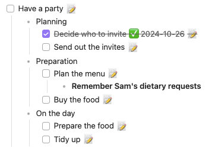

# Layout commands

## Hiding/Showing Elements

You can hide and show individual elements of the rendered list with the "hide" and "show" commands
together with the name of the element.

> [!released]
The `show` commands were introduced in Tasks 1.14.0.

<!-- NEW_QUERY_INSTRUCTION_EDIT_REQUIRED -->

## Task Elements

The following task elements exist:

- `id`
- `depends on`
- `priority`
- `cancelled date`
- `created date`
- `start date`
- `scheduled date`
- `due date`
- `done date`
- `recurrence rule`
- `on completion`
- `tags`

All of these task elements are shown by default, so you will use the command `hide`
if you do not want to show any of them.

For example:

```text
hide created date
```

> [!released]
>
> - `created date` was introduced in Tasks 2.0.0.
> - `tags` was introduced in Tasks 4.1.0.
> - `cancelled date` was introduced in Tasks 5.5.0.
> - `id` and `depends on` were introduced in Tasks 6.1.0.

### Hide and Show Tags

> [!Info] About `hide tags`
>
> 1. Only tags recognised by Obsidian are hidden with `hide tags`.
>     - Tasks is a bit more relaxed in recognising tags than Obsidian. For example,  `#123` is treated as a tag by Tasks, and so is included in Tasks' searches, sorting and grouping code.
>     - However, `#123` is [not recognised as a valid Obsidian tag](https://help.obsidian.md/Editing+and+formatting/Tags#Tag+format) and so not hidden.
>     - See [[Tags#Recognising Tags]] for more information.
> 1. It is not possible to hide or show individual tags. We are tracking this in [discussion #848](https://github.com/obsidian-tasks-group/obsidian-tasks/discussions/848).
>     - However, you can hide individual tags in Tasks search results with CSS snippets: see [this comment](https://github.com/obsidian-tasks-group/obsidian-tasks/discussions/848#discussioncomment-12117010).

## Query Elements

The following query elements exist:

- `tree`
- `edit button`
- `postpone button`
- `backlink`
- `urgency`
- `task count`

> [!released]
>
> - `urgency` was introduced in Tasks 1.14.0.
> - `tree` was introduced in Tasks 7.12.0.

All of these query elements except `urgency` and `tree` are shown by default, so you will use the command `hide`
if you do not want to show any of them, or the command `show` to show the urgency score or tree view.

For example:

```text
hide task count
```

### Hide and Show Tree

> [!Tip]
> The new instruction `show tree` is the first in a long series of steps to teach the Tasks plugin to fully handle [nested tasks and list items](https://help.obsidian.md/Editing+and+formatting/Basic+formatting+syntax#Nesting+lists).
>
> When you use `show tree`, Tasks shows all found tasks, and **all** their nested tasks and list items (for now, regardless of whether or not the nested tasks matched the query).

> [!released]
> `show tree` was introduced in Tasks 7.12.0.

#### Show Tree example

Suppose you have a note called `Party Planner`, with the following list:

```text
- [ ] Have a party
    - Planning
        - [x] Decide who to invite ✅ 2024-10-26
        - [ ] Send out the invites
    - Preparation
        - [ ] Plan the menu
            - **Remember Sam's dietary requests**
        - [ ] Buy the food
    - On the day
        - [ ] Prepare the food
        - [ ] Tidy up
```

And you have this Tasks query:

````text
```tasks
not done
filename includes Party Planner

show tree
hide backlink
```
````

The `show tree` instruction enables us to see the parent/child relationships in the tasks, and their nested tasks and list items:


<span class="caption">Sample search results with 'show tree' instruction</span>

#### How Show Tree works

> [!warning]
> If using `show tree`, please be aware of its current behaviour, detailed below.
>
> We are releasing this first version, having found to already be valuable in our own vaults.

- For now, **all child tasks and list items are displayed**, regardless of whether they match the query.
  - In the screenshot above, `Decide who to invite` did not match the `not done` query, but it is still shown.
- Any **sorting instructions only affect the sorting of the left-most tasks** in the results list.
  - Child tasks and list items are displayed in the order that they appear in the file. They are not affected by any `sort by` instructions.
- For now, the **tree layout is turned off by default**, whilst we explore how it should interact with the filtering instructions.
  - We hope to make it the default behaviour in a future release.

## Example of show and hide

Multiple show and hide instructions can be used in a query, each on a separate line.

For example:

    ```tasks
    no due date
    path includes GitHub

    hide recurrence rule
    hide task count
    hide backlink
    show urgency
    ```

## Full Mode

In full mode, query results will show the emojis and the concrete recurrence rule or dates.

This is the default mode.

The command is `full mode`.

Example:

    ```tasks
    not done
    full mode
    ```

This can be reversed with [[#Short Mode]].

## Short Mode

In short mode, query results will only show the emojis, but not the concrete recurrence rule or dates.
You can hover over the task to see the rule and dates in a tooltip.

The command is `short mode`.

Example:

    ```tasks
    not done
    short mode
    ```

This can be reversed with [[#Full Mode]].

## Alternative to typing layout instructions

> [!released]
> [[Query File Defaults]] were introduced in Tasks 7.15.0.

All the layout instructions in this page can be generated for you automatically, by putting certain file properties (called 'Query File Defaults') in the file containing the query.

For example, suppose the file containing our query begins with the following:

<!-- snippet: DocsSamplesForDefaults.test.DocsSamplesForDefaults_demo-short-mode_yaml.approved.yaml -->
```yaml
---
TQ_short_mode: true
---
```
<!-- endSnippet -->

All Tasks code blocks in that file will then have this content automatically inserted at their start:

<!-- snippet: DocsSamplesForDefaults.test.DocsSamplesForDefaults_demo-short-mode_instructions.approved.txt -->
```txt
short mode
```
<!-- endSnippet -->

And of course, if `TQ_short_mode` were `false`, the following would be inserted:

```txt
full mode
```

For more information, see [[Query File Defaults]].

And for even more power, see [[Make a query user interface]].
