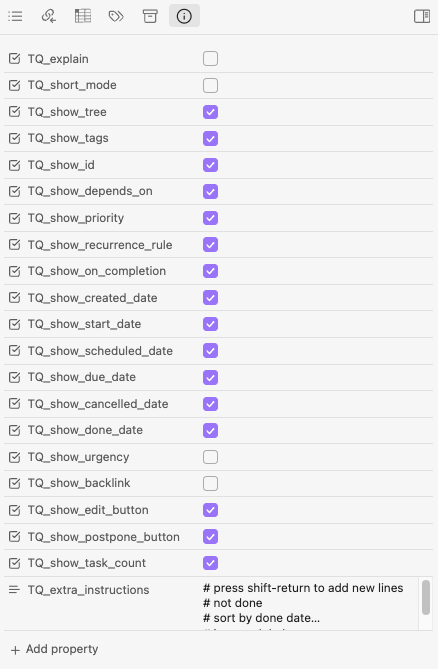

# Query File Defaults

> [!released]
> Introduced in Tasks 7.15.0.

## Benefits

This is a somewhat specialised facility that enables you to:

1. **Modify [[layout]] options in a Tasks Query without editing the `tasks` code block source.**
    - This could save you switching repeatedly between Reading and Editing modes.
    - Perhaps you usually like to see your Tasks search results with certain [[Layout]] options, but sometimes it is nice to see more detail, perhaps turning  `show tree` on and off, depending on your mood.
2. **Automatically insert one or more instructions in to all the `tasks` code blocks in a file.**
    - You have multiple Tasks queries in a Markdown file, and they have a lot of text in common.
    - You would like to avoid repeating those common instructions in each one, because keeping them consistent is tedious and error-prone.
3. **Remind yourself what all `tasks` code blocks in a file do.**
    - Quickly turn [[Explaining Queries|explain]] on and off, for when you need a reminder, or are wondering why some tasks are not included in a search.

## Summary

**Query File Defaults** are like the [[Global Query]] only more specific:

- The Global Query:
  - applies to **all queries in the vault**,
  - is defined in the **Tasks Settings**.
- Query File Defaults:
  - apply to **all queries in a file**,
  - is defined in **one or more standard [[#Supported Query File Defaults property values|named properties]] at the start of the file**.

Structure of this page:

- This page uses [[#examples]] to demonstrate the mechanism.
- It then shows how to easily adjust a file's Query File Defaults using the [[#Obsidian-native user interface]] and a [[#Meta Bind user interface]].
- Finally, it gives [[#technical details]] and records [[#Limitations of Query File Defaults|limitations]].

## Examples

These examples are provided to demonstrate how Query File Defaults work, so that all the supported values ([[#Supported Query File Defaults property values|listed below]]) should make sense.

### Add extra instructions

Any number of Tasks instructions can be inserted at the start of all queries in a file, using the `TQ_extra_instructions` property:

```yaml
---
TQ_extra_instructions: |-
  not done
  group by filename
---
```

When editing `TQ_extra_instructions` in Obsidian's File properties editor, you can press `<Shift> + <Return>` to insert a new line.

> [!tip]
>
> - `TQ_extra_instructions` is especially useful when you have more than one Tasks search block in a file, and you want the same instructions to be present in all the searches.
> - Before this feature, if those standard instructions changed, you had to remember to update every search.
> - Now you can put those standard instructions in `TQ_extra_instructions`, and only update them in one place.
> - Since Tasks 7.20.0, `TQ_extra_instructions` does support [[Line Continuations]].

> [!note]
> The `TQ_extra_instructions` property isn't an array. It's a single string value, and the `|-` allows it to span multiple lines.

### Short or full mode

Suppose the file containing our query begins with the following:

<!-- snippet: DocsSamplesForDefaults.test.DocsSamplesForDefaults_demo-short-mode_yaml.approved.yaml -->
```yaml
---
TQ_short_mode: true
---
```
<!-- endSnippet -->

Any Tasks code blocks in that file will then have this content inserted at the start:

<!-- snippet: DocsSamplesForDefaults.test.DocsSamplesForDefaults_demo-short-mode_instructions.approved.txt -->
```txt
short mode
```
<!-- endSnippet -->

All possible behaviours of `TQ_short_mode`:

| `TQ_short_mode` value | Generated instruction |
| --------------------- | --------------------- |
| `true`                | `short mode`          |
| `false`               | `full mode`           |
| *no value*            | *no instruction*      |

### Show or hide tree

Suppose the file containing our query begins with the following:

```yaml
---
TQ_show_tree: true
---
```

Any Tasks code blocks in that file will then have this content inserted at the start:

```txt
show tree
```

All possible behaviours of `TQ_show_tree`:

| `TQ_show_tree` value | Generated instruction |
| -------------------- | --------------------- |
| `true`               | `show tree`           |
| `false`              | `hide tree`           |
| *no value*           | *no instruction*      |

## Applying instructions to every Tasks search in a file

### Obsidian-native User Interface

You can use the Obsidian **File properties** view to customise Tasks searches:


<span class="caption">Obsidian's **File properties** widget, with checkboxes and a text box to modify query file defaults for a file containing Tasks searches. See [[#Widening property names in Obsidian]] for the CSS snippet used to widen property names.</span>

To try this out:

1. Show the `File properties` panel:
    - Enable the Obsidian core Properties view plugin: `Settings` > `Core plugins` > turn on `Properties view`
    - Switch to Reading or Live Preview modes.
    - Run the `Properties view: Show file properties` command.
2. Add one or more `TQ_*` properties to the file
    - Click on `Add property`.
    - Start typing `TQ_`, or any part of the property names list in [[#Supported Query File Defaults property values]] below.
    - Press `<Return>` or `<Enter>` to add the property.
3. Now you can modify these `TQ_*` properties to change the behaviour of all the Tasks searches in this file.

> [!tip]
> Use the command **Tasks: Add all Query File Defaults properties** to add all the available `TQ_*` properties to the active note in one simple step.

#### Widening property names in Obsidian

By default, the property names are very narrow in Obsidian.

You can make them wider with the following CSS Snippet.

<!-- snippet: resources/sample_vaults/Tasks-Demo/.obsidian/snippets/widen-property-labels.css -->
```css
/* Make property labels wider, to fit the names of Tasks-specific properties */
.metadata-content {
    --metadata-label-width: 14em;
}
```
<!-- endSnippet -->

The Obsidian user guide shows how to [use CSS snippets in Obsidian](https://help.obsidian.md/How+to/Add+custom+styles#Use+Themes+and+or+CSS+snippets).

### Meta Bind User Interface

See [[Make a query user interface]] for how to use Query File Defaults with the [[Meta Bind Plugin]] to create a User Interface to easily customise many aspects of your Tasks searches:


<span class="caption">Meta Bind widgets to edit Query File Defaults</span>

## Technical details

### Supported Query File Defaults property values

These are all the properties currently supported by Tasks, as Query File Defaults.

<!-- snippet: DocsSamplesForDefaults.test.DocsSamplesForDefaults_supported-properties-empty.approved.yaml -->
```yaml
---
TQ_explain:
TQ_extra_instructions:
TQ_short_mode:
TQ_show_backlink:
TQ_show_cancelled_date:
TQ_show_created_date:
TQ_show_depends_on:
TQ_show_done_date:
TQ_show_due_date:
TQ_show_edit_button:
TQ_show_id:
TQ_show_on_completion:
TQ_show_postpone_button:
TQ_show_priority:
TQ_show_recurrence_rule:
TQ_show_scheduled_date:
TQ_show_start_date:
TQ_show_tags:
TQ_show_task_count:
TQ_show_tree:
TQ_show_urgency:
---
```
<!-- endSnippet -->

### Command: Add all Query File Defaults properties

> [!tip]
> Use the command **Tasks: Add all Query File Defaults properties** to add all these properties to the active note.

### Types of Query File Defaults property values

These are all the types of properties currently supported by Tasks, as Query
File Defaults.

The `type` values are explained in the [Property types](https://help.obsidian.md/Editing+and+formatting/Properties#Property+types) section of Obsidian Help.

> [!tip]
> The Tasks plugin automatically adds these properties to the Obsidian vault.

<!-- snippet: DocsSamplesForDefaults.test.DocsSamplesForDefaults_fake-types.json.approved.json -->
```json
{
  "types": {
    "TQ_explain": "checkbox",
    "TQ_extra_instructions": "text",
    "TQ_short_mode": "checkbox",
    "TQ_show_backlink": "checkbox",
    "TQ_show_cancelled_date": "checkbox",
    "TQ_show_created_date": "checkbox",
    "TQ_show_depends_on": "checkbox",
    "TQ_show_done_date": "checkbox",
    "TQ_show_due_date": "checkbox",
    "TQ_show_edit_button": "checkbox",
    "TQ_show_id": "checkbox",
    "TQ_show_on_completion": "checkbox",
    "TQ_show_postpone_button": "checkbox",
    "TQ_show_priority": "checkbox",
    "TQ_show_recurrence_rule": "checkbox",
    "TQ_show_scheduled_date": "checkbox",
    "TQ_show_start_date": "checkbox",
    "TQ_show_tags": "checkbox",
    "TQ_show_task_count": "checkbox",
    "TQ_show_tree": "checkbox",
    "TQ_show_urgency": "checkbox"
  }
}
```
<!-- endSnippet -->

## Limitations of Query File Defaults

- Tasks searches in **Canvas cards** cannot use [[Query File Defaults]], because the [Canvas format](https://jsoncanvas.org) does not support frontmatter/properties.
  - The workaround is to use the Canvas [Convert to file](https://help.obsidian.md/Plugins/Canvas#Add+text+cards) facility to convert cards which contain Tasks queries to a separate Markdown note, embedded in the canvas.
  - You can then add Query File Defaults to the new note.
