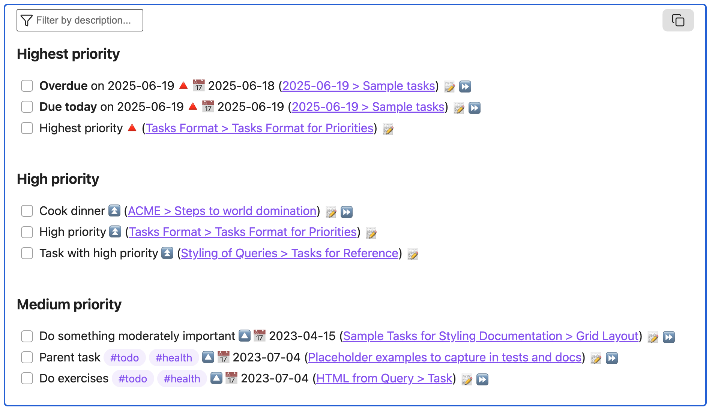
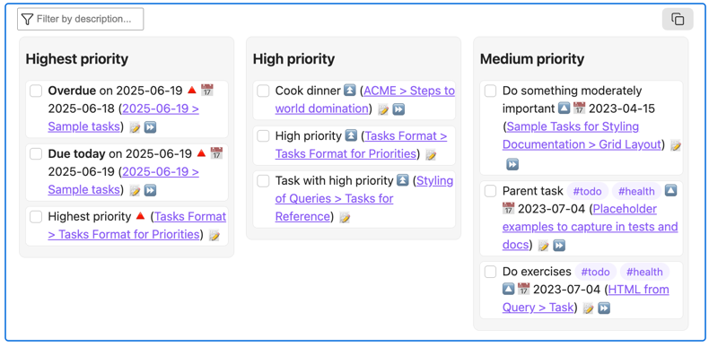
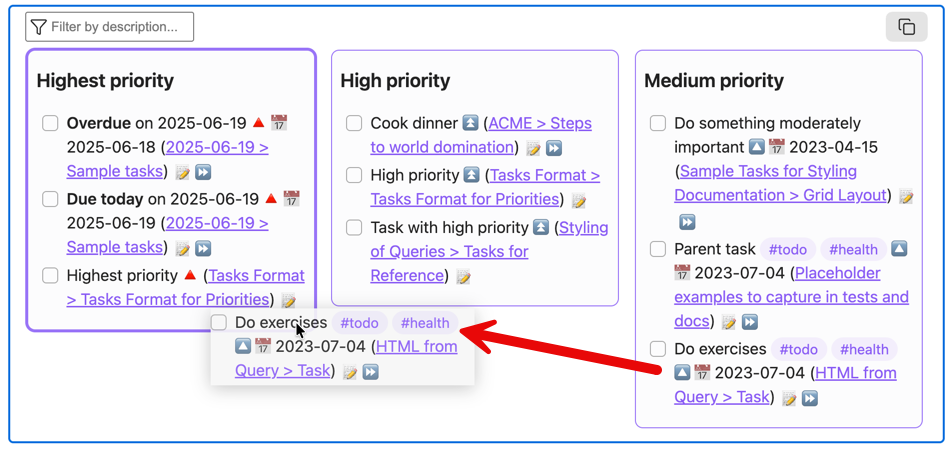

# Views

<span class="related-pages">#feature/views</span>

> [!released]
> Introduced in Tasks 8.4.0.

By default, the Tasks plugin displays search results as a list of matching tasks.

The `view` instruction allows tasks to be displayed in other formats, such as columns.

You can include multiple `view` instructions in a query, but only the last one is used.

## List View

This is the default Tasks behaviour:

```text
view list
```


<span class="caption">List view - the default view</span>

## Columns view

The `view columns` command is a special grouping instruction that displays matching tasks in columns.

```text
view columns by priority
```


<span class="caption">Columns view - here showing columns by Priority</span>

To display the priority columns in the opposite order, use:

```text
view columns by priority reverse
```

### Supported columns

You can use any supported [[Grouping]] option with `view columns by`.

### Drag and drop between columns

Some [[Grouping]] options support editing via drag-and-drop between columns.

The following `view columns by` instructions currently support editing:

```text
view columns by priority

view columns by cancelled
view columns by created
view columns by done
view columns by due
view columns by scheduled
view columns by status
```


<span class="caption">Some columns views, including priority, enable drag-and-drop to edit property values</span>

> [!tip]
> Even when editing is supported, not every column accepts dropped tasks. Tasks only allows valid edits.
> For example, if there is a column **Invalid due date**:
>
> - you cannot drop tasks into that column, because doing so would create an invalid date,
> - you can drag tasks out of that column into a valid one.

<!--
Text used in test vault to create screenshots:

---
TQ_extra_instructions: |-
  status.type is todo
  limit groups 3
  hide task count
  preset hide_date_fields
  preset hide_non_date_fields
  show due date
  show priority
  description does not include urgen
  priority above none
level_1_group: priority
---
# Manually testing views

## Column view

```tasks
view columns by {{query.file.property('level_1_group')}}
```

## List view

```tasks
view list
group by {{query.file.property('level_1_group')}}
```
-->
