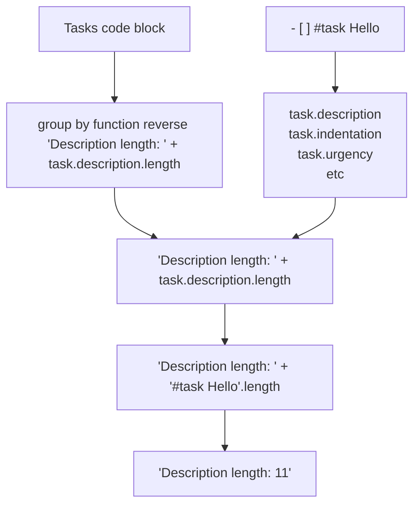

# Custom Grouping

<span class="related-pages">#feature/scripting #feature/grouping</span>

> [!released]
> Custom grouping was introduced in Tasks X.Y.Z.

## Basics of custom grouping

- A task, whose data you can access via all the [[Task Properties]]
- an instruction line of the form:
  - `group by function <expression>`
  - See [[Expressions]]

## Worked Example

> [!Example]
> Suppose that we want to see which of our tasks have the longest descriptions.
>
> To do this, we could group tasks with group headings like:
>
> `Description length: 27` - for all tasks with description 27 characters long.
>
> We can achieve this with this line, where the `reverse` work makes the tasks with longest descriptions be shown first:
>
> `group by function reverse 'Description length: ' + task.description.length`

Here is a visual explanation of how that instruction behaves:



## Expressions

The instructions look like this:

- `group by function <expression>`
- `group by function reverse <expression>`

The `expression` can:

- use a large range of properties of each task
- use any valid JavaScript language features

The `expression` must:

- use properties on a given task, such as `task.description`, `task.status.name`
  - See the reference page [[Task Properties]] for all the available properties
- return one of:
  - either a single value of any type that can be converted to string
  - or an array of values (in which case, the task will be displayed multiple times, once under each heading generated from the array)

> [!warning]
> The strings returned are rendered as-is. This means, for example, that if the text you return has underscores in (`_`) that are not meant to indicate italics, you should escape them with backslashes ('\_') like this:
>
> ```text
> group by function task.description.replaceAll('_', '\\_')
>```

## Custom group examples

```text
group by function task.priority
group by function task.status.nextStatusSymbol.replace(" ", "space")
group by function task.status.symbol.replace(" ", "space")
```

<!--
Using task.path, so not yet reading for public visibility:
```text
group by function task.path.replace("some/prefix/", "")
group by function reverse task.path.startsWith("journal/") ? "journal/" : task.path
group by function task.path.startsWith("journal/") ? "journal/" : task.path
```
-->

## Available Properties

The Reference section has a complete list of available [[Task Properties]].

## Troubleshooting

> [!Warning]
> Currently most types of error in function expressions are only detected when the search runs.
>
> This means that error messages are displayed in the group headings, when results are viewed.
>
> In a future release, we plan to show errors in formulae when the query block is being read.

### Syntax error

The following example gives an error:

````text
```tasks
group by function hello
```
````

gives this heading name:

```text
##### Error: Failed calculating expression "hello". The error message was: hello is not defined
```

> [!todo]
> Do syntax-error checking when parsing the instruction
