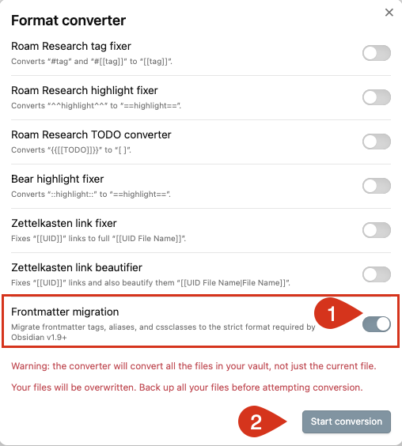

# Missing tags, aliases and cssclasses in some Obsidian 1.9.x versions

## Summary

- **Obsidian 1.9.0 and above** have **breaking changes** that are likely to cause missing `tags`, `aliases`, `cssclasses` values.
  - See [[#Obsidian 1.9.0 and above read properties strictly]] and [[#What needs to change?]]
- **Obsidian 1.9.3** introduced a new option in the core **Format converter** plugin to update your notes automatically.
  - See [[#How to fix unsupported properties]]
- **Obsidian 1.9.4** behaves more robustly than the earlier 1.9.x versions, although it still has some issues.
  - See [[#Things discovered whilst exploring this breaking change]]

## Obsidian 1.9.0 and above read properties strictly

> [!Warning] Warning: Breaking changes in Obsidian 1.9.x
>
> The [Bases](https://help.obsidian.md/bases) functionality in Obsidian 1.9.x is amazing.
>
> However, it is important to note the following in the [Obsidian 1.9.0 (Insider) changelog](https://obsidian.md/changelog/2025-05-21-desktop-v1.9.0/):
> > [!Quote] Breaking changes
> > We have officially removed support for the properties `tag`, `alias`, `cssclass` in favor of `tags`, `aliases` and `cssclasses`. In addition, the values of these properties _must_ be a list. If the current value is a text property, it will no longer be recognized by Obsidian.

Consequences of this:

- Searches that use **tags** in properties/frontmatter may no longer find expected, due to tags not being recognised, or being interpreted differently.
- Notes with **aliases** may no longer be found, as their alias values may be ignored.
- Notes with **cssclasses** may no longer be rendered as before, as their cssclass(s) values may be ignored.

## Things discovered whilst exploring this breaking change

### Obsidian 1.9.4

All the following behaviours were observed and tested in Obsidian 1.9.4.

| Properties                                            | Obsidian 1.9.4 behaviour                                                                                                                                                                       |
| ----------------------------------------------------- | ---------------------------------------------------------------------------------------------------------------------------------------------------------------------------------------------- |
| **`tag`, `alias`, `cssclass`**                        | ❌ Ignored by Obsidian: no longer treated as `tags`, `aliases`, `cssclasses`                                                                                                                   |
| **`tags` that are not proper lists**                  | ✅ Obsidian highlights incorrectly-formatted `tags` in red.<br>✅ Obsidian no longer deletes their values when making any changes to the file's properties.                                    |
| **`aliases`, `cssclasses` that are not proper lists** | ❌ Obsidian still does not warn about these.<br>✅ Obsidian no longer deletes their values when making any changes to the file's properties.                                                   |
| **`TAGS`, `ALIASES`, `CSSCLASSES`**                   | ✅ Still treated as `tags`, `aliases`, `cssclasses`                                                                                                                                            |
| **Finding and fixing formatting problems**            | ✅ New ["Properties" option in the Format Converter core plugin](https://help.obsidian.md/plugins/format-converter#Properties) easily fixes wrongly-named and wrongly-formatted properties.    |
| **Restoring any lost data**                           | ❌ Because Obsidian 1.9.0, 1.9.1 and 1.9.2 may have already silently deleted mis-formatted list values, you may still notice missing data, and may wish to review a backup copy of your vault. |

### Obsidian 1.9.0, 1.9.1 and 1.9.2

All the following behaviours were observed and tested in Obsidian 1.9.2.

| Properties                                                    | Obsidian 1.9.0, 1.9.1 and 1.9.2 behaviours                                                                                              |
| ------------------------------------------------------------- | --------------------------------------------------------------------------------------------------------------------------------------- |
| **`tag`, `alias`, `cssclass`**                                | ❌ Ignored by Obsidian: no longer treated as `tags`, `aliases`, `cssclasses`                                                            |
| **`tags`, `aliases`, `cssclasses` that are not proper lists** | ❌ Obsidian no longer warns about these.<br>❌ Obsidian silently deletes their values when making any changes to the file's properties. |
| **`TAGS`, `ALIASES`, `CSSCLASSES`**                           | ✅ Still treated as `tags`, `aliases`, `cssclasses`                                                                                     |
| **Finding problems**                                          | ❌ Any problem values have to be **found** by the user, to prevent data loss                                                            |
| **Fixed problems**                                            | ❌ Any problem values have to be **fixed** by the user                                                                                  |

## What needs to change?

These examples, from the [Obsidian documentation](https://help.obsidian.md/plugins/format-converter#Properties), show the kind of edits needed:

1. Property names may need updating.
2. These are all list properties, so each value needs to be on a new line, preceded by a hyphen (`-`).

**Aliases:**

```yaml
# Before

alias: My Note Title

# After

aliases:
  - My Note Title
```

**Tags:**

```yaml
# Before

tag: project, important

# After

tags:
  - project
  - important
```

**CSS Classes:**

```yaml
# Before

cssclass: custom-style

# After

cssclasses:
  - custom-style
```

## How to fix unsupported properties

### Step 1: Run the Format converter plugin

The Obsidian team has now provided a mechanism to **update entire pre-Obsidian-1.9.0 vaults**.

Here is how to use it.

1. Make a **backup of your vault**.
2. Make sure you are using **Obsidian 1.9.3 or above**.
3. Turn on the **[Format converter](https://help.obsidian.md/plugins/format-converter)** core plugin.

    
    <span class="caption">Turn on the 'Format converter' core plugin</span>

4. Run the **Open format converter** command.
5. Turn on the **[Frontmatter migration](https://help.obsidian.md/plugins/format-converter#Properties)** option.
6. Click **Start conversion**.

    
    <span class="caption">Select 'Frontmatter migration' option, and Start the conversion</span>

### Step 2: Rebuild the cache vault in this and all its synced copies

Anecdotally, we have found that there is a higher-than-usual chance of getting an out-of-date Obsidian cache when a lot of files have changed.

This can result in problems like plugins not being able to find every task in the vault.

So for safety, after the format converter has completed, we would recommend that:

1. You should [**regenerate the Obsidian metadata cache**](https://publish.obsidian.md/tasks/Support+and+Help/Missing+tasks+in+callouts+with+some+Obsidian+1.6.x+versions#The+solution+Regenerate+the+Obsidian+metadata+cache).
2. If your vault is synchronised with other devices, once each other device has finished syncing, you should repeat the cache regeneration step there too.

## Appendix

Some earlier notes that may still be of interest.

### Find properties that need updating

#### Find old `tag`, `alias`, `cssclass` and properties

If your vault uses the original names `tag`, `alias`, `cssclass` properties, it will benefit from using the Format converter.

Here is how to easily see if you have any old values needing to be updated.

1. In the Obsidian **Search** box, paste in `["alias"]`.
2. In the Obsidian **Search** box, paste in `["tag"]`.
3. In the Obsidian **Search** box, paste in `["cssclass"]`.

#### Find any incorrectly typed `tags`, `aliases` and `cssclasses` with string values

`tags`, `aliases` and `cssclasses` properties with string values will be wrongly interpreted by Obsidian 1.9.0 and above.

Here is one way to find them.

1. Download the file **[Check Tags.base](https://github.com/obsidian-tasks-group/obsidian-tasks/tree/main/resources/sample_vaults/Tasks-Demo/How%20To/Find%20properties%20not%20read%20by%20Obsidian%201.9.x)** - and open it in Obsidian 1.9.2 or newer.

2. Download the file **[Check Aliases.base](https://github.com/obsidian-tasks-group/obsidian-tasks/tree/main/resources/sample_vaults/Tasks-Demo/How%20To/Find%20properties%20not%20read%20by%20Obsidian%201.9.x)** - and open it in Obsidian 1.9.2 or newer.

3. Download the file **[Check CssClasses.base](https://github.com/obsidian-tasks-group/obsidian-tasks/tree/main/resources/sample_vaults/Tasks-Demo/How%20To/Find%20properties%20not%20read%20by%20Obsidian%201.9.x)** - and open it in Obsidian 1.9.2 or newer.

### Other ways to find and fix your properties

- Check to see if the [Obsidian Linter](https://github.com/platers/obsidian-linter) plugin has provided a way to find and fix problem properties.
- A Discord user reported:
    > I thought I'd just raise awareness of this little python app written by someone in the Obsidian user community - it can bulk edit YAML properties - I used it myself to get all my YAML consistent to help with using Bases in my vault...it works really well! It has a dry run mode so you can test a change before committing it: <https://github.com/fussbanana/obsidian-frontmatter-tool>
