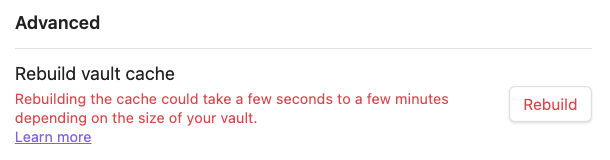

# Missing tasks in callouts with some Obsidian 1.6.x versions

## tl;dr

> [!Info] This page is **very important** to you if:
>
> - you use any Obsidian plugins to manage tasks (such as Tasks or dataview)
>   - *...and...*
> - you use [[#What is a callout with a title?|callouts with titles]] in your vault,
>   - *...and...*
> - you have any task lines inside those callouts,
>   - *...and...*
> - you have **ever** used the current vault on the current computer/device in **any** of the following Obsidian versions:
>   - Obsidian 1.6.0, 1.6.1, 1.6.2, or 1.6.3

> [!bug] Missing tasks
>
> - If the above are all true:
>   - **Obsidian 1.6.3** - and likely also 1.6.0, 1.6.1 and 1.6.2 -  had a bug that ==Tasks, dataview and likely other plugins *will* fail to find some of your tasks==.
>   - **Obsidian 1.6.4** fixed the bug when files are edited, but ==still requires manual edits to existing files, to apply the fix==.
>   - **Obsidian 1.6.5** provides an efficient way to fix a vault's cache for all files: this needs to be done for:
>     - ==every affected vault==,
>     - ==on every device==.
> - This page:
>   - Explains [[#The cause Incorrect Obsidian metadata cache|the cause]] and [[#The solution Regenerate the Obsidian metadata cache|the solution]].
>   - Explains the problems with Obsidian [[#Obsidian 1.6.3 failed to find tasks in some callouts|1.6.3]] and [[#Obsidian 1.6.4 partially fixed the bug (for Catalyst users)|1.6.4]].
>   - Links to the [[#related bug reports]].

### What is a callout with a title?

Here is an example callout with a title:

````text
> [!tip] Callouts can have custom titles
> Like this one.
````

Which displays like this:

> [!tip] Callouts can have custom titles
> Like this one.

## The cause: Incorrect Obsidian metadata cache

The underlying cause, confirmed in Obsidian 1.6.3, is that Obsidian reported incorrect (too large) line numbers in its [Metadata cache](https://help.obsidian.md/Files+and+folders/How+Obsidian+stores+data#Metadata+cache) for tasks (and other content) inside callouts with titles. Plugins use that cache to locate tasks and other data.

> [!quote] Metadata cache
> In order to provide a fast experience while using the app, Obsidian maintains a local record of metadata about the files in your vault called the **metadata cache**. This metadata powers many things across the app, from the Graph view to the Outline view.
>
> Obsidian keeps this cache in sync with the files in your vault, but it is possible for the data to get out of sync with the underlying files. In the event that this happens to your vault, you can rebuild your metadata cache from the app settings in the *Files and links* section.
>
> *Source: [Obsidian help](https://help.obsidian.md/Files+and+folders/How+Obsidian+stores+data#Metadata+cache)*

## The solution: Regenerate the Obsidian metadata cache

Obsidian 1.6.5 was released to all users on 25 June 2024. It provides the following mechanism to rebuild to the vault cache.

> [!Tip]
> Go to the Obsidian settings, then Files and links. In the Advanced section, then ==rebuild the vault cache==.
> 
> <span class="caption">Rebuild the vault metadata cache</span>
>
> The metadata is stored locally, and there is effectively a separate cache for each vault. This means that:
>
> - This rebuilding needs to be done in ==each affected vault==.
> - And for vaults that are synchronised across devices, it will need to be done ==on every device==.

## Obsidian problems - in earlier releases

### Obsidian 1.6.3 failed to find tasks in some callouts

The following task in a callout ==will **not be found** by Tasks in Obsidian 1.6.3==:

```text
> [!NOTE] Some Title - Remove me to make the task be found
> - [ ] Task in callout
```

The underlying cause is that Obsidian 1.6.3 reports incorrect (too large) line numbers in its [cache](https://docs.obsidian.md/Reference/TypeScript+API/CachedMetadata) for tasks (and other content) inside callouts with titles. Plugins use that cache to locate tasks and other data.

Each nested callout seems to increase the discrepancy in line numbers. So in the following, only `Correction4` would be found:

````text
 > [!Calendar]+ MONTH
 >> [!Check]+ GROUP
 >>> [!Attention]+ Correction TITLE
 >>> Some stuff goes here
 >>> - [ ] Correction1
 >>> - [ ] Correction2
 >>> - [ ] Correction3
 >>> - [ ] Correction4
````

We wrote up the underlying Obsidian issue in: [Tasks inside callouts have incorrect positions in the cache](https://forum.obsidian.md/t/tasks-inside-callouts-have-incorrect-positions-in-the-cache/84057/1).

> [!Note]
> We think it's likely the issue was also present in earlier 1.6.x versions, but we don't know for sure.

### Obsidian 1.6.4 partially fixed the bug (for Catalyst users)

Obsidian 1.6.4 beta/insider version was released to those with [Catalyst licences](https://help.obsidian.md/Licenses+and+payment/Catalyst+license) on 20 June 2024.

The [Obsidian 1.6.4 changelog](https://obsidian.md/changelog/2024-06-20-desktop-v1.6.4/) reported some fixes to checkboxes and callouts.

However, on initial testing we found that the missing tasks were still not found in many cases.

So it partially fixed the problem, but user intervention was still required to activate the fix in each affected file.

> [!Quote]- Laborious manual fix, if using Obsidian 1.6.4 and you cannot update to 1.6.5
> To ensure Obsidian 1.6.4 finds all your tasks in titled callouts, the Obsidian team has advised:
>
> - An ==edit needs to be made anywhere in a file containing any callout with titles==, to make Obsidian re-read the file and generate correct line numbers for callout content.
> - After a couple of seconds of inactivity, Obsidian's cached data will be updated, and missing checkboxes in that file will be found correctly.
> - ==Don't undo the edit==, as apparently the cached data would then be reverted.
>
> You will need to do this in all your files that have tasks in titled callouts.
>
> And if the vault is synchronised across multiple devices, you will need to ==do the above on every device==.
>
> The good news is that doing this will then ensure that Obsidian 1.6.4 does now report the correct locations of things inside titled callouts.

## Related bug reports

- **Tasks plugin**:
  - [Error with Tasks in Titled Callouts – Obsidian v1.6.3 (and v1.6.4 until file with callout is edited) · Issue #2890](https://github.com/obsidian-tasks-group/obsidian-tasks/issues/2890)
  - [Tasks with nested structures cannot be searched or are searched sporadically. · Issue #2904](https://github.com/obsidian-tasks-group/obsidian-tasks/issues/2904)
- **dataview plugin**:
  - [DQL Task Query: Titled callouts cause a shift of results by one · Issue #2365](https://github.com/blacksmithgu/obsidian-dataview/issues/2365)
  - [Issue with the First Task Item in Callout Losing Data · Issue #2359](https://github.com/blacksmithgu/obsidian-dataview/issues/2359)
- **Obsidian**:
  - 1.6.3: [Checkbox tasks in a callout can't be clicked or checks the wrong item](https://forum.obsidian.md/t/last-checkbox-in-a-callout-cant-be-clicked/82742)
  - 1.6.4: [Tasks inside callouts have incorrect positions in the cache](https://forum.obsidian.md/t/tasks-inside-callouts-have-incorrect-positions-in-the-cache/84057)
