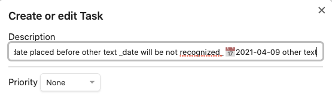

# Getting Started
{: .no_toc }

<details open markdown="block">
  <summary>
    Table of contents
  </summary>
  {: .text-delta }
1. TOC
{:toc}
</details>

---

## Finding tasks in your vault

Tasks tracks your checklist items from your vault.
The simplest way to create a new task is to create a new checklist item.
The markdown syntax for checklist items is a list item that starts with spaced brackets: `- [ ] take out the trash`.
Now Tasks tracks that you need to take out the trash!

To list all open tasks in a markdown file, simply add a [query]({{ site.baseurl }}) as a tasks code block like so:

````markdown
    ```tasks
    not done
    ```
````

## Adding data to your tasks (optionally)

Now you have a list of all open tasks! This is enough to get started with tasks.
You can _optionally_ start using one or more of the other features that Tasks offers.
Like, for example, [priorities]({{ site.baseurl }}) or [dates]({{ site.baseurl }}#start-date).

## Easy editing of tasks

A more convenient way to create a task is by using the `Tasks: Create or edit` command from the command palette.
You can also bind a hotkey to the command.
The command will parse what's on the current line in your editor and pre-populate a modal.
In the modal, you can change the task's description, its due date, and a recurrence rule to have a repeating task.

You can find out more in [‘Create or edit Task’ Modal]({{ site.baseurl }}).

See other pages in 'Getting Started' for more details on due dates and recurrence, and many other features.

You cannot toggle a task (un)done in the modal.
For that, do one of the following.

## Completing tasks

There are two ways to mark a task done:

1. In preview mode, click the checkbox at the beginning of the task to toggle the status between "todo" and "done".
2. In edit mode, use the command `Tasks: Toggle Done`.
    - The command will only be available if the cursor is on a line with a checklist item.
    - You can map the command to a hotkey in order to quickly toggle statuses in the editor view (I recommend to replace the original "Toggle checklist status" with it).
    - If the checklist item is not a task (e.g. due to a global filter), the command will toggle it like a regular checklist item.

A "done" task will have the date it was done appended to the end of its line.
For example: `✅ 2021-04-09` means the task was done on the 9th of April, 2021.

## Limitations and warnings

<div class="code-example" markdown="1">
Warning
{: .label .label-yellow}
Whenever Tasks behaves in an unexpected way, **please try restarting Obsidian**.

---

Warning
{: .label .label-yellow}
Tasks only supports **single-line checklist items**.

The task list rendered through this plugin **and** the checklist items
from which the task list is built render only the first line of the item.
Text after the first line in a multi-line checklist item is
ignored (but is unaffected in the stored `.md` file).

This works:

```markdown
-   [ ] This is a task
    -   This is a sub-item
    -   Another sub-item
    -   [ ] And a sub task
        -   Even more details
```

The following _does not work:_

```markdown
-   [ ] This task starts on this line
        and then its description continues on the next line
```

---

Warning
{: .label .label-yellow}
Tasks can read tasks that are in **numbered lists**.

{: .released }
Reading tasks inside numbered lists was introduced in Tasks 1.20.0.

For example:

```markdown
1. [ ] Do first step
2. [ ] Do next step
3. [ ] Do following step
```

Editing and toggling tasks in numbered lists works fine: the original number is preserved.

However, when these tasks are displayed in tasks blocks they are displayed as ordinary bullet list items.

This is because they will usually be displayed in a completely different order than in the original list, often mixed in with tasks from bullet lists. The original numbers in this case just don't make sense.

---

Warning
{: .label .label-yellow}
Tasks can read tasks that are inside **blockquotes** or [Obsidian's built-in callouts](https://help.obsidian.md/How+to/Use+callouts).

{: .released }
Reading tasks inside callouts and blockquotes was introduced in Tasks 1.11.1

However, under the following very specific circumstance, Tasks cannot add or remove completion dates or make the next copy of a recurring task:

- Obsidian is in Live Preview editor mode (pencil icon in lower right corner),
- AND the task's markdown is in a callout,
- AND the user clicked on the task's checkbox to complete or re-open the task.

If you toggle a task's status in this situation, you will see a warning. Use the command `Tasks: Toggle Done`, or switch to Reading View (book icon in lower right corner) to click the checkbox.

Completing a task by clicking its checkbox from a `tasks` query block _will_ work in any editor mode, even if the query is inside a callout.

---

Warning
{: .label .label-yellow}

Tasks cannot read tasks that are in **Obsidian Canvas cards**.

---

Warning
{: .label .label-yellow}

Tasks does not display Tasks query blocks that are in **Obsidian Canvas cards**.

We are tracking this in [issue #1732](https://github.com/obsidian-tasks-group/obsidian-tasks/issues/1732).

---

Warning
{: .label .label-yellow}

Tasks cannot read tasks that are **inside code blocks**, such as the ones used by the **Admonitions plugin**. Use Obsidian's built-in callouts instead.

---

Warning
{: .label .label-yellow}

Obsidian supports two styles of **comments**:

- `<!-- I am text in a comment -->`
- `%% I am text in a comment %%`

Tasks does read any tasks that are inside these comments, because Obsidian does not read them.

---

Warning
{: .label .label-yellow}
Tasks can only render **inline footnotes**. Regular footnotes are not supported.

```markdown
-   [ ] This is a task^[with a working inline footnote]
-   [ ] This footnote _will not work_[^notworking]
```

---

Warning
{: .label .label-yellow}
Tasks' support for **block quotes inside tasks** is limited. It renders correctly, but since Tasks only supports a single line, the meta-data of the task will be inside the block quote.

---

Warning
{: .label .label-yellow}
Tasks won't render **spaces around list items** if you have a list with empty lines.

```markdown
-   [ ] First task before the empty line

-   [ ] Another task. The empty line above will _not_ result in the tasks being more spaced out.
```

---

Warning
{: .label .label-yellow }

Tasks reads task lines **backwards from the end of the line**, looking for metadata emojis with values, tags and block links. As soon as it finds a value that it does not recognise, it stops reading.

This means that you can only put **block links** (`^link-name`) and **tags** after metadata such as dates, priorities, recurrence rules. Anything else will break the parsing of dates, priorities and recurrence rules.

```markdown
-   [ ] Task with priority placed before tag _priority will be recognized_ 🔼 #tag
-   [ ] Task with date placed before tag _date will be recognized_ 📅 2021-04-09 #tag
-   [ ] Task with date placed before other text _date will be not recognized_ 📅 2021-04-09 other text
-   [ ] Task with block link _works_ 📅 2021-04-09 ^e5bebf
```

If you are concerned that some values in a task are not being parsed as you intended, perhaps because a task is not being found by Tasks searches, you can view the task in the [‘Create or edit Task’ Modal]({{ site.baseurl }}).

If there are any **Tasks emojis visible in the Description field**, close the modal and delete or move to the left any unrecognised text.


<br>The `Tasks: Create or edit` modal showing a due date that was not parsed, due to trailing `other text`.

---

Warning
{: .label .label-yellow}
Tasks only supports checklist items in markdown files with the file extension `.md`.

</div>
