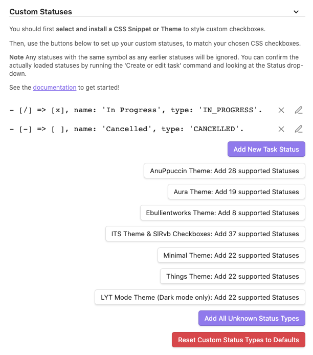

# Statuses
{: .no_toc }

<details open markdown="block">
  <summary>
    Table of contents
  </summary>
  {: .text-delta }
1. TOC
{:toc}
</details>

---

## Introduction

This page provides an overview of using Tasks with **Core Statuses** **Custom Statuses**, which some people refer to as Custom Checkboxes or Alternative/Alternate Checkboxes.

{: .released }
Custom Statuses were introduced in Tasks X.Y.Z

Further information is available in the following related pages.

### Related pages

- [How to style custom statuses]({{ site.baseurl }}).
- [How to set up your custom statuses]({{ site.baseurl }}).
- [Status Collections]({{ site.baseurl }}).

---

## What IS a Status?

Every task in the Tasks plugin now has a Status.

Status is just Tasks' name for:

1. the character (`symbol`) between the `[` and `]` in a task line
2. AND some options that you can customise, to tell tasks how to treat all your tasks with that character.

Some obsidian users call them other names, like 'Alternative Checkboxes', but that is more about how they are displayed, rather than about the actual *behaviour* of tasks with particular statuses.

## What's IN a Status?

These are the options that you can modify, for each status:


Here is some more detail.

### Status Symbol

- the single character in the `[]` at the start of the task.
- this character will control what how tasks are rendered by your Theme or CSS Snippet.

### Status Name

- a name for the status.
- this is flexible: for custom statuses, you can use any name you wish.
- is searchable with `status.name`, for example `status.name includes My custom in-progress status`.

### Next Status Symbol

- the status symbol to use when the task is toggled.

### Status Type

- one of `TODO`, `IN_PROGRESS`, `DONE`, `CANCELLED`, `NON_TASK`.
- Tasks needs to know the type of each status, so that it knows how to treat them when searching, and what to do when tasks with the status are toggled.
- the `DONE` type is used to determine:
  - whether to add the Done date, and
  - whether to create new instances of recurring tasks.
- types are searchable with `status.type`, for example `status.type is IN_PROGRESS`.
- you can have any number of statuses with the same status type, and then search them conveniently with `status.type`
- Also available:
  - `sort by status.type`
  - `group by status.type`

## What can Statuses do?

Now we have seen what is in a Status, what can we do with them?

Here are some examples, for inspiration.

### Todo -> In Progress -> Done

You can tweak Tasks' `Todo` status so that it toggles to 'In Progress', which then toggles to 'Done'.

This might be useful if you have a few slightly more time-consuming tasks to keep an eye on. Perhaps you would like to prioritise finishing things that are in progress before starting something new?

<!-- placeholder to force blank line before included text --> <!-- include: DocsSamplesForStatuses.test.DefaultStatuses_todo-in_progress-done.approved.md -->

| Status Symbol | Next Status Symbol | Status Name | Status Type | Needs Custom Styling |
| ----- | ----- | ----- | ----- | ----- |
| `space` | `/` | Todo | `TODO` | No |
| `/` | `x` | In Progress | `IN_PROGRESS` | Yes |
| `x` | `space` | Done | `DONE` | No |

<!-- placeholder to force blank line after included text --> <!-- endInclude -->

### Separate cycle for Important tasks

Sometimes I have a few really important tasks that I wish to stand out from the crowd, and several Themes make `!` tasks stand out visually, so I find this works really well.

By using non-standard symbols for the `IN_PROGRESS` and `DONE` statuses, if I decide to later re-open one of these completed tasks, it automatically goes on to `!` again.

<!-- placeholder to force blank line before included text --> <!-- include: DocsSamplesForStatuses.test.DefaultStatuses_important-cycle.approved.md -->

| Status Symbol | Next Status Symbol | Status Name | Status Type | Needs Custom Styling |
| ----- | ----- | ----- | ----- | ----- |
| `!` | `D` | Important | `TODO` | Yes |
| `D` | `X` | Doing - Important | `IN_PROGRESS` | Yes |
| `X` | `!` | Done - Important | `DONE` | Yes |

<!-- placeholder to force blank line after included text --> <!-- endInclude -->

### Pro and Con checkboxes - which toggle to each other

If I'm brain-storming ideas for things I am stuck on, writing a list of Pros and Cons sometimes helps.

Happily, some themes use `P` and `C` for these. Others use `p` and `c`.

Either way, I can make them toggle to each other, and by giving them the type `NON_TASK`, I can exclude them from my Tasks searches, as I don't see them as actionable.

<!-- placeholder to force blank line before included text --> <!-- include: DocsSamplesForStatuses.test.DefaultStatuses_pro-con-cycle.approved.md -->

| Status Symbol | Next Status Symbol | Status Name | Status Type | Needs Custom Styling |
| ----- | ----- | ----- | ----- | ----- |
| `P` | `C` | Pro | `NON_TASK` | Yes |
| `C` | `P` | Con | `NON_TASK` | Yes |

<!-- placeholder to force blank line after included text --> <!-- endInclude -->

## Done date, Recurrence and Statuses

It is the Task Status Type changing **to** `DONE` that controls when:

- tasks **gain** their Done dates (if Done dates are enabled in settings),
- new copies of recurring tasks are created.

It is the Task Status Type changing **from** `DONE` that controls when:

- tasks **lose** their Done dates (if Done dates are enabled in settings).

## Controlling behaviour of Statuses

This table demonstrates the behaviour of each of the status types in Tasks.
Each column shows an example task with the given status type.

The tasks shown are purely examples for context. The `~` column is just an arbitrary example to show `NON_TASK`'s behaviour'. You can assign each of these types to any of your custom statuses.

<!-- placeholder to force blank line before included text --> <!-- include: DocsSamplesForStatuses.test.Status_Transitions status-types.approved.md -->

| Operation and status.type | TODO | IN_PROGRESS | DONE | CANCELLED | NON_TASK |
| ----- | ----- | ----- | ----- | ----- | ----- |
| Example Task | `- [ ] demo` | `- [/] demo` | `- [x] demo` | `- [-] demo` | `- [~] demo` |
| Matches `done` | no | no | YES | YES | YES |
| Matches `not done` | YES | YES | no | no | no |
| Matches `status.name includes todo` | YES | no | no | no | no |
| Matches `status.type is TODO` | YES | no | no | no | no |
| Matches `status.name includes in progress` | no | YES | no | no | no |
| Matches `status.type is IN_PROGRESS` | no | YES | no | no | no |
| Matches `status.name includes done` | no | no | YES | no | no |
| Matches `status.type is DONE` | no | no | YES | no | no |
| Matches `status.name includes cancelled` | no | no | no | YES | no |
| Matches `status.type is CANCELLED` | no | no | no | YES | no |
| Matches `status.type is NON_TASK` | no | no | no | no | YES |
| Name for `group by status` | Todo | Done | Done | Done | Done |
| Name for `group by status.type` | 2 TODO | 1 IN_PROGRESS | 3 DONE | 4 CANCELLED | 5 NON_TASK |
| Name for `group by status.name` | Todo | In Progress | Done | Cancelled | My custom status |

<!-- placeholder to force blank line after included text --> <!-- endInclude -->

{: .warning }
The `group by` results of the above table are subject to change.

---

## Core Statuses

Core statuses represent conventional markdown tasks:

```text
- [ ] I am a task that is not yet done
- [x] I am a task that has been done
```

They don't require any custom CSS styling or theming on order to display correctly in Tasks blocks or Live Preview.

This is what the Core Statuses look like initially in Tasks' settings:


Note that `Todo` is followed by `Done`, in order to preserve compatibility with earlier Tasks releases.

{: .info }
You can edit the 'Todo' core status to make its Next Status Symbol be `/` and enable `Todo` -> `In Progress` -> `Done`, if you prefer.

And this is how you can use them:

<!-- placeholder to force blank line before included text --> <!-- include: DocsSamplesForStatuses.test.DefaultStatuses_core-statuses.approved.md -->

| Status Symbol | Next Status Symbol | Status Name<br>`status.name includes...`<br>`sort by status.name`<br>`group by status.name` | Status Type<br>`status.type is...`<br>`sort by status.type`<br>`group by status.type` | Needs Custom Styling |
| ----- | ----- | ----- | ----- | ----- |
| `space` | `x` | Todo | `TODO` | No |
| `x` | `space` | Done | `DONE` | No |

<!-- placeholder to force blank line after included text --> <!-- endInclude -->

### Editing core statuses

The only restriction on editing core statuses is that you cannot change their Status Symbols.

You are free to rename them, change their next character, and even change their Status Type, should you wish.

---

## Custom Statuses

Custom statuses represent any non-standard markdown tasks.

They **require custom CSS styling or theming** on order to display correctly in Tasks blocks or Live Preview.

### Default custom statuses

This is what the Custom Statuses look like initially in Tasks' settings:



And this is how you can use them:

<!-- placeholder to force blank line before included text --> <!-- include: DocsSamplesForStatuses.test.DefaultStatuses_custom-statuses.approved.md -->

| Status Symbol | Next Status Symbol | Status Name<br>`status.name includes...`<br>`sort by status.name`<br>`group by status.name` | Status Type<br>`status.type is...`<br>`sort by status.type`<br>`group by status.type` | Needs Custom Styling |
| ----- | ----- | ----- | ----- | ----- |
| `/` | `x` | In Progress | `IN_PROGRESS` | Yes |
| `-` | `space` | Cancelled | `CANCELLED` | Yes |

<!-- placeholder to force blank line after included text --> <!-- endInclude -->

### First choose your styling scheme

You can use any snippet or theme you wish. If you are already using a snippet or theme that supports "custom checkboxes", you should stick with that.

If, however, you are using the default theme, or a theme that doesn't know style "custom checkboxes", you will need to pick one.

[Status Collections]({{ site.baseurl }}) has a list of the ones that Tasks already has one-click support for, to help you choose.

### Editing custom statuses

Your choice of styling facility will determine which letters and characters you wish to you in your custom statuses.

Then see [How to set up your custom statuses]({{ site.baseurl }}) for how to set up your custom statuses.

{: .warning }
Remember to set up your chosen CSS Snippet or Theme before setting up the custom statuses.

## Using Statuses

### Editing your tasks

The [‘Create or edit Task’ Modal]({{ site.baseurl }}#status-and-done-on) allows you to change the status of a task.

### Related commands

{: .info }
There are not yet any new commands for applying custom statuses.
We are tracking this in [issue #1486](https://github.com/obsidian-tasks-group/obsidian-tasks/issues/1486) .

### Related searches

- `done` - matches tasks status types `TODO` and `CANCELLED`
- `not done` - matches tasks with status types `TODO` and `IN_PROGRESS`
- **Status Name**
  - `status.name` text search
  - `sort by status.name`
  - `group by status.name`
- **Status Type**
  - `status.type` text search
  - `sort by status.type`
  - `group by status.type`

For details, see [Filters for Task Statuses]({{ site.baseurl }}#filters-for-task-statuses)

{: .info }
We envisage adding `status.symbol`.

## Credit: Sytone and the 'Tasks SQL Powered' plugin

This plugin's implementation of reading, searching and editing custom statuses was entirely made possible by the work of [Sytone](https://github.com/sytone) and his fork of Tasks called ['Tasks SQL Powered'](https://github.com/sytone/obsidian-tasks-x). [^task-x-version]

Where code in Tasks has been copied from 'Tasks SQL Powered', Sytone has been specifically credited as a co-author, that is, joint author, and these commits can be seen on the GitHub site: [Commits "Co-Authored-By: Sytone"](https://github.com/search?q=repo%3Aobsidian-tasks-group%2Fobsidian-tasks+%22Co-Authored-By%3A+Sytone%22&type=commits).

Subsequently, the custom statuses implementation in Tasks has diverged from the 'Tasks SQL Powered' significantly. However, none of the new features and fixes would have been possible without Sytone's foundation work, for which we are very grateful.

[^task-x-version]: 'Tasks SQL Powered' as of [revision 2c0b659](https://github.com/sytone/obsidian-tasks-x/tree/2c0b659457cc80806ff18585c955496c76861b87) on 2 August 2022
