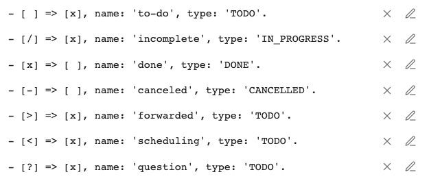
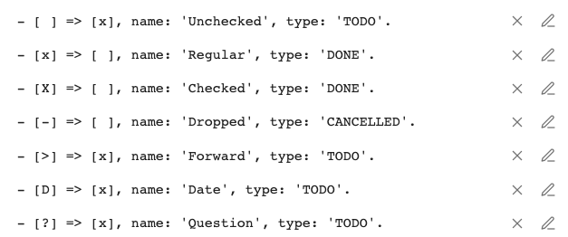
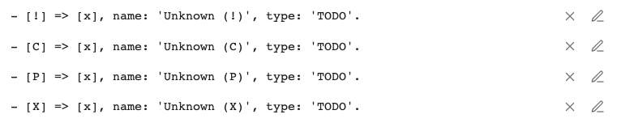

# Status Settings
{: .no_toc }

  

    Table of contents
  

  {: .text-delta }
1. TOC
{:toc}

---

## Overview

This is what you see in the Tasks settings when you first look at the Task Statuses section:

 
*Initial Task Statuses Settings*

There are two sections:

1. **Core Statuses**
    - These are statuses that are built in to Tasks, and cannot be deleted.
    - They are the two task types that are built in to Obsidian and Tasks natively: `[ ]` and `[x]`.
    - Their status symbols cannot be changed.
    - All their other properties can be edited.
2. **Custom Statuses**
    - These statuses are what many themes call 'custom checkboxes'.
    - You will need to choose and install a Theme or CSS Snippet that supports 'custom checkboxes'
    - Tasks automatically adds `[/]` and `[-]`
    - And this is where you can add your own custom statuses.

We also see that each status consists of:

- **Status Symbol** (for example, `x` and  `-`)
- **Status Name** (for example, 'In Progress')
- **Next Status Symbol** (for example, `x` and `space`)
- **Status Type** (one of `TODO`, `DONE`, `IN_PROGRESS` or `CANCELLED`)

## Add New Task Status

This adds a new, empty row to the Custom Statuses section.

 
*An empty Status, which can be edited and deleted*

You can then click its Pencil icon and fill in the details for your new Status.

## Bulk-adding Statuses

### Add all Status types supported by Minimal Theme

This populates the Custom Statuses list with all the statuses supported by the Minimal Theme.

You may wish to delete the default custom statuses first, so that you only see the Minimal statuses.

 
*The first few statuses supported by Minimal*

The [Minimal Theme]({{ site.baseurl }}) page shows the full list statuses that will be added, and what they look like in that theme.

### Add all Status types supported by ITS Theme and SlRvb's Alternate Checkboxes

This populates the Custom Statuses list with all the statuses supported by the ITS Theme, and also the identical SlRvb's Alternate Checkboxes.

 
*The first few statuses supported by ITS Theme and SlRvb's Alternate Checkboxes*

You can see screenshots, and the statuses that will be added:

- [SlRvb’s Alternate Checkboxes]({{ site.baseurl }})
- [ITS Theme]({{ site.baseurl }})

### Add All Unknown Status Types

This searches all the tasks in your vault for any with status symbols that are not already in Tasks settings.
It then creates a new symbol for each unknown status symbol.
This can be a convenient way to populate the Custom Statuses settings.

For example, in a vault that has already used a few custom statuses, we might see:

 
*Example result from adding all Unknown statuses*

## Reset Custom Status Types to Defaults

This resets the entire Custom Statuses section back to its default list.

This allows you to try out each of the buttons above, and if you don't like them, you can quickly undo their changes.
