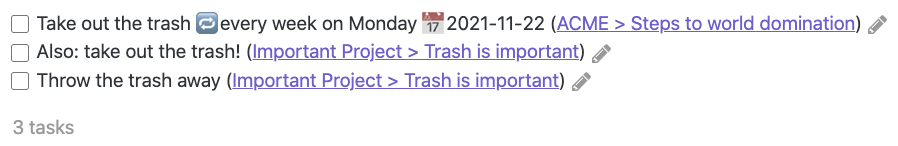
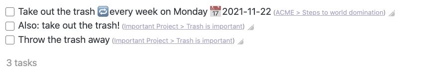
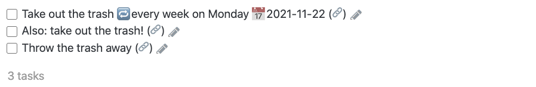

# How to style backlinks
{: .no_toc }

<details open markdown="block">
  <summary>
    Table of contents
  </summary>
  {: .text-delta }
1. TOC
{:toc}
</details>

---

## Motivation and assumptions

In Tasks results, by default each task is displayed with its filename,
and the name of the previous heading, for example `(ACME > Steps to world domination)`.
This is called a **backlink**.

If you don't like how backlinks look, this guide shows how you can modify their appearance.

We assume that you know how to [use CSS snippets in Obsidian](https://help.obsidian.md/How+to/Add+custom+styles#Use+Themes+and+or+CSS+snippets).

## Default backlink style

Here is an example task block that does not hide any components of the output: sometimes you want to see all the information in each task.

    ```tasks
    not done
    description includes trash
    ```

This screenshot shows what this might look like, with some sample data:



Notice that the backlinks (the blue file and heading names) can quite dominate the results, visually.

## Built-in options

We could use `hide backlink`, but then we would lose the ability to navigate to the source file.

We could also use `short mode`, which would replace the backlink text with an icon, but this would hide all the other properties of the task, such as due date and recurrence.

## Using CSS to de-emphasize the backlinks

We can de-emphasize the text in the backlinks, with [this CSS snippet](https://github.com/obsidian-tasks-group/obsidian-tasks/blob/gh-pages/resources/sample_vaults/Tasks-Demo/.obsidian/snippets/tasks-plugin-backlinks-small-grey.css):

<!-- snippet: resources/sample_vaults/Tasks-Demo/.obsidian/snippets/tasks-plugin-backlinks-small-grey.css -->
```css
/* By David Phillips (autonia) https://github.com/autonia
   From https://github.com/obsidian-tasks-group/obsidian-tasks/discussions/622#discussioncomment-2649299
*/
.tasks-backlink {
    font-size: 0.7em;
    opacity: 0.6;
    filter: grayscale(60%);
}
```
<!-- endSnippet -->

Which gives us this result:



## Using CSS to replace the backlinks with icons

Or we can replace the backlink text with an icon, with [this CSS snippet](https://github.com/obsidian-tasks-group/obsidian-tasks/blob/gh-pages/resources/sample_vaults/Tasks-Demo/.obsidian/snippets/tasks-plugin-backlinks-icon.css):

<!-- snippet: resources/sample_vaults/Tasks-Demo/.obsidian/snippets/tasks-plugin-backlinks-icon.css -->
```css
/* By Anna Kornfeld Simpson (@AnnaKornfeldSimpson) https://github.com/AnnaKornfeldSimpson
   From https://github.com/obsidian-tasks-group/obsidian-tasks/discussions/834#discussioncomment-3028600

   Then converted to embed the icon inside this .css file, to remove the need
   for an internet connection, as follows:
   1. Link icon downloaded from https://twemoji.twitter.com
      https://github.com/twitter/twemoji/blob/master/assets/svg/1f517.svg
      licensed under the CC-BY 4.0
   2. SVG encoded for embedding here with https://yoksel.github.io/url-encoder/

Tasks 3.0.0 compatibility note.

    Prior to Tasks 3.0.0, the first CSS line below was the following, with a '>'
    separator.

li.plugin-tasks-list-item > span.tasks-backlink > a {
*/
li.plugin-tasks-list-item span.tasks-backlink > a {
    content: url("data:image/svg+xml,%3Csvg xmlns='http://www.w3.org/2000/svg' viewBox='0 0 36 36'%3E%3Cpath fill='%238899A6' d='M15 9l6-6s6-6 12 0 0 12 0 12l-8 8s-6 6-12 0c-1.125-1.125-1.822-2.62-1.822-2.62l3.353-3.348S14.396 18.396 16 20c0 0 3 3 6 0l8-8s3-3 0-6-6 0-6 0l-3.729 3.729s-1.854-1.521-5.646-.354L15 9z'/%3E%3Cpath fill='%238899A6' d='M20.845 27l-6 6s-6 6-12 0 0-12 0-12l8-8s6-6 12 0c1.125 1.125 1.822 2.62 1.822 2.62l-3.354 3.349s.135-1.365-1.469-2.969c0 0-3-3-6 0l-8 8s-3 3 0 6 6 0 6 0l3.729-3.729s1.854 1.521 5.646.354l-.374.375z'/%3E%3C/svg%3E");
    height: .9em;
}
```
<!-- endSnippet -->

Which gives us this result:


