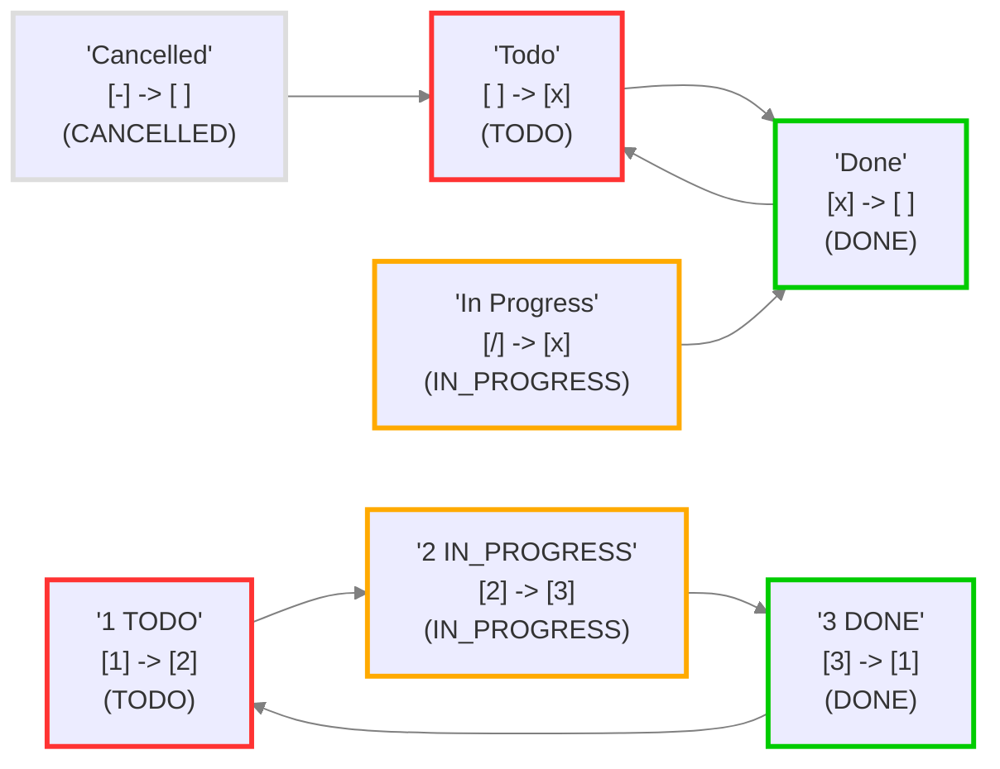

# issue 1486 - setup and notes

## Context

- [Add 'Set Status' commands \[which will also allow users to set hotkeys for particular statuses\] · Issue #1486](https://github.com/obsidian-tasks-group/obsidian-tasks/issues/1486)

## Tasks Status in this vault

These are the statuses actually used by Tasks in this vault.

## Commands and Hotkeys

Use Cmd + Opt + number to invoke these commands:

1. Obsidian: Toggle checkbox status
    - [[issue 1486 - status commands - 1 Obsidian Toggle checkbox status]]
2. Obsidian: Cycle bullet/checkbox
    - [[issue 1486 - status commands - 2 Obsidian Cycle bullet checkbox]]
3. Tasks: Toggle task done
    - [[issue 1486 - status commands - 3 Tasks Toggle task done - no global filter]]
    - [[issue 1486 - status commands - 3 Tasks Toggle task done - with global filter]]
