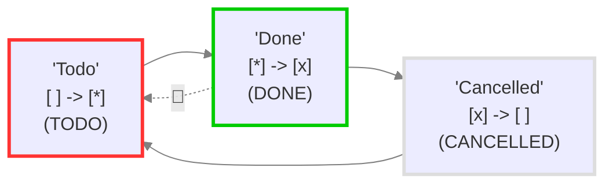

```mermaid
flowchart LR

classDef TODO        stroke:#f33,stroke-width:3px;
classDef DONE        stroke:#0c0,stroke-width:3px;
classDef IN_PROGRESS stroke:#fa0,stroke-width:3px;
classDef CANCELLED   stroke:#ddd,stroke-width:3px;
classDef NON_TASK    stroke:#99e,stroke-width:3px;

1["'Todo'<br>[ ] -> [*]<br>(TODO)"]:::TODO
2["'Done'<br>[*] -> [x]<br>(DONE)"]:::DONE
3["'Cancelled'<br>[x] -> [ ]<br>(CANCELLED)"]:::CANCELLED
1 --> 2
2 --> 3
2-. "🔁" .-> 1
3 --> 1

linkStyle default stroke:gray
```
