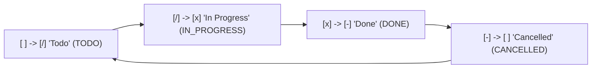

```mermaid
flowchart LR
1["[ ] -> [/] 'Todo' (TODO)"]
2["[x] -> [-] 'Done' (DONE)"]
3["[/] -> [x] 'In Progress' (IN_PROGRESS)"]
4["[-] -> [ ] 'Cancelled' (CANCELLED)"]
1 --> 3
2 --> 4
3 --> 2
4 --> 1
```
