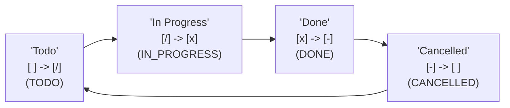

```mermaid
flowchart LR
1["'Todo'<br>[ ] -> [/]<br>(TODO)"]
2["'Done'<br>[x] -> [-]<br>(DONE)"]
3["'In Progress'<br>[/] -> [x]<br>(IN_PROGRESS)"]
4["'Cancelled'<br>[-] -> [ ]<br>(CANCELLED)"]
1 --> 3
2 --> 4
3 --> 2
4 --> 1
```
