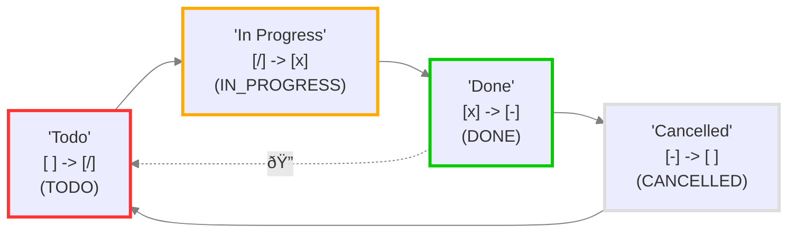

```mermaid
flowchart LR

classDef TODO        stroke:#f33,stroke-width:3px;
classDef DONE        stroke:#0c0,stroke-width:3px;
classDef IN_PROGRESS stroke:#fa0,stroke-width:3px;
classDef CANCELLED   stroke:#ddd,stroke-width:3px;
classDef NON_TASK    stroke:#99e,stroke-width:3px;

1["'Todo'<br>[ ] -> [/]<br>(TODO)"]:::TODO
2["'Done'<br>[x] -> [-]<br>(DONE)"]:::DONE
3["'In Progress'<br>[/] -> [x]<br>(IN_PROGRESS)"]:::IN_PROGRESS
4["'Cancelled'<br>[-] -> [ ]<br>(CANCELLED)"]:::CANCELLED
1 --> 3
2 --> 4
2-. "ðŸ”" .-> 1
3 --> 2
4 --> 1

linkStyle default stroke:gray
```
