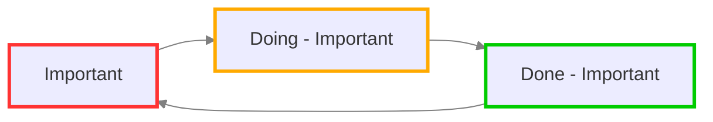

```mermaid
flowchart LR

classDef TODO        stroke:#f33,stroke-width:3px;
classDef DONE        stroke:#0c0,stroke-width:3px;
classDef IN_PROGRESS stroke:#fa0,stroke-width:3px;
classDef CANCELLED   stroke:#ddd,stroke-width:3px;
classDef NON_TASK    stroke:#99e,stroke-width:3px;

1["Important"]:::TODO
2["Doing - Important"]:::IN_PROGRESS
3["Done - Important"]:::DONE
1 --> 2
2 --> 3
3 --> 1

linkStyle default stroke:gray
```
