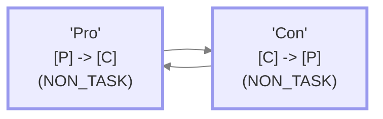

```mermaid
flowchart LR

classDef TODO        stroke:#f33,stroke-width:3px;
classDef DONE        stroke:#0c0,stroke-width:3px;
classDef IN_PROGRESS stroke:#fa0,stroke-width:3px;
classDef CANCELLED   stroke:#ddd,stroke-width:3px;
classDef NON_TASK    stroke:#99e,stroke-width:3px;

1["'Pro'<br>[P] -> [C]<br>(NON_TASK)"]:::NON_TASK
2["'Con'<br>[C] -> [P]<br>(NON_TASK)"]:::NON_TASK
1 --> 2
2 --> 1

linkStyle default stroke:gray
```
