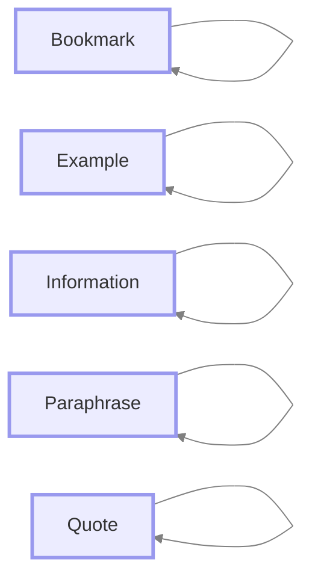

```mermaid
flowchart LR

classDef TODO        stroke:#f33,stroke-width:3px;
classDef DONE        stroke:#0c0,stroke-width:3px;
classDef IN_PROGRESS stroke:#fa0,stroke-width:3px;
classDef CANCELLED   stroke:#ddd,stroke-width:3px;
classDef NON_TASK    stroke:#99e,stroke-width:3px;

1["Bookmark"]:::NON_TASK
2["Example"]:::NON_TASK
3["Information"]:::NON_TASK
4["Paraphrase"]:::NON_TASK
5["Quote"]:::NON_TASK
1 --> 1
2 --> 2
3 --> 3
4 --> 4
5 --> 5

linkStyle default stroke:gray
```
